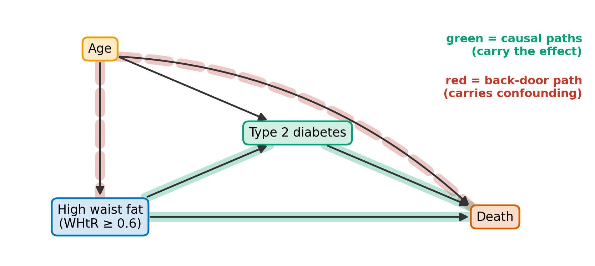
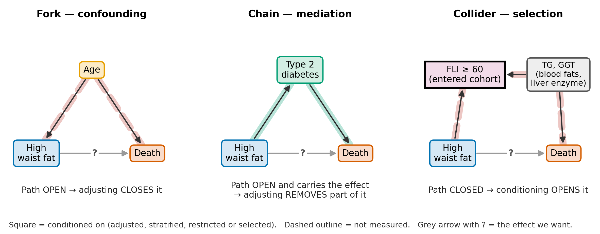
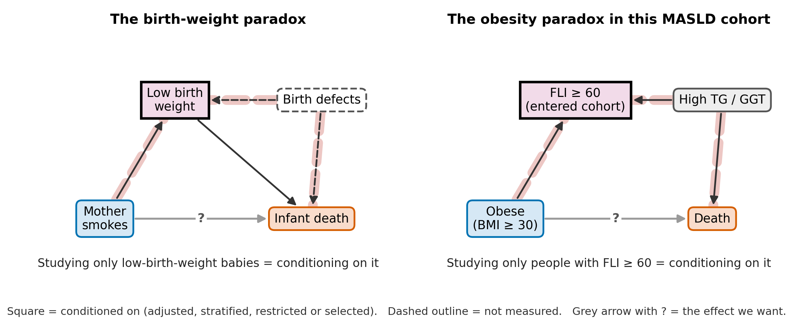
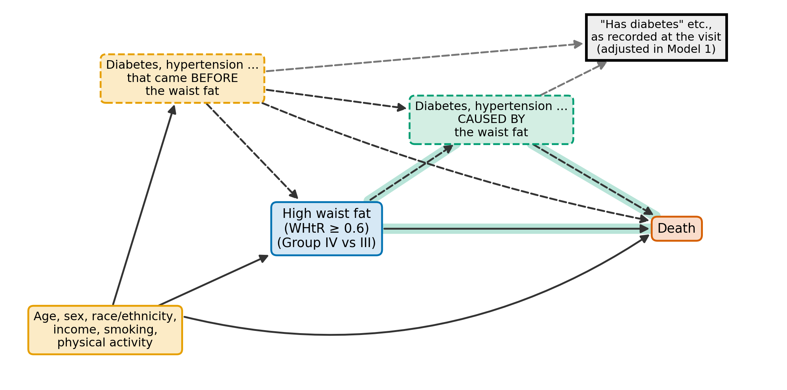
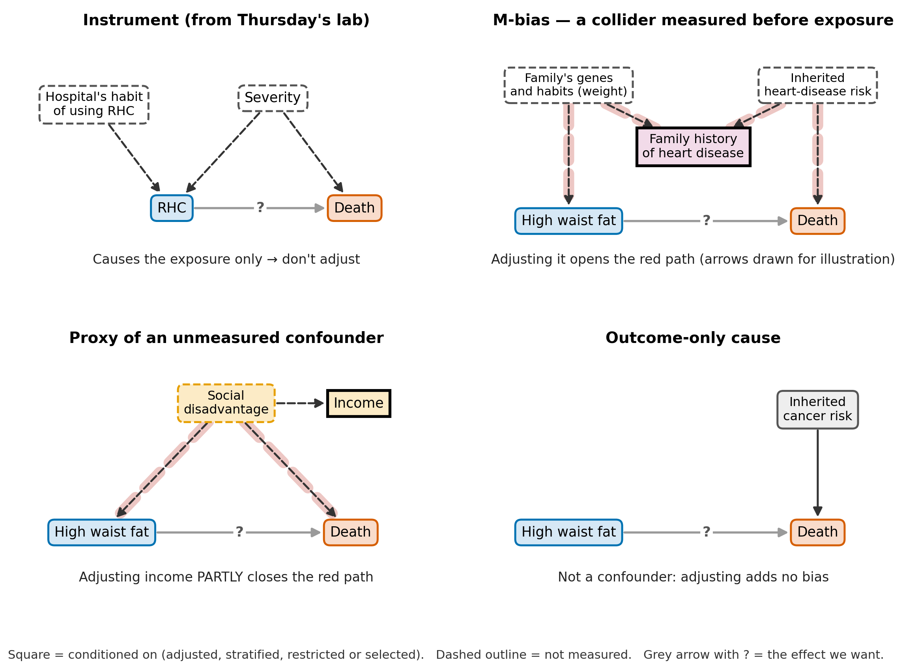
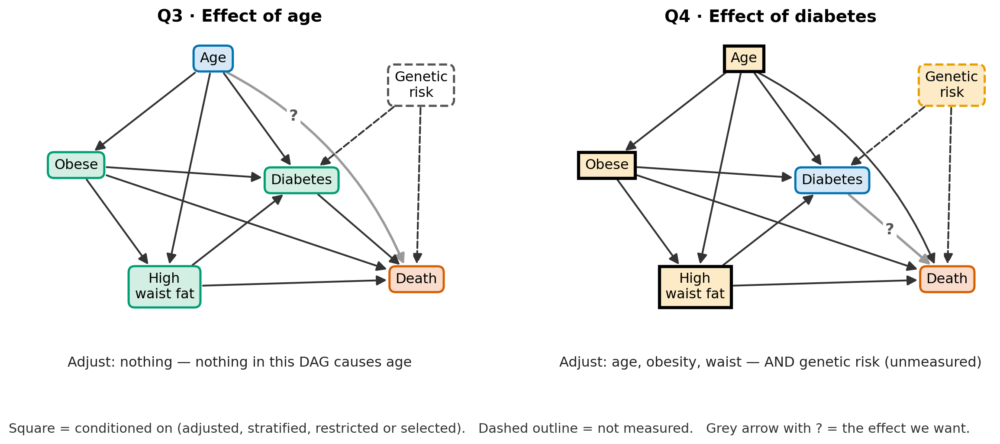
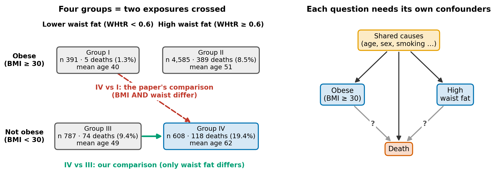
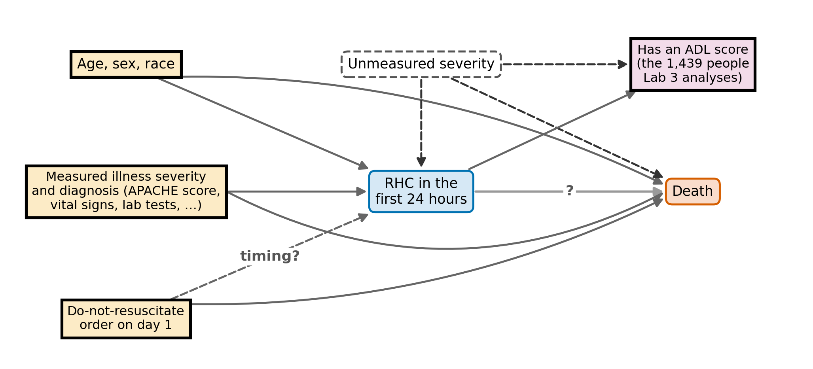

# Week 4 — Confounding: what to adjust for, how to decide, and what the number can tell you

Duration: ~2.5 h (Tue 29 Sep, before the Thu 1 Oct lab). Deck:
`lectures/slides/Week4_confounding_slides.qmd` — **obesity (BMI) as the only exposure**,
the paper's four BMI × waist groups kept for Week 5. Its numbers come from
`lectures/analysis/Week4_bmi_exposure.R`.

> **The deck and this plan.** This plan was written for an earlier deck that ran on the
> paper's four phenotype groups; the deck now uses obesity vs not obese throughout, with the
> same figure style, Parts and plan-slide numbers. It covers **Plan Slides 1–18 and 22**;
> the Lab 3 bridge (**Plan Slides 19–21**) is not in the deck. Every deck slide's speaker
> notes name its plan slide.

> **Timing.** Per-slide markers below sum to **147 min including the break**, against a
> 150-minute cap. Without Plan Slides 19–21 (15 min) the deck runs about **132 min**. **If
> you retime a slide, retime it in the deck's notes too.** See *If you are running behind*
> at the foot of this file.

> **Written for SPPH students, and matched to EpiMethods.** The deck uses plain language
> (every term defined on first use), EpiMethods' own notation (A, Y, L, U; Y(A=1),
> Y(A=0)), and the section names and order of the EpiMethods *Concepts* page for the
> Causal roles chapter. Each concept slide ends with a **"Read more"** line naming the
> matching *Concepts* section, EpiMethods tutorial or video, and the key paper; the deck
> closes with a *Where to read more* slide and the full reference list.

The lecture is one argument. **On the same 5,939 rows, our locked hazard ratio moves from
2.34 to 1.06 when the paper's Model 1 covariates enter. What moved it?** There are three
kinds of answer, and the lecture takes them in order: *which* variables were adjusted and
what role each plays (the DAG, before the break); *how* those variables got chosen (the
empirical criteria, and the data-driven methods that should not be used for this); and
*what the effect measure itself does* on adjustment (collapsibility, after the break). A
final block puts **Thursday's actual L3 exercise** on screen, so the lab reads as the
mechanics of the second half rather than as a change of subject.

> **Every DAG is drawn.** Each structural claim in this lecture has a figure in
> `lectures/img/w4_*.png`, drawn in one visual language throughout:
> - **Colour = role:** exposure blue, outcome vermillion, confounder orange, mediator
>   green, collider purple, any other variable grey.
> - **Outlines and shapes:** a **dashed outline** means *not measured*. A **square** node
>   is conditioned on — adjusted, stratified, restricted or selected.
> - **Arrows and bands:** a **grey arrow marked "?"** is the effect we want. A highlighted
>   band marks a causal path (solid green) or an open non-causal path (dashed red).
>
> The DAGs behind Slides 8, 17 and 19 are printed as `dagitty` code in the appendix, so
> students can paste them into dagitty.net and check every adjustment-set statement
> themselves.

> **Row-set discipline.** Every quantitative slide names the rows it quotes. **Three** sets
> appear today, nested, and they are not interchangeable:
> - the **full reconstructed analytic file, N = 6,371** — Table 1, group sizes, death
>   counts;
> - the **locked domain, N = 6,048** — the subset with a valid fasting weight;
> - its **matched complete-case subset, N = 5,939** — the 6,048 less 109 people missing
>   cancer status; every crude-versus-adjusted hazard ratio is fitted here, so crude and
>   adjusted differ for one reason rather than two.
>
> 6,371 − 5,939 is not the complete-case loss; 109 is.

> **What this week does NOT do.** Whether an effect *differs* across subgroups, including
> whether WHtR's effect differs between the obese and the non-obese, is effect
> modification (Week 5 and P3). Survey weights are Week 6; the missing-data mechanics
> (and L3's complete-case step) are Week 7. Formal mediation analysis is not in this
> course. Today the phenotype is one exposure with one named contrast.

## Learning objectives

1. State the **causal question** an adjusted estimate is meant to answer, as opposed to a
   prognostic one, and the three conditions under which adjustment answers it:
   **conditional exchangeability, positivity, consistency**.
2. Read a DAG: tell **causal** paths from **back-door** paths and from paths blocked at a
   collider; recognise the **fork, chain and collider**; and use the back-door rule to
   find a valid adjustment set — or to show that none exists with the variables measured.
3. Assign each covariate a **role** — confounder, proxy, mediator, collider, pre-exposure
   collider (M-bias), instrument, outcome-only cause — and state the **action** each role
   implies, including when **selection into the cohort** is itself conditioning.
4. When the DAG is incomplete, apply the **empirical criteria** (pre-treatment, common
   cause, disjunctive cause, modified disjunctive cause); and say why **change-in-estimate,
   stepwise significance and prediction-tuned machine learning** are the wrong tools for
   choosing confounders.
5. Explain **collapsibility**: why an OR or HR moves on adjustment with no confounding
   present while an RD or RR does not; distinguish **conditional** from **marginal**
   effects; and describe how **standardisation (g-computation)** produces a marginal one.
6. Use Table 1 to **describe and diagnose** (sparse cells, positivity, label mismatches) rather
   than to select, and report adjusted results without committing the **Table 2 fallacy**.
7. Recognise the four MASLD phenotype groups as a **joint exposure**, and say what that
   implies for the adjustment set.

## Continuity

- **Last week (Wk 3 → L2 / P1):** the cohort was built and locked — eligibility, the
  FLI ≥ 60 case definition, a typed funnel. M0 memos are in; the paper is locked.
- **This week:** the contrast *inside* that cohort — what distorts it, what adjustment
  does to it, and what the number that comes out can and cannot mean.
- **Sets up:** **L3** on Thursday (crude, conditional and marginal OR / RR / RD on the RHC
  data), **P2** (a Table 1, a variable-role table and a crude-versus-adjusted comparison on
  your own paper) and **Week 5** (effect modification).

### The division of labour, stated on Slide 1 and again on Slide 19

| | Teaches | On which data |
|---|---|---|
| Tuesday (this lecture) | the **judgement** — which variables, why, and what the effect measure does | MASLD (Kueh 2026) |
| Thursday (L3) | the **mechanics** — Table 1, three GLMs, crude / conditional / marginal, standardisation | **RHC** (right-heart catheterisation, EpiMethods `confoundingE`) |
| P2 | both, transferred | the student's locked paper |

**Say this out loud, twice.** L3 is not MASLD. It runs on the RHC data, a binary outcome,
which is precisely what makes collapsibility visible: the lab estimates one contrast as an
OR, an RR and an RD, three ways each. An earlier version of this lecture told students that
L3 would build a MASLD Table 1 and fit crude and age-adjusted Cox models; L3 does neither,
and a student waiting for MASLD to appear on Thursday loses the first half of the lab.

---

## Frame · 10 minutes across the slides below

## Slide 1 — Today's question, where we are, and the words we will use (6 min)
- Open with the question in plain words: non-obese adults with more waist fat died about
  twice as often; after adjustment the difference almost disappears — why?
- The arc: **Replicate → Interrogate → Improve → Defend**; Interrogate starts today. Show
  the learning objectives in one breath.
- Walk the Tue / Thu / P2 table. First of the two places L3's different dataset is named.
- **The running example on one slide:** who (NHANES adults with MASLD, FLI ≥ 60), the
  2 × 2 of BMI and WHtR that makes Groups I–IV, the outcome (death, HR), and our
  comparison (IV vs III).
- **Notation shared with EpiMethods:** A, Y, L, U and Y(A=1), Y(A=0); what "adjust for /
  condition on" and "crude" mean. Students who meet these words once, slowly, follow the
  rest of the lecture.

## Slide 2 — The number that moved (4 min)
- **Locked contrast, IV vs III, matched 5,939 rows:** crude HR **2.34 (1.72–3.18)** →
  Model 1 **1.06 (0.77–1.45)**.
- For orientation, the replication contrast on the same rows: IV vs I, **16.05 → 3.79**.
  On the full 6,371-row file the reproduction gives **15.14 → 3.28**, against the paper's
  **15.13 → 3.155**; the gap from 16.05 → 3.79 is the row set, not the reproduction.
- Ask the room: *what could make a hazard ratio move like that?* Take three or four
  answers, write them on the board, and **do not evaluate them**. Slide 13 lists five
  mechanisms, including one nobody suggests; Slide 15 demonstrates it.
- The complete-case restriction is already ruled out, and say so: crude on the 6,048-row
  locked domain is 2.33; on its 5,939 complete cases, 2.34.

## Part 1 — What question, and what would answer it · 12 minutes across the slides below

*EpiMethods Concepts: "The Epistemological Divide"; "The Counterfactual Framework".*

## Slide 3 — Explain or predict? (3 min)
- The same data can serve two questions. **Prognostic:** *which non-obese adults with
  MASLD are at higher risk of death?* **Causal:** *would a non-obese adult with MASLD live
  longer if their central adiposity were lower?*
- Prediction rewards any variable that tracks death, including downstream disease.
  Causal estimation punishes adjusting for downstream disease. The syntax `+ covariate` is
  identical; the rules are opposite.
- The paper's abstract says the phenotype *"was independently associated with higher
  all-cause mortality"*, and its conclusion that it *"confers the poorest survival"* —
  causal-sounding language on a model built like a prognostic one. Do not adjudicate it
  here; name the gap.
- Consequence for the second half: tools optimised for prediction (stepwise, AIC, LASSO)
  optimise the wrong target for today's question.

## Slide 4 — Potential outcomes, three conditions, and why the exposure is tricky (9 min)
- Notation, as in EpiMethods: **A** exposure, **Y** outcome, **L** measured covariates,
  **U** unmeasured. Each person has **Y(IV)** and **Y(III)**: the outcome they would have
  in each group.
- Put up three hypothetical rows — person, observed group, Y(IV), Y(III) — with a **?** in
  every unobserved cell. The individual effect is never observed: causal inference is a
  missing-data problem. The target becomes an average, the **ATE**, E[Y(IV) − Y(III)].
- Association equals causation only if the groups are **exchangeable**. A trial buys that
  by randomising. We can only hope for **conditional exchangeability** given L — and it is
  untestable.
- **Positivity:** within every level of L, each group must actually occur — it is about
  P(group | kind of person), not P(kind of person | group). On the full file (N = 6,371):
  among **obese women**, 2,550 have high waist fat and only **60 (2%)** lower waist fat, so
  comparisons against the paper's Group I say almost nothing about women. Among
  **non-obese women**, 114 of 387 (29%) are in Group III — fine for our comparison.
- **Say the distinction out loud:** women are 14.5% of Group III but 44.9% of Group IV.
  That is **imbalance**, which makes sex a **confounder** to adjust for — not a positivity
  problem. An earlier draft of this plan mixed the two up.
- **Consistency:** "being in Group IV" must mean one thing. It does not — a waist can
  change by diet, exercise, drugs or illness, with different futures (Hernán & Taubman
  2008). This is one reason the obesity-paradox literature does not settle.
- **Why body shape is a tricky exposure (one slide).** *What If* (Hernán & Robins, ch. 3,
  "Consistency: first, define the counterfactual outcome" and "The target trial") uses
  obesity as its own worked example:
  - "had they not been obese" has many versions (diet, exercise, surgery, drugs, illness),
    each with its own effect;
  - obesity is a history, not a moment;
  - comparing obese with non-obese people implicitly emulates an impossible trial that
    reshapes people instantly.

  The fix is to ask about an intervention (their example: lose 5% of BMI a year from age
  40) and emulate that target trial. Say why we keep the paper's exposure anyway: it makes
  every bias visible.

## Part 2 — Drawing the assumptions · 37 minutes across the slides below

*EpiMethods Concepts: "Structural and Knowledge-Based Selection Techniques"; "Simpson's Paradox".*

## Slide 5 — Reading a DAG (6 min)

{width=100%}

- Nodes are variables; an arrow is a direct causal effect; *acyclic* is time running one
  way. **The absent arrows are the strongest assumptions**: here, that nothing else causes
  both WHtR and death.
- A **causal path** follows the arrows *forward* the whole way from exposure to outcome.
  A **back-door path** starts with an arrow *into* the exposure. A path that leaves the
  exposure but meets a collider (→ X ←) is non-causal, and closed unless you condition on
  X — Slide 6.
- The goal: block every back-door path, leave causal paths open, and open no new path by
  what you condition on. dagitty.net lists the paths and the minimal adjustment sets.

## Slide 6 — Three building blocks, drawn in MASLD (9 min)

{width=100%}

- **Fork (Age):** open by default; conditioning closes it → adjust.
- **Chain (type 2 diabetes):** open by default and it *carries* the effect; conditioning
  removes part of what you are trying to estimate → do not adjust, for a total effect.
- **Collider (FLI ≥ 60):** blocked by default; conditioning *opens* it. FLI is computed
  from BMI, waist, triglycerides and GGT.
- **Say it slowly: "conditioning" includes adjustment, stratification, restriction and
  selection.** This cohort was selected on FLI ≥ 60 before anyone fitted a model.
- Could adjustment undo it? Adjusting for TG and GGT would close the path the selection
  opened — but TG and GGT are plausibly **effects** of central fat, so that trades
  selection bias for mediator and collider bias. Week 5 (Slide 18) and M1 return to this
  entanglement.
- One-minute check: *which structure is "hypertension"?* Take answers, then hold them —
  the answer depends on timing, and Slide 8 shows why the data cannot give it.

## Slide 7 — A collider you can see, and paradoxes that are colliders (7 min)

{width=100%}

- **Start with a collider you can see (real data, `w4_collider_scatter.png`).**
  - Among the 14,170 fasting-subsample adults with FLI computable, higher BMI goes with
    higher triglycerides (Spearman ρ = +0.28; median TG 116 obese vs 89 not).
  - Among the 6,052 with FLI ≥ 60 the link reverses (ρ = −0.30; 126 vs 174). A low-BMI
    person stays in the cohort only if their TG is high.
  - Point at the empty lower-left corner of the right panel: that is the selection
    boundary.
  - Numbers from `lectures/analysis/Week4_bmi_exposure.R`.
- **Simpson's paradox:** an association in the whole population reverses in every
  subgroup. The data cannot tell you which to believe; the causal structure does. Stratify
  on a confounder; do **not** stratify on a collider.
- **The birth-weight paradox** (Hernández-Díaz, Schisterman & Hernán 2006): among
  low-birth-weight infants, maternal smoking looks protective. Low birth weight is a
  collider of smoking and unmeasured birth defects.
- **The obesity paradox inside a disease cohort** has the same shape, and is often called
  *index-event bias*. A non-obese adult reaches FLI ≥ 60 mostly through high TG / GGT. In
  the paper's own Model 1, Group III (non-obese) has 3.175 times the hazard of Group I
  (obese). FLI selection is one candidate explanation; confounding by age and by prior
  illness are others. **Naming a candidate is not demonstrating one.**
- **The same collider touches the locked contrast.** Within BMI < 30, a low-WHtR adult
  also needs more TG / GGT to reach the threshold. On the locked rows, Group III's median
  triglycerides and GGT are both higher than Group IV's. If those carry mortality risk,
  IV vs III is pushed **downward** — a named bias of known direction on our own estimand.
- Keep the two halves of the headline apart. **Descriptively**, Group IV has the poorest
  observed survival — 19.5% died against 9.6% in Group III (paper) — and the paper reports
  that accurately. **Comparatively**, on the locked contrast the adjusted HR is
  **1.06 (0.77–1.45)**, and the paper's own Model 1 implies about **0.99** for IV vs III.

## Slide 8 — A working DAG for the locked contrast (10 min) · **do not drop**

{width=100%}

- Walk it left to right. Pre-exposure causes (age, sex, race/ethnicity, income, smoking,
  physical activity) point into both waist and death. Cardiometabolic disease appears
  **twice**, both unmeasured as such: disease that came *before* the central fat (a
  confounder) and disease *caused by* it (a mediator).
- **Ignoring selection, the valid set** is the pre-exposure causes plus disease-before.
- **The measurement problem is the lesson.** Model 1 enters each disease as **one
  composite indicator** — a self-reported past diagnosis *or* a measurement taken at the
  same visit that measures the waist (P2's Trap 1). Nothing records whether the disease
  came before or after the central fat, so the indicator is a **blend of both disease
  nodes**. Adjust for it, and three things happen at once:
  - some confounding is closed;
  - some of the effect is removed;
  - a new path opens: WHtR → disease-after ← disease-before → death.

  Leave it out, and disease-before stays open. Inside the FLI ≥ 60 cohort, Slide 6's
  TG / GGT path would also need blocking. **No valid set exists with the measured
  variables** — the appendix has the DAG to check it.
- Now place the paper's models. **Model 1** conditions on age, sex and the blend (plus
  cancer and medication use); it omits race/ethnicity and income. **Model 2** adds smoking
  and sedentary time. Under this DAG, neither is the valid set, and neither is clearly the
  worse one.
- This is why the P2 worked example says it **cannot say which estimand Model 1
  targets**. The honest move is to state the DAG, name what each model conditions on, and
  report both with the reading each requires. Choosing the one whose number you prefer is
  not an option.
- Room exercise (2 min): *name one arrow on this figure you would dispute, or one you
  would add.* Record two; P2's DAG sketch is where they go.

## Slide 9 — More roles, and the action each implies (5 min)

{width=100%}

| Role | Structure | Adjust? | Why |
|---|---|---|---|
| Confounder | A ← L → Y | **Yes** | closes a back-door path |
| Proxy of an unmeasured confounder | A ← U → Y, U → P | Usually yes | partly closes it; residual confounding remains |
| Mediator | A → M → Y | **No**, for a total effect | removes effect; and if M ← U → Y, opens a collider path |
| Collider, or its descendant | A → C ← U → Y | **No** | opens a non-causal path |
| Pre-exposure collider (M-bias) | A ← U1 → C ← U2 → Y | No, if it is only that; if it might also confound, adjusting is usually the safer mistake | M-bias tends to be small |
| Instrument | Z → A only | **No** | removes no bias; widens the CI; can amplify bias from U (Z-bias) |
| Outcome-only cause | R → Y only | Optional | RD / RR: precision. OR / HR: the number changes (Slide 15) |

- Three of the four panels are MASLD:
  - **Family history of CHD** is measured, pre-exposure and in the paper's Table 1 — a
    plausible M-structure, and exactly what the pre-treatment rule would adjust.
  - **Income** is a proxy for structural disadvantage.
- The instrument panel uses L3's world. A hospital's habit of using RHC *would* be an
  instrument **if** hospital practice affected death only through RHC — an assumption
  worth disputing. If it fails, the "instrument" is a confounder.

## Part 3 — When the DAG runs out · 8 minutes across the slide below

*EpiMethods Concepts: "Empirical Criteria for DAG-Deficient Scenarios".*

## Slide 10 — Empirical criteria (8 min)
- **Pre-treatment:** adjust for everything measured before the exposure. It avoids
  mediators, but walks into M-bias and adjusts instruments. L3 applies this idea to a
  **pre-chosen list** — `+ .` adjusts for every column the exercise kept, not everything
  recorded before RHC.
- **Common cause:** only variables known to cause both. Too strict: anything uncertain gets
  dropped, and omitting a real confounder usually costs more than including a harmless
  extra (EpiMethods' reason). It can even adjust for nothing when a measured set would have
  worked: if a cause of the exposure (C1) and a cause of the outcome (C2) share an
  unmeasured parent, the back door A ← C1 ← U → C2 → Y is open; adjusting for **either**
  C1 or C2 would block it, but neither is a common cause (VanderWeele & Shpitser 2011).
- **Disjunctive cause** (VanderWeele & Shpitser 2011): pre-exposure causes of the exposure
  **or** the outcome **or** both. Robust to not knowing which.
- **Modified disjunctive cause** (VanderWeele 2019): the same, then **drop known
  instruments** and **add proxies** for unmeasured common causes.
- The table's first four rows are on the slide already filled in; **take the room's
  answers on the last three**, which are the point:

| Candidate | Plausibly before the exposure? | Cause of WHtR? | Cause of death? | Modified disjunctive |
|---|---|---|---|---|
| Age, sex | yes | yes | yes | in |
| Race/ethnicity, income | yes | plausibly (as proxies for structural factors) | yes | in |
| Smoking, physical activity | largely | yes | yes | in |
| Alcohol | largely | plausibly | yes | in — and an input to FLI via GGT |
| T2DM, hypertension, dyslipidaemia, CKD, MI | **unknown** | both directions | yes | **cannot be placed** |
| Cancer | **unknown** | both directions (weight loss) | yes | **cannot be placed** |
| Medication use | follows diagnosis | inherits the disease's problem | — | **cannot be placed** |

- Every criterion needs **time order**, and a single NHANES visit does not supply it for
  prevalent disease. The criteria reproduce Slide 8's problem honestly rather than solving
  it.

## Slide 11 — BREAK (10 min)
- Leave Slide 8's DAG on screen. Restart prompt: *the number moved from 2.34 to 1.06.
  Which of the board's guesses could you now rule out, and which could you not?*

## Part 4 — How covariates get chosen in practice, and what the effect measure does · 38 minutes across the slides below

*EpiMethods Concepts: "Modelling criteria for variable selection"; "Collapsibility and the Choice of Effect Measure".*

## Slide 12 — Table 1 describes; it does not select (5 min)
- Four columns, full file (N = 6,371), from the reproduced Table 1 (deaths from the
  reproduced Table 2):

| | I | II | III | IV |
|---|---|---|---|---|
| n | 391 | 4,585 | 787 | 608 |
| Deaths, n (%) | 5 (1.3) | 389 (8.5) | 74 (9.4) | 118 (19.4) |
| Age, mean | 40.1 | 50.9 | 49.1 | 61.5 |
| Female, % | 15.3 | 55.6 | 14.5 | 44.9 |
| Type 2 diabetes, % | 10.7 | 27.4 | 13.9 | 30.8 |

- Read IV against III as **magnitudes**. Age: (61.5 − 49.1) / 14.6 ≈ a **0.85 SD** gap.
  Female: 44.9% against 14.5%. These rows say where to look; the DAG decides what they
  are.
- What Table 1 is *for*:
  - **Sparse cells.** Group I has 5 deaths, and 1 cardiovascular death, so the
    unadjusted cardiovascular IV-vs-I HR runs from 2.27 to 123.47 (reproduced, full
    file).
  - **Positivity.** Only 60 obese women have a lower WHtR, against 2,550 with a high one.
  - **Label mismatches.** The "< 25" BMI header from Week 3, where the Methods say 30; the
    income percentages P2 finds that disagree with their own counts.
- **p-values in Table 1** shrink as N grows, whatever the bias. Reproduce the paper's p
  column (P2 asks for it), and read standardised differences instead.
- **For Thursday:** L3's Table 1 is stratified by **death**, because that is the
  exercise's target table. In P2, stratify by **exposure**. Ask aloud what question each
  version answers.

## Slide 13 — Change-in-estimate (7 min)
- The procedure: add a covariate; if the exposure coefficient moves by more than 10%,
  call it a confounder and keep it. Purposeful selection's "confounding check" is the
  same idea.
- On MASLD it fires wholesale: 2.34 → 1.06 on the same rows is a 55% move. Now list what
  can produce a move, and return to the board from Slide 2:
  1. **Confounding removed** — age, sex.
  2. **Effect removed** — the mediator half of the blend.
  3. **Bias added** — adjusting the blend opens WHtR → disease-after ← disease-before →
     death (Slide 8).
  4. **Non-collapsibility** of the hazard ratio — the one nobody suggests (Slide 15). It
     moves estimates *away* from 1, so it cannot be why this one fell toward 1.
  5. **Different rows** — ruled out here: 2.33 on the locked domain against 2.34 on its
     complete cases.
- Change-in-estimate cannot tell these apart; it is blind to causal structure. It is
  safer with an RD or RR, which have no fourth term, but no better at the other three.

## Slide 14 — Significance-based and algorithmic selection (4 min)
- **Stepwise by p-value.**
  - Confounding is not a significance test: a strong confounder can be "non-significant"
    in a modest sample.
  - The final confidence intervals ignore the search that produced the model, so they
    are too narrow (post-selection inference).
  - It optimises fit. Run on the MASLD file, it would be expected to keep the
    cardiometabolic blend, because those variables predict death strongly — exactly the
    ones Slide 8 could not place.
- **Purposeful selection** (Hosmer & Lemeshow; Bursac et al. 2008): a p < 0.25 screen,
  then a change-in-estimate check. Better than raw stepwise, but still blind to causal
  structure — its check retains a collider, because conditioning on one moves the
  estimate.
- **Machine learning.** LASSO and random forests are prediction tools. Their legitimate
  place in causal work is the prediction sub-tasks: the propensity-score model and the
  outcome model.
  - **Post-double-selection** (Belloni et al. 2014) implements the disjunctive union: a
    LASSO for the outcome, another for the exposure, and adjust for both lists.
  - Outcome-adaptive LASSO, hdPS and C-TMLE are other confounder-oriented selection
    methods — pointers only for now.

## Slide 15 — Collapsibility (12 min) · **do not drop**
- **Start with a two-minute refresher** on the four measures, on one worked example (65% vs
  35% died): RD 0.30, RR 1.86, OR 3.45, and what an HR is. Many SPPH students last met the
  odds ratio in a first-year course; the collapsibility point lands only if the OR is
  familiar.
- **Definition:** a measure is collapsible if, with no confounding, the whole-population
  value is a weighted average of the stratum values. **RD and RR are collapsible. OR and
  HR are not.**
- A hypothetical, in MASLD vocabulary. Age is **balanced by design** — half of each age
  stratum has a high WHtR — so age is not a confounder. The risks are deliberately large so
  the effect is visible.

| Stratum (n) | Risk, high WHtR | Risk, low WHtR | OR | RR | RD |
|---|---|---|---|---|---|
| Age ≥ 60 (200) | 0.80 | 0.50 | 4.00 | 1.60 | 0.30 |
| Age < 60 (200) | 0.50 | 0.20 | 4.00 | 2.50 | 0.30 |
| Everyone (400) | 0.65 | 0.35 | **3.45** | 1.86 | 0.30 |

- Read the OR column. It is 4 in both strata and 3.45 in everyone, and no weighted average
  of 4 and 4 is 3.45. Adjusting for age moves the OR from 3.45 to 4.00, a **16%** change:
  change-in-estimate calls age a confounder, and it is not one.
- The RD column does not move. The RR differs by stratum (1.60, 2.50) but the whole
  population's 1.86 lies between them, a weighted average. Note in passing that the OR is
  homogeneous here while the RR is not: whether an effect "varies" depends on the scale.
  That is Week 5.
- **Two corrections to common slogans.**
  - Non-collapsibility is **not bias**: 4.00 and 3.45 are correct answers to two different
    questions.
  - It **does not happen under the null**. If the exposure does nothing in any stratum,
    every OR is 1. It needs a non-null effect and a covariate that predicts the outcome.
    The previous version of this deck said the HR moves on adjustment "even under a null";
    that is withdrawn — the correct phrase is **"even without confounding"**.
- **Size and direction.** It grows with the effect and with how strongly the covariate
  predicts the outcome — and it moves the adjusted OR or HR **away from 1** (toy: 3.45 →
  4.00; Lab 3: 1.058 → 1.072). Our locked estimate moved **toward** 1 (2.34 → 1.06), so
  non-collapsibility explains **none** of that drop; with the adjusted HR at 1.06 the
  marginal HR would lie between 1 and 1.06, so if anything it offsets a sliver. The drop
  is the other mechanisms on Slide 13, and which of those, Slide 8 says the data cannot
  tell. (An earlier draft said non-collapsibility explained "a small slice" of the drop —
  wrong direction; withdrawn.)
- The HR also carries a built-in selection over follow-up time: later risk sets hold
  only the survivors (Hernán 2010).

## Slide 16 — Conditional versus marginal, and how to get the marginal one (10 min) · **do not drop**
- **Conditional effect:** within levels of the covariates — what a regression coefficient
  is. **Marginal effect:** the population average — what a trial estimates, and usually
  what a policy question needs.
- **Standardisation (g-computation), four steps:**
  1. Fit an outcome model with exposure and covariates.
  2. Copy the data, set everyone to exposed, and predict each person's risk.
  3. Set everyone to unexposed, and predict again.
  4. Average each set of predictions and contrast them.

  This is L3 Problem 2(c): `predict(model, newdata = everyone_treated, type = "response")`.
  L3 does it once per measure, with a different model each time: a logistic model for the
  OR, a Poisson model for the RR, a Gaussian model for the RD. Standardising the logistic
  model alone would also be valid and gives slightly different RR and RD values; neither
  is wrong.
- **The decomposition to carry into the lab:**
  - **Crude vs marginal** is confounding — given that the model is right and the set
    sufficient.
  - **Marginal vs conditional** is non-collapsibility. It is **zero by construction** for
    an RR from a log-link model, or an RD from an identity-link model, without product
    terms: every person's predicted ratio (or difference) is the same, so the average is
    too. That equality is algebra, not evidence.
  - On the Slide 15 toy: crude 3.45 = marginal 3.45 (no confounding); conditional 4.00.
- **L3's three models:**
  - **Logistic** → OR.
  - **Poisson with a log link and robust (sandwich) SEs** → RR, the "modified Poisson"
    of Zou (2004). The Poisson variance is wrong for a 0/1 outcome; the robust SE repairs
    the inference.
  - **Gaussian with an identity link and robust SEs** → RD, the linear probability
    model.
  - Both can predict "risks" outside 0–1 (in Lab 3: Poisson up to 1.57, the linear model
    from −0.25 to 1.16). That is a known price of these models, not a coding error.
  - Naimi & Whitcomb (2020) Table 2 is the one-page reference.
- **Back to MASLD.** Our 2.34 → 1.06 is crude versus *conditional*. Non-collapsibility
  would push a conditional HR away from 1, so it cannot account for this drop (Slide 15). The survival analogue of standardisation is a
  standardised survival curve, or six-year risk under "everyone IV" against "everyone
  III"; Week 5's model-based absolute risks start that.

## Part 5 — Reporting what you estimated · 13 minutes across the slides below

*EpiMethods Concepts: "The Table 2 Fallacy"; "Interaction vs. Effect Modification".*

## Slide 17 — The Table 2 fallacy: four questions, four DAGs (8 min)

{width=100%}

{width=100%}

- **Show one model first**, as a paper's Table 2 would print it: obesity + high waist fat
  + age + sex + diabetes, on 5,911 MASLD adults (a separate teaching example that uses
  *both* body-shape measures). Its rows: obese 0.80 (0.65–0.99), high waist fat 1.17
  (0.87–1.57), age per 10 years 2.30 (2.12–2.49), diabetes 1.65 (1.39–1.97). Take a vote:
  "so obesity is protective?"
- **Then four questions on one DAG**, each with its own adjustment set (checked with
  dagitty):
  - **Q1, obesity** — adjust for age; not waist or diabetes, which lie on obesity's path.
  - **Q2, high waist fat** — adjust for age *and obesity*, which is a confounder here.
    This is the paper's own "independent of total body weight" question.
  - **Q3, age** — adjust for nothing.
  - **Q4, diabetes** — needs genetic risk, which is unmeasured.
- **The same variable changes role with the question.** Waist fat is a mediator in Q1 and
  the exposure in Q2; obesity is the exposure in Q1 and a confounder in Q2.
- **Each question's own model** (with sex, race/ethnicity, smoking and activity added):
  - obesity **0.95** (0.78–1.14);
  - waist **1.24** (0.93–1.67);
  - age **2.38** (2.21–2.56);
  - diabetes **1.71** (1.43–2.04), still confounded.

  The one-model obesity row (0.80) differs most, because it holds waist and diabetes fixed.
  The other rows are close — the fallacy is about **meaning**, not only size.
- **Your turn:** flip the obese → waist arrow. Q1 and Q2 swap roles — the DAG, not the
  data, decides.
- **Credit the paper.** Its Table 2 reports only its exposure rows, with the covariates
  in a footnote — the recommended layout. Rule: **one exposure, one model, one row
  reported** (Westreich & Greenland 2013).

## Slide 18 — The four groups are two exposures (5 min)

{width=100%}

- Groups I–IV are BMI ≥ 30 crossed with WHtR ≥ 0.6. That makes the phenotype a **joint
  exposure** — exactly the "joint variable model" of EpiMethods `confounding9`.
- One fitted model, several questions:
  - **IV vs III** — WHtR within the non-obese. This is our locked contrast: a *simple
    effect*.
  - **II vs I** — WHtR within the obese.
  - **IV vs I** — the paper's contrast. Both axes change, and the reference cell is
    obese: Group I is not the doubly-unexposed cell.
- **Week 4's consequence: the adjustment set follows the question.**
  - For the effect of WHtR within a BMI stratum, you need the confounders of WHtR → death.
  - For the joint effect of both, you need the confounders of **both** exposures
    (EpiMethods `confounding0`, *Implications for confounding control*).
- Whether WHtR's effect differs between the obese and the non-obese (II-vs-I against
  IV-vs-III) is an **effect-modification question**, for Week 5 and P3. Flag the
  constraint now: every contrast that touches Group I rests on **5 deaths** in the full
  file, and fewer still on the rows the hazard ratios use.

## Part 6 — Thursday · 15 minutes across the slides below

## Slide 19 — L3 is RHC, not MASLD (7 min) · **do not drop**

{width=100%}

- **Open by naming it** (the second time). The lab is a different dataset with a binary
  outcome and a different exposure: right-heart catheterisation in the first 24 hours
  (`swang1`), and death (`death`).
- **The analytic file** is complete cases: **1,439 of 5,735**. The drop is **entirely one
  variable**: the ADL score (`adld3p`) is missing for exactly 4,296 patients.
  - Having an ADL score mostly means **surviving the first days**. Thirty-day mortality
    is **8%** among patients with one and **42%** among those without.
  - The crude OR is **1.25** on all 5,735 rows and **1.04** on the 1,439, before any
    adjustment. The complete-case step is Slide 6's lesson — selection is conditioning —
    in L3's own data.
  - L3's crude-versus-adjusted comparison is still on one row set, so it is internally
    clean; it describes patients who survived long enough to be assessed. Name it and
    park it for Week 7.
  - To check it yourself: `tapply(rhc$dth30 == "Yes", is.na(rhc$adld3p), mean)`.
- **The adjustment set** is `swang1 + .`: the 22 covariates the exercise kept. `rhc.csv`
  holds more baseline variables (insurance, income, education, weight, and others) that L3
  leaves out. That is the pre-treatment idea from Slide 10, on a pre-chosen list.
  - Ask the room which covariates sit at the **timing edge**, recorded in the same first
    day as the decision to catheterise: `dnr1` (a DNR order on day 1), `surv2md1` (a
    model-predicted survival probability), and the day-1 physiology.
  - `dnr1` returns next week as L4's effect modifier.
- **The tools, and three traps:**
  - `tableone::CreateTableOne` for Table 1; `glm()` with `binomial`, `poisson` and
    `gaussian` families.
  - `Publish::publish(..., confint.method = "robust")` for the robust SEs. **Install
    `Publish` before Thursday** (`install.packages("Publish")`, capital P). The setup
    page listed it for Lab 4, but L3 needs it too.
  - Publish labels the Poisson column **"HazardRatio"**. It is a risk ratio; the label is
    the package's, not an HR.
  - `predict(newdata = ...)` for standardisation. The marginal estimates carry no CIs;
    a bootstrap would supply them.

## Slide 20 — Read the 3 × 3, and read 2(e) critically (6 min)
- The exercise page already prints the filled 3 × 3 in Problem 2(d), so there is nothing
  to keep secret. **Make the task explaining the pattern, not predicting the numbers:**

| | OR | RR | RD |
|---|---|---|---|
| Crude | 1.038 | 1.019 | 0.009 |
| Conditional | 1.072 | 1.030 | 0.013 |
| Marginal | 1.058 | 1.03 | 0.013 |

  - Crude → marginal is the confounding the 22 covariates remove: 1.038 → 1.058.
  - Marginal → conditional in the OR column (1.058 → 1.072) is non-collapsibility. It is
    small because the effect is near the null — Slide 15's size rule, observed.
  - The RR and RD rows agree because Slide 16 says they must.
- **Read Problem 2(e)'s printed answer critically.** Three of its sentences need
  correcting, and the TA should raise them at 2(e):
  1. The OR does **not** move "because the odds ratio is sensitive to how covariates
     interact with the exposure". The model has no interaction; Slide 15's toy moves with
     none.
  2. Equal conditional and marginal RRs are **not** evidence that the RR is collapsible —
     the log link with no product terms forces the equality.
  3. The marginal estimates **do** use the covariates; they are standardised over them.
     It is the crude estimate that ignores them.
- **Logistics:**
  - In the downloaded Rmd, **uncomment the `read.csv` line** first; the data are in the
    zip's `Data/` folder.
  - The Rmd's "Lab Assignment #1" refers to another course: the wrangling code is given,
    and you have not seen RHC before.
  - Ignore its percentage weights. The course grade is Complete / Incomplete: knit to PDF
    or HTML, put the group name and present members' first names in `author:`, add
    `sessionInfo()`, and submit before the session ends.

## Slide 21 — P2: the same judgement, on your paper (2 min)
- **Table 1 by exposure** (including the paper's p column), a **variable-role table**, and
  **crude versus adjusted on the same rows**.
- The adjustment set comes from a DAG and the Slide 10 criteria — not from
  change-in-estimate and not from stepwise selection. For an HR or OR, say that
  non-collapsibility is one reason the estimate moves.
- P2 is optional and ungraded, with nothing to submit; it enters M1. Say so plainly.
- The M3 question to prepare for: *"Age differs hugely across your groups. Is it a
  confounder or is it on the causal path — and what would controlling for it do if you're
  wrong?"*

## Close · 4 minutes

## Slide 22 — What adjustment cannot fix; key takeaways; where to read more (4 min)
- **Unmeasured confounding**, and **a wrong DAG**.
- **Selection into the cohort (FLI ≥ 60).** In principle it is blockable by adjusting
  FLI's inputs, but TG and GGT are plausibly effects of central fat, so doing so trades
  one bias for another (Week 5 Slide 18, M1).
- **The survey design.** Week 6 re-runs the locked contrast design-aware: **1.29
  (0.90–1.86)**, an interval that still includes 1.
- **Heterogeneity across subgroups** (Week 5).
- Exit question: *write down the one arrow in your own paper's DAG you are least sure of.*
- **Key takeaways** (one slide, six lines): assumptions as a DAG; adjust confounders, not
  mediators, colliders or instruments, and remember selection counts; the modified
  disjunctive rule when the DAG is incomplete; ORs and HRs move without confounding; one
  exposure per model; 2.34 → 1.06 cannot be pinned on one cause.
- **Where to read more** (one slide): the reading map below, with the EpiMethods videos and
  the EpiMethods quiz for self-testing.

## Slide 23 — References (uncounted)

---

## If you are running behind

Drop or shrink in this order. The first two cost the least.

1. **Slide 7 — paradoxes that are colliders (5 min).** Keep the locked-contrast bullet
   (Group III's higher TG / GGT) as one sentence on Slide 6.
2. **Slide 18 — the joint exposure (5 → 2 min).** Show the figure; say "the adjustment set
   follows the question" and "effect modification is Week 5".
3. **Slide 3 — explain or predict (4 min).** Fold it into one sentence at the top of
   Slide 4.
4. **Slide 17 — the Table 2 fallacy (8 → 5 min):** show the one-model table and the
   four DAGs; skip the comparison table. **Slide 14 — selection methods (4 → 2 min).** Shrink, do not drop: both are core EpiMethods content. Keep the rule
   *one exposure, one model, one row*, and *confounding is not a significance test* plus
   the post-double-selection pointer.

**Never drop Slides 8, 15, 16 or 19.** The measurement blend, collapsibility, the
conditional / marginal decomposition, and the lab's real dataset are what Thursday depends
on; everything else supports one of the four.

## Reading map — each segment and where students can review it

| Segment | EpiMethods page | Key reference |
|---|---|---|
| Potential outcomes, DAG grammar (Slides 4–6) | `confounding0` (video lessons), `DAGcodes` | Greenland, Pearl & Robins 1999; Tennant et al. 2021 |
| Confounder, mediator, collider by simulation | `confounding1`, `confounding2`, `confounding3` | — |
| Simpson's and birth-weight paradoxes (Slide 7) | `confounding3b` | Hernández-Díaz, Schisterman & Hernán 2006 |
| Instruments and Z-bias (Slide 9) | `confounding4` | — |
| Empirical criteria (Slide 10) | `confounding0` | VanderWeele & Shpitser 2011; VanderWeele 2019 |
| Change-in-estimate (Slide 13) | `confounding6` | — |
| Stepwise, purposeful selection, ML (Slide 14) | `confounding0` | Heinze, Wallisch & Dunkler 2018 |
| Collapsibility, marginal effects (Slides 15–16) | `confounding5` | Naimi & Whitcomb 2020 |
| Table 2 fallacy (Slide 17) | `confounding0` | Westreich & Greenland 2013 |
| Joint exposure (Slide 18) | `confounding9` | Knol & VanderWeele 2012 |
| L3 (Slides 19–20) | `confoundingE`, `confoundingEsolution` | Zou 2004 |

## Appendix — three DAGs to paste into dagitty.net

Paste each block into the *Model code* pane at dagitty.net. The "Causal effect
identification" panel then gives the adjustment sets each slide states.

**Slide 8 — the locked contrast.** `L` stands for age, sex, race/ethnicity, income,
smoking and physical activity; `Blend` is the composite comorbidity indicator. With
`Before` and `After` latent, dagitty reports that no adjustment set exists; remove
`Before`'s latent tag and it returns {Before, L}.

```
dag {
  WHtR [exposure]
  Death [outcome]
  Before [latent]
  After [latent]
  L -> WHtR
  L -> Death
  L -> Before
  Before -> WHtR
  Before -> Death
  Before -> After
  WHtR -> After
  After -> Death
  WHtR -> Death
  Before -> Blend
  After -> Blend
}
```

**Slide 17 — the Table 2 fallacy, four questions on one DAG.** Set each variable in turn
as the exposure (click it, then "exposure"):
- `Obese` — dagitty returns {Age};
- `Waist` — {Age, Obese};
- `Age` — the empty set;
- `Dm` (diabetes) — no set, because `U` (genetic risk) is latent.

```
dag {
  Obese [exposure]
  Death [outcome]
  U [latent]
  Age -> Obese
  Age -> Waist
  Age -> Dm
  Age -> Death
  Obese -> Waist
  Obese -> Dm
  Obese -> Death
  Waist -> Dm
  Waist -> Death
  Dm -> Death
  U -> Dm
  U -> Death
}
```

**Slide 19 — L3 with selection on having an ADL score.** `L` stands for the measured
covariates. Click `ADLrec` to condition on it and watch RHC → ADLrec ← U → Death open.

```
dag {
  RHC [exposure]
  Death [outcome]
  U [latent]
  L -> RHC
  L -> Death
  U -> RHC
  U -> Death
  U -> ADLrec
  RHC -> ADLrec
  RHC -> Death
}
```

## References

- Belloni A, Chernozhukov V, Hansen C. Inference on treatment effects after selection among
  high-dimensional controls. *Rev Econ Stud* 2014.
- Bursac Z, Gauss CH, Williams DK, Hosmer DW. Purposeful selection of variables in logistic
  regression. *Source Code Biol Med* 2008.
- Greenland S, Pearl J, Robins JM. Causal diagrams for epidemiologic research.
  *Epidemiology* 1999.
- Heinze G, Wallisch C, Dunkler D. Variable selection — a review and recommendations for
  the practicing statistician. *Biom J* 2018.
- Hernán MA. The hazards of hazard ratios. *Epidemiology* 2010.
- Hernán MA, Taubman SL. Does obesity shorten life? The importance of well-defined
  interventions to answer causal questions. *Int J Obes* 2008.
- Hernández-Díaz S, Schisterman EF, Hernán MA. The birth weight "paradox" uncovered?
  *Am J Epidemiol* 2006.
- Knol MJ, VanderWeele TJ. Recommendations for presenting analyses of effect modification
  and interaction. *Int J Epidemiol* 2012.
- Naimi AI, Whitcomb BW. Estimating risk ratios and risk differences using regression.
  *Am J Epidemiol* 2020.
- Tennant PWG, et al. Use of directed acyclic graphs (DAGs) to identify confounders in
  applied health research. *Int J Epidemiol* 2021.
- VanderWeele TJ. Principles of confounder selection. *Eur J Epidemiol* 2019.
- VanderWeele TJ, Shpitser I. A new criterion for confounder selection. *Biometrics* 2011.
- Westreich D, Greenland S. The Table 2 fallacy. *Am J Epidemiol* 2013.
- Zou G. A modified Poisson regression approach to prospective studies with binary data.
  *Am J Epidemiol* 2004.
