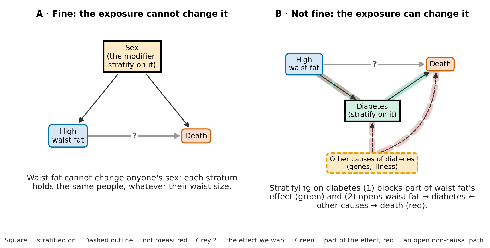
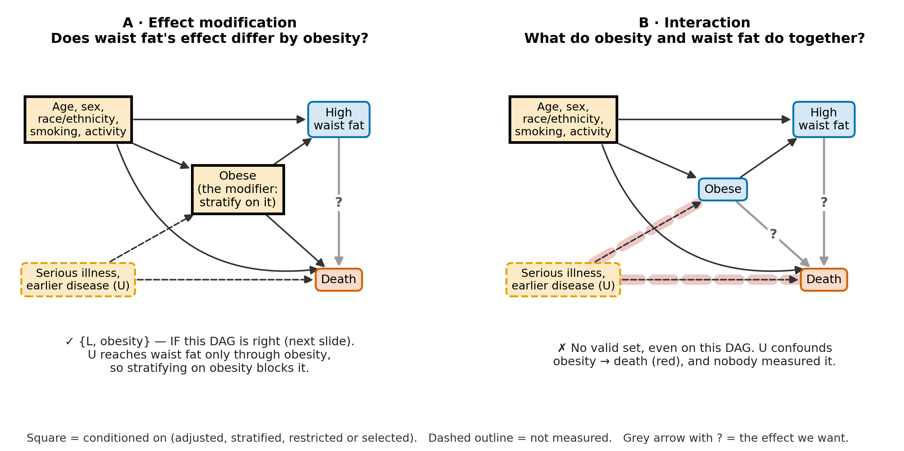
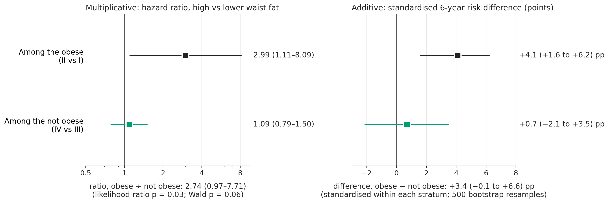

# Week 5 — Effect modification and interaction: learn the distinction, then stress-test it

Duration: ~2.5 h (Tue 6 Oct, before the Thu 8 Oct lab). Deck:
`lectures/slides/Week5_interaction_slides.qmd`. Its MASLD numbers come from
`lectures/analysis/Week5_joint_exposure.R` (written to `Week5_joint_exposure.json`) and from
the P3 and M1 result objects (`examples/_results/`). The code and output on its "In R"
slides come from `lectures/analysis/Week5_code_outputs.R`, which runs each block exactly as
shown and records what R printed.

> **The design.** Teach the clean 2 × 2 idea first, on a made-up fixed-follow-up example
> (smoking, income, hypertension), where the two questions can be read straight off the
> table. Then use MASLD as the **stress test**: the same two questions on the paper's four
> phenotype groups, where time order, sparse cells and selection make the causal reading
> hard. R code sits next to the concept it computes; every causal assumption, target
> population and contrast is stated on the slide.

> **Timing.** The deck's speaker notes give **142 minutes** of content and no break slot.
> With the usual 10-minute break (placed below after Slide 18, before "Count first") that is
> **152 minutes — 2 over the 150-minute class.** Take the two minutes from *If you are
> running behind* at the foot of this file. If you retime a slide, retime it in the deck's
> notes too; this plan copies their minutes.

> **Built on Week 4.** Same rows (**5,911**), same pre-exposure adjustment set L (age, sex,
> race/ethnicity, smoking, sedentary time), same DAG style, Week 4's collapsibility table
> reread for modification (Slide 13), and Week 4's g-computation idea extended to
> standardised survival (Slides 23–26).

> **Row-set discipline.** Every quantitative slide names its rows.
> - **5,911** — Week 4's rows: the locked domain complete on every covariate of the paper's
>   Model 2 and the pre-exposure set. All of the MASLD analysis in Part 3 and Part 4's
>   interaction slides.
> - **6,048** — the locked domain itself: only the crude IV-vs-I table by sex (Slides 33–35),
>   the rows P3's code uses.
> - **1,296** — P3's rows (Groups III + IV complete on Model 1) and **1,291** (Groups III + IV
>   within the 5,911): the sex test on Slide 36.

> **What this week does NOT do.** Survey weights are Week 6: every number here is
> **unweighted**. RERI, AP and S are in the appendix and the lab, not the core lecture.
> Propensity-score methods for subgroup effects (Karim, ch. 8, §8.6) come after the
> propensity-score weeks.

## Learning objectives

By the end, students answer the deck's five questions, in order (Slide 2):

1. Am I changing **one exposure** (effect modification) or imagining **two exposures
   jointly** (interaction)?
2. What is my modifier M, and could **A change M**?
3. On what **scale** am I comparing effects — additive or multiplicative?
4. What do the **four cells** actually contain?
5. What should I **report**, with uncertainty, without over-interpreting it?

…and can write the R for each step: cell counts, stratum-specific HRs from a product term
and the likelihood-ratio test, standardised six-year risks, and the interaction contrast.

## Continuity

- **Last week (Week 4 / L3).** Confounding with obesity as the only exposure; the DAG decides
  what to adjust; ORs and HRs move without confounding (collapsibility).
- **Today.** The paper's real exposure is obesity × waist fat. Two questions on one 2 × 2.
- **Thursday (L4).** EpiMethods `confoundingE2`: the RHC data, a **binary** outcome, DNR as
  the modifier, logistic regression, RERI/AP/S. See *Thursday* below.
- **P3.** One pre-specified modifier on the student's own paper (optional, ungraded; enters
  M1). Slides 10 and 38 are the P3 checklist.

---

## Opening · 6 minutes

## Slide 1 — Two questions hiding in the same 2 × 2 table (4 min)

- The four groups with people and deaths: **I 355 / 4 · II 4,265 / 362 · III 732 / 67 ·
  IV 559 / 101** (5,911 rows). Question 1, effect modification: does waist fat's effect differ
  by obesity? Question 2, interaction: what do the two together do?
- Point at Group I's 4 deaths, but do not unpack the causal problems yet.

## Slide 2 — The map for today (2 min)

- The five questions above; the lecture's recurring algorithm. "A model term such as `A * M`
  comes after these questions."

## Part 1 · Learn the distinction on a clean example · 24 minutes

## Slide 3 — Start with smoking, income, and hypertension (3 min)

- A fixed-follow-up example: A = smoking, M = low income **measured before** the smoking
  window, Y = incident hypertension. Risks 5% / 15% / 10% / 30%. Say the time order out
  loud: it is what makes income a defensible modifier here.

## Slide 4 — Question 1: effect modification (4 min)

- One exposure, smoking; income defines the groups. RD +5 vs +15 points (modified on the
  additive scale); RR 2.0 in both (not modified on the multiplicative scale). Hence
  **effect-measure modification**.

## Slide 5 — In R: read smoking's effect within each income group (3 min)

- A data frame and two lines: RD and RR by income. The code does exactly what the table did.

## Slide 6 — Question 2: interaction (5 min)

- Two exposures, reference = higher income, not smoking. RR 2, 3, 6 = 2 × 3: no
  multiplicative interaction. **IC** defined at first use as a difference of risk
  differences: (30 − 15) − (10 − 5) = **+10 points**; null IC = 0.
- The causal reading is stronger: intervening on income is less well-defined than using
  baseline income to define strata.

## Slide 7 — In R: interaction on two scales (3 min)

- `mult_ratio` = 1 and `IC` = 0.1 (ten percentage points). RERI/AP/S are deliberately not
  introduced here (appendix and lab).

## Slide 8 — Same table, different question (3 min)

- The anchor slide: effect modification imagines changing one variable; interaction, two.
  Point back to it whenever MASLD gets complicated.

## Slide 9 — Confounding is a third idea (3 min)

- Control confounding; describe modification; describe all four exposure states for
  interaction. A product term is a tool, on its model's scale; the question comes first.

## Part 2 · A practical workflow for effect modification · 21 minutes

## Slide 10 — A five-step workflow (3 min)

- Choose A and M with a reason; check A cannot cause M; count A × M cells; estimate A within
  each M on a named scale; report both effects, their contrast and uncertainty, and the
  adjustment set. **This is the P3 workflow.**

## Slide 11 — The modifier must survive the "could A change it?" test (5 min) · **do not drop**

{width=100%}

- "A's effect among people with M = m" is cleanest when A cannot move people into or out of
  M. Sex, age, genes, or a condition established before A are natural candidates; a condition
  measured at the same visit may not be.
- If A could cause M, stratifying may block part of A's effect (green in the figure) or
  induce collider bias (red). **Timing is the practical check, not the definition**: the rule
  is that M must not be affected by A.

## Slide 12 — What do we adjust for? (5 min)

- Effect modification: control confounding of **A → Y** within levels of M; the causal effect
  of M itself need not be identified, but conditioning on M must be causally defensible.
- Interaction: the **joint** effects of A and M must be identified — a stronger requirement.
  The adjustment set follows the question, not the presence of `A * M` in software.

## Slide 13 — Name the scale before saying "no modification" (4 min)

- Week 4's collapsibility table read for modification: OR 4.00 in both age groups, RD 0.30 in
  both, RR 1.60 vs 2.50. Never say "no effect modification" without naming the scale.

## Slide 14 — Two scales are enough for the core lecture (4 min)

- Multiplicative: ratio of HRs (null 1). Additive: difference of RDs (null 0). For survival
  data, use standardised risks at a fixed time for the additive scale.

## Part 3 · Now stress-test the idea with MASLD · 53 minutes, with the break after Slide 18

## Slide 15 — The MASLD question we will try to answer (2 min)

- A = high waist fat (WHtR ≥ 0.6); M = obesity; Y = all-cause death; L = Week 4's
  pre-exposure set. Primary question: does waist fat's effect on death differ between
  people with and without obesity? The paper asked a **prognostic phenotype** question; the
  causal re-reading is ours.

## Slide 16 — Why the MASLD example becomes causally difficult (4 min)

- BMI and waist were measured at the **same examination**; both are adiposity measures, so
  "obesity before waist fat" is an assumption; MASLD ascertainment depends partly on BMI and
  waist; Group I is sparse — the paper reports **5 deaths** (386 people; its Table 2), our
  complete-case rows **4**. Nothing here makes the paper wrong.

## Slide 17 — Causal audit: can obesity really be the modifier? (7 min) · **do not drop**

{width=100%}

- Panel A (effect modification): {L, obesity} is the minimal set **on this DAG**, under
  strong assumptions, including obesity before waist fat. Panel B (interaction): U confounds
  obesity → death and is unmeasured, so the joint effect has no valid set even then.
- "The question changed, so the identification problem changed." dagitty-checked; the
  deck's appendix prints the DAG as dagitty code.

## Slide 18 — What the effect-modification interpretation assumes (5 min)

- Obesity established before the waist-fat exposure; no unmeasured common cause of obesity
  and waist fat that stratifying on obesity would open; L adequate within each stratum;
  conditioning on MASLD not inducing important selection bias. FLI includes BMI **and** waist
  circumference (plus TG and GGT), so the last cannot be ruled out. Say it is an
  identification concern we cannot rule out, not that the bias is large.

## BREAK (10 min) — not in the deck's notes; put it here

## Slide 19 — Count first (3 min)

- Group I anchors the obese waist-fat comparison II vs I and has **4 deaths**. Among 2,432
  obese women only **57** have lower waist fat. Report the cell counts beside the estimates.

## Slide 20 — In R: count before you model (3 min)

- `table(group, died)` and the obese-women table: two lines students reuse in P3.

## Slide 21 — One product-term model, two stratum-specific HRs (4 min)

- `fit <- coxph(... ~ obese * central + L)`. Not obese: **1.09 (0.79–1.50)**; obese:
  **2.99 (1.11–8.09)**; ratio **2.74 (0.97–7.71)**; likelihood-ratio p = 0.03. The product
  term re-parameterises the same four cells; it does not create information where Group I
  has four deaths.

## Slide 22 — In R: recover both HRs and test the product term (4 min)

- `exp(b["central"])` = 1.09 and `exp(b["central"] + b["obese:central"])` = 2.99;
  `anova(fit_main, fit)` gives the likelihood-ratio p, 0.029.

## Slide 23 — Why compute standardised six-year risks? (4 min)

- Our re-analysis, not the paper's. Same people, waist fat set lower then high, predicted
  six-year risk averaged — Week 4's g-computation with a survival model.

## Slide 24 — Additive scale: the standardised six-year results (3 min)

- Obese 2.3% → 6.4% (**+4.1 points**); not obese 9.1% → 9.8% (**+0.7**). Difference of risk
  differences **+3.4 (−0.1 to +6.6)** points (500 bootstrap resamples, 10 of which drew no
  Group I deaths). Model-standardised risks, not observed proportions.

## Slide 25 — In R: use the same people twice, changing only waist fat (4 min)

- `risk6()` copies a stratum, changes only `central`, predicts survival at six years and
  averages: 2.3, 6.4, 9.1, 9.8%.

## Slide 26 — In R: turn the four predictions into risk differences (2 min)

- 4.1 and 0.7 points; difference 3.4.

## Slide 27 — Put both scales on one page (4 min)

{width=100%}

- The report: waist fat **may** have a larger effect among the obese on both scales, but the
  estimate is unstable and rests on a reference cell with four deaths. Avoid "significant
  interaction" as a headline.

## Slide 28 — The paper's IV vs I comparison asks a different question (4 min)

- II vs I and IV vs III change waist fat only (within-row); IV vs I changes both (diagonal):
  useful for phenotype risk stratification, not the effect of high waist fat among the not
  obese. Do not decompose it through alternative routes in the core lecture.

## Part 4 · Interaction, survival tools, and reporting · 38 minutes

## Slide 29 — If obesity is a second exposure, the estimand changes (5 min)

- Keep the coding: A = high waist fat, M = obesity; four potential outcomes Y(a, m).
  Multiplicative: **2.74 (0.97–7.71)**. Additive: with all four joint states standardised to
  one common population, **IC = +3.9 points**. A causal joint-exposure reading also needs
  obesity's effect identified, and U is unmeasured.

## Slide 30 — In R: interaction with the same A and M coding (2 min)

- The multiplicative contrast is the same product term: `exp(b["obese:central"])` = 2.74.

## Slide 31 — In R: the additive interaction contrast (2 min)

- `risk6_all()` sets everyone to each joint state: R00 6.9, R10 7.5, R01 2.5, R11 7.0%
  (III, IV, I, II); IC = 3.9 points. Why 3.9 here and 3.4 before: effect modification
  standardises within each obesity stratum; joint interaction standardises all four states to
  one common population.

## Slide 32 — The right survival tool depends on the scale (4 min)

- Multiplicative: Cox `A * M` → ratio of HRs, **2.74 (0.97–7.71)**. Additive: standardised
  risk at a fixed time → difference of RDs, **+3.4 (−0.1 to +6.6) points**. Do not turn a
  censored outcome into "ever died"; a fixed-follow-up binary outcome (Thursday) is different.

## Slide 33 — A dramatic subgroup claim can be built on almost no information (3 min)

- Crude IV vs I by sex, 6,048 rows: men **36.14 (8.86–147.48)**,
  women **4.11 (0.99–17.12)**; Group I deaths / people **2 / 317** and **2 / 58**. Diagonal phenotype
  comparisons, not sex-specific waist-fat effects. No biological story.

## Slide 34 — In R: reproduce the crude IV-vs-I HRs (3 min)

- `relevel(..., ref = "I")`, one crude Cox model per sex; `groupIV` is IV vs I.

## Slide 35 — In R: now count the reference events (2 min)

- Group I by sex: 2 deaths in men, 2 in women.

## Slide 36 — Ask the subgroup question cleanly (4 min)

- The locked IV-vs-III contrast with sex as the modifier: crude **0.62 (0.26–1.43)**,
  p 0.278 (P3); the paper's Model 1 **1.00 (0.42–2.35)**, p 0.993 (P3); Week 4's pre-exposure
  set **1.13 (0.48–2.66)**, p 0.78. Six-year RDs about +0.8 points in men and +0.5 in women.
  "No evidence" is not "evidence of no difference".

## Slide 37 — In R: one test for sex modification on the locked contrast (3 min)

- Restrict to III + IV; `IV * female` with L; ratio 1.13 (0.48–2.66), likelihood-ratio p 0.78.

## Slide 38 — Honest subgroup reporting (3 min)

- Pre-specify and say why A cannot cause M; name the question; count every cell; A within each
  M on a named scale; contrast and interval, not just p; no invented biology.

## Slide 39 — The algorithm to take into your own paper (3 min)

- One exposure or two? Can A change M? Which scale? What do the cells contain?

## Slide 40 — Key takeaways (4 min)

- Six takeaways; exit question: *one modifier for your own paper, and one sentence on why
  your exposure cannot change it.* **Next:** Week 6, survey weights — design-aware, P3's
  Model 1 sex ratio becomes **2.53 (0.92–6.98)** (M1).

## Appendix (uncounted)

- One model, two parameterisations (`group` ≡ `obese * central`, `all.equal` TRUE).
- RERI, AP, S and IC with their nulls; RERI/AP/S depend on the reference coding and are not
  emphasised because obesity's joint causal effect is not identified here.
- Why diabetes is a risky modifier: diabetes in 13% vs 28% of people with lower vs high waist
  fat. What splitting by diabetes produces:
  waist fat's HR **1.23** without diabetes and **0.93** with it — neither a clean causal subgroup effect if waist fat can affect diabetes.
- Where to read more; references; the two questions as dagitty code.

---

## Thursday — L4 (EpiMethods `confoundingE2`) · for the TA and the instructor, not in the deck

The deck carries no lab bridge; the L4 handout carries the short version of these notes.
They are worth five minutes at the start of Thursday's session.

- **Data.** The RHC data again (Week 4's L3): the 1,439 complete cases, restricted to
  DASI > 20 → **623** patients. Outcome: the binary death variable, **40%** died. Exposure:
  `no_rhc_status`; modifier / second exposure: `no_dnr_status`.
- **The exercise's reference cell.** The exercise text says it changes the reference levels
  "to `No RHC` and `No`"; its code does the reverse. Both indicators are coded 1 for "No", so
  the reference cell (0, 0) is **RHC and a DNR order** — the lowest-risk cell, which RERI
  needs (Knol et al. 2011).
- **Count first — that reference cell holds 3 patients.** Only **23** of the 623 have a DNR
  order (20 without RHC, 3 with). Run
  `with(high_dasi_data, table(rhc_status, dnr_status, death_status))`: the RHC + DNR cell has
  3 patients and 1 death. Everything in Problem 2 divides by it:
  - OR for no RHC among DNR patients **29.8 (1.14–781)**;
  - RERI **−28.5 (−125 to 68)**, AP −14.0, S 0.04 (0.002–0.80);
  - product term p = 0.056 (Problem 1's p = 0.048, with RHC's confounders only).
  - The only well-supported stratum estimate is no RHC among patients **without** a DNR
    order: OR **1.21 (0.78–1.86)**, 600 patients.
  This is Tuesday's "Count first" in the lab's data: Group I has 4 deaths; the lab's
  reference cell has 3 patients.
- **Read the intervals, not interactionR's p column.** interactionR (0.1.7) computes the
  RERI, AP and S p-values one-sided or on the wrong scale: S prints p = 0.98 while its own
  interval (0.002–0.80) excludes 1. The exercise tells students to compare those p-values
  with 0.05.
- **interactionR prints the wrong way round in Problem 1.** With `em = TRUE` it treats the
  **first** name in `exposure_names` as the modifier, so as called it shows DNR's effect by
  RHC — the reverse of Problem 1's question. Read Problem 1 from the Publish rows (no RHC vs
  RHC: **33.0 (1.79–609)** with a DNR order, **1.22 (0.80–1.85)** without), or swap the order
  of `exposure_names`.
- **Statements in the exercise text to correct out loud:**
  1. "SI = 1: no multiplicative interaction" — S is an **additive** measure (deck appendix).
  2. "RERI < 0 … the exposures may be protective when combined" — a negative RERI means
     **less than additive**, not protective.
  3. Interaction as "a departure from multiplicativity" — differs from the *Concepts* page and
     from Tuesday (the joint effect of two exposures, on either scale).
- **Death is common (40%),** so ORs overstate RRs and the OR-based RERI is not the risk-based
  RERI.
- **The 1,439 are complete cases,** which Week 4 showed is selection on early survival (the
  ADL score). It carries into L4 unchanged.
- **Is DNR a fair modifier?** DNR and RHC are both day-1 decisions, and which came first is
  not recorded. Tuesday's rule: A must not be able to change M. If catheterisation (or what
  it revealed) could prompt a DNR order, DNR fails it, and Problem 1's reading assumes it
  could not.
- To reproduce: run the solution's two `glm()` calls on `rhc_data.rds` from
  `confoundingEx2.zip`, plus `interactionR::interactionR()` and `Publish::publish()` as the
  solution calls them.

---

## If you are running behind

The notes run 142 minutes; with the break, 152. Cut in this order.

1. **Slides 30–31 — interaction in R (4 → 1 min).** Say "same product term; IC 3.9 over one
   common population" and move on.
2. **Slides 34–35 — the crude IV-vs-I code (5 → 2 min).** Show the counts slide only.
3. **Slide 23 — why standardise (4 → 2 min).** Slide 25's code walks through it anyway.
4. **Slide 9 — confounding is a third idea (3 → 1 min).**

**Never drop Slides 11, 17, 19 or 27.** The could-A-change-M rule, the causal audit, the
cell counts and the two-scale summary are the argument.

## Reading map — each segment and where students can review it

| Segment | EpiMethods / course page | Key reference |
|---|---|---|
| Definitions (Slides 3–9) | `confounding0` *Concepts*, "Formal Definitions"; effect-modification [video](https://youtu.be/cxfwqBD1M1c) and [slides](https://docs.google.com/presentation/d/1q-RTYkiQV8tCbn71BGL3V11jjlGgq1oBfZwavLuWOks/edit?usp=sharing) | VanderWeele 2009; Bours 2021; Karim ch. 8 §8.2–8.5 |
| The modifier rule, adjustment sets (Slides 11–12, 17–18) | `confounding0`, "Implications for Confounding Control" | Karim ch. 8, Fig. 8.1 |
| Scale (Slides 13–14) | `confounding0`, "The Role of the Scale"; `confounding5` (Week 4) | VanderWeele & Knol 2014 |
| Joint variable vs product term; RERI, AP, S (appendix) | `confounding9`; [interaction tutorial](https://ehsanx.github.io/interaction/) | Knol et al. 2011; Hosmer & Lemeshow 1992 |
| Reporting (Slides 38–39) | `confounding0`, "Reporting guideline" | Knol & VanderWeele 2012; Karim ch. 8 §8.7 |
| Thursday | `confoundingE2`, `confoundingE2solution` | — |

**Before assigning the reading.**

- **Karim, ch. 8.** Sections 8.1–8.5 and 8.7 match today; §8.6 belongs after the
  propensity-score weeks. Three slips in the assigned sections: §8.4.3.1 gives the ratio of
  odds ratios as 1.27 "with a 95% confidence interval of 1.04 to 1.27" (Table 8.3: 1.04–1.56);
  the same paragraph calls OR~M=0~ = 2.93 "the low-income group" although §8.3 codes high
  income as M = 0; and §8.5.1 describes AP as the share "attributed to the exposure" rather
  than to the interaction.
- **The interaction tutorial** states that RERI "ranges from 0 to ∞" and AP "from −1 to 1".
  Both can be negative, and AP can fall below −1.

## Appendix — the two questions as dagitty code

```
dag {
  Waist [exposure]  Death [outcome]  U [latent]
  L -> Obese  L -> Waist  L -> Death
  U -> Obese  U -> Death
  Obese -> Waist  Obese -> Death  Waist -> Death
}
```

With `Waist` as the only exposure dagitty returns {L, Obese}. Add `Obese` as a second
exposure and no set exists; remove the latent tag from `U` and {L, U} appears. Each of Slide
18's assumptions, broken, removes Panel A's set: reverse `Obese -> Waist`; add `U -> Waist`;
add a latent `G -> Obese`, `G -> Waist`; add a latent income node; or add
`FLI [adjusted]  Waist -> FLI  Waist -> TG  TG -> FLI  TG -> Death`.

## References

- Banack HR, Kaufman JS. The obesity paradox: understanding the effect of obesity on mortality among individuals with cardiovascular disease. *Prev Med* 2014;62:96–102.
- Bours MJL. Tutorial: a nontechnical explanation of the counterfactual definition of effect modification and interaction. *J Clin Epidemiol* 2021;134:113–124.
- Hosmer DW, Lemeshow S. Confidence interval estimation of interaction. *Epidemiology* 1992;3:452–456.
- Karim ME. Effect modification in non-randomized studies: methods and applications with propensity scores. Chapter 8 (book chapter).
- Knol MJ, VanderWeele TJ. Recommendations for presenting analyses of effect modification and interaction. *Int J Epidemiol* 2012;41:514–520.
- Knol MJ, VanderWeele TJ, Groenwold RHH, et al. Estimating measures of interaction on an additive scale for preventive exposures. *Eur J Epidemiol* 2011;26:433–438.
- Kueh MTW, et al. Body weight categories and fat distribution in relation to all-cause mortality among adults with metabolic dysfunction-associated steatotic liver disease. *BMJ Open* 2026;16:e113719.
- Lajous M, Bijon A, Fagherazzi G, et al. Body mass index, diabetes, and mortality in French women: explaining away a "paradox". *Epidemiology* 2014;25:10–14.
- VanderWeele TJ. On the distinction between interaction and effect modification. *Epidemiology* 2009;20:863–871.
- VanderWeele TJ, Knol MJ. A tutorial on interaction. *Epidemiol Methods* 2014;3:33–72.
- Westreich D, Greenland S. The Table 2 fallacy: presenting and interpreting confounder and modifier coefficients. *Am J Epidemiol* 2013;177:292–298.
