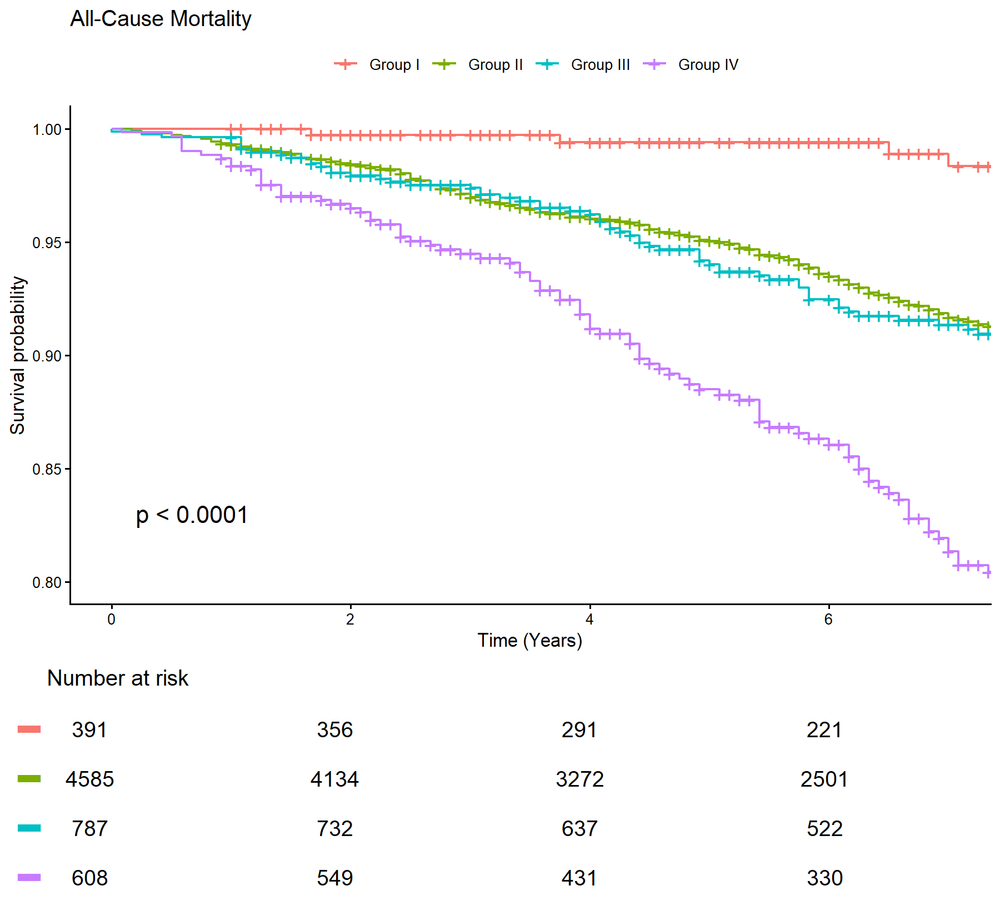

## Week 2 {.center}

### Survey Data Sources & Reading a Methods Section Critically

**The data engine underneath the paper — and how a replicator reads Methods.**

- Data source: **NHANES** (public, documented, versioned)
- Skill: strip a Methods section for its reproducible parts
- Feeds **L1** (Thu) and **M0** shortlisting (due Wk3)

::: {.notes}
Welcome to Week 2. Last week we met the paper and the term-long arc; today we go one level down — into the *data engine* (NHANES) — and we practice the core replicator skill: reading a Methods section for parts. Set the tone: this is where the term's hands-on work begins. Timing: the per-slide markers in these notes sum to ~105 min including the break; the remaining ~45 min of the 150-min session is live work and discussion on the same material — the three-way alcohol recoding at "Extract ELIGIBILITY", the six M0 criteria, the two class prompts already in these notes, and Q&A. The lecture plan carries the full split.
:::

## Learning objectives

- Describe **NHANES structure**: 2-year cycles; interview / MEC / lab components; the `SEQN` merge key; the fasting subsample
- Explain why MASLD is a **surrogate-defined** outcome here (**Fatty Liver Index**) — what non-invasive scores buy and cost
- Read a Methods section to extract the **four primitives**: exposure, outcome, eligibility, variables
- State the **six M0 feasibility criteria** — and place the four primitives correctly inside them: reconstructability is the **pre-screen**, not the whole gate
- Anticipate **L1**: download multiple NHANES cycles and merge on `SEQN`

::: {.notes}
Preview the five objectives; tell students the whole lecture is organized so that by the end they can fill a four-box template for Kueh 2026 and screen any candidate paper the same way — while being clear that the four boxes are the reconstructability screen and M0 asks for six criteria. Objectives map onto slide clusters: NHANES structure (3-6), MASLD/FLI (7-8), four primitives (10-14), M0 (15-16).
:::

## Where we've been, where we're going

- **Wk1 recap:** we set up the course and only **named** the paper (Kueh 2026, MASLD phenotypes & mortality) — one teaser slide, no methods
- We unpack the paper **one piece at a time**, the week each method needs it — **today is the first piece**
- **Today:** open the *data engine* (**NHANES**) + read Methods like a replicator — and meet **what MASLD is** and the **Fatty Liver Index**
- **Sets up:** Thu **L1** (multi-cycle download + merge on `SEQN`) and **M0** (shortlist candidate papers)

::: {.notes}
Continuity slide. Week 1 deliberately only *mentioned* the paper; today is the first real slice of it. Reconnect to the four-verb arc from Week 1, then make the promise concrete: everything downstream — Table 1, confounding, interaction, weights, missing data — rests on understanding this data source and reading the paper's Methods. Say plainly: "you are not expected to know MASLD or the FLI yet — that starts now."
:::

## Where we are in the project

- Term map: **Replicate (Wk2–8) → Interrogate → Improve → Defend**
- Milestones: **M0 (Wk3)** through **M4 (Dec)**
- Today's job: understand the **data source** and *strip a Methods section for parts*
- Two deliverables this week feeds:
  - **L1** (Thu lab)
  - **M0 shortlisting** (due Wk3)

::: {.notes}
(3 min) Orient students on the timeline. M0 is next week — so today's four-primitive template and feasibility criteria are immediately actionable. Keep this fast; it's a map, not a lecture.
:::

## Why start with the data source

- You cannot judge or reproduce a study you don't understand **at the data level**
- The Methods section is a **promise** about data — one you must be able to keep
- NHANES is **public, documented, and versioned** — ideal for a replication course

**MASLD:** Kueh 2026 uses NHANES **2007–2018** (six cycles) — every number we reproduce traces back to public files.

::: {.notes}
(4 min) The framing move of the whole course: reproduction starts at the data. A beautiful results table means nothing if you can't obtain and reconstruct the inputs. Stress "promise you must keep" — Methods is a contract with the reader.
:::

## NHANES in one picture

- Continuous NHANES released in **2-year cycles**: 2007-08, 2009-10, … 2017-18
- ~5,000 examined persons per cycle after screening
- Nationally representative of the US civilian non-institutionalized population via a **complex multistage design** (weights exist — we *use* them in Wk6)
- Data arrive as **many small files by topic**, not one table

**MASLD:** "2007–2018" = six cycles stacked; combining cycles is why the analytic **N runs to several thousand** — the paper reports **~6,300**, our **full analytic file** lands on **6,371**.

::: {.notes}
(8 min) Draw the picture: a stack of cycles, each a bundle of topic files. Note weights exist but defer their use to Wk6 — today just plant the flag. The "many small files" point motivates the merge skill in L1.
:::

## The three data-collection settings

- **Interview (questionnaire)** — at home: demographics, income, alcohol, medical history
- **MEC exam** (Mobile Examination Center) — physical measures: **BMI**, **waist circumference**, blood pressure
- **Laboratory** — blood draws: **triglycerides**, **GGT**, glucose; some assays only in the **fasting subsample**

**MASLD:** FLI needs triglycerides + GGT (lab) + BMI + waist (MEC) — the exposure spans *two* settings, so anyone missing either is **missing the exposure**.

::: {.notes}
(7 min) The three settings map to three sources of files. The key teaching point: the FLI exposure is assembled across settings, so a participant can be present but still un-classifiable. This foreshadows the fasting-subsample and missingness problems.
:::

## `SEQN`: the key that holds it together

- Every respondent has one **`SEQN`** (respondent sequence number), unique *within* a cycle
- Analysis = pick the topic files you need, then **merge on `SEQN`** into one row-per-person table
- **Gotcha:** `SEQN` is unique within a cycle, *not across* cycles → add a **cycle indicator** before stacking

**MASLD:** reproducing Table 1 means merging `DEMO` + `BMX` + `BIOPRO` + `TRIGLY` + `ALQ` + mortality — all keyed on `SEQN`, across six cycles.

::: {.notes}
(7 min) This is the conceptual heart of L1. Make the gotcha vivid: two different people in two cycles can share a SEQN value. If you stack first without a cycle tag, you can silently collide records. Add cycle indicator, then stack — that's the L1 recipe.
:::

## The fasting subsample (and why it will haunt us)

- Some labs (fasting glucose, triglycerides on the calculation path) come **only** from the morning **fasting subsample** → smaller N, its own weight (`WTSAF`)
- Being in the fasting subsample is **not random** with respect to health — a preview of **selection bias**

**MASLD:** FLI needs fasting labs, so it is computable only in NHANES' **designed fasting subsample**. That is a *design* feature with its own weight, **not** missing data.

::: {.notes}
(7 min) Plant the distinction that runs through Weeks 3, 6 and 7: absence *by design* is handled by the subsample weight; absence *within* the subsample is item nonresponse. Ask the class which of the two an imputation model could ever address.
:::

## What "MASLD" actually is

- **MASLD** = metabolic dysfunction-associated steatotic liver disease (the 2023 rename of **NAFLD**): hepatic **steatosis** **+** ≥ 1 cardiometabolic criterion
- Gold-standard steatosis = **biopsy or imaging** — neither exists in NHANES for this window
- So the paper needs a **surrogate** for "fatty liver"

**MASLD:** the disease definition itself *forces* a non-invasive workaround — a feature of the data, not a shortcut by the authors.

::: {.notes}
(6 min) Be fair to the authors here: there is no biopsy/imaging in this NHANES window, so a surrogate isn't cutting corners — it's the only option. This fairness matters for M1: we interrogate the consequences without impugning intent.
:::

## Surrogate outcomes: the Fatty Liver Index

- **FLI** is a published score from **triglycerides, BMI, GGT, waist circumference**
- Kueh calls steatosis at **FLI ≥ 60**
- Non-invasive scores make population studies possible — but **embed their inputs into the case definition**

**MASLD:** seed for **M1** — the phenotype groups are built from **BMI × waist (WHtR)**, and FLI eligibility *also* uses **BMI + waist**. Exposure and cohort selection share inputs → **circularity**. Name it today; dissect it at M1.

::: {.notes}
(8 min) The circularity seed. Say it slowly: the groups are defined by BMI and waist; the eligibility filter (FLI) is also built from BMI and waist. Same variables on both sides. We only *name* it now — the full dissection is M1. This is one of the richest interrogation threads in the whole paper.
:::

## Break

**10 minutes.**

Back for the second half: the **four primitives** and the **M0 feasibility** test.

::: {.notes}
(10 min) Break. When you return, the mode shifts from "understand the data source" to "operationalize reading Methods." Tell them the second half is a template they'll reuse for their own M0 papers next week.
:::

## The four primitives of a reproducible study

- To reproduce *any* paper, extract four things from the Methods:
  - **Exposure**
  - **Outcome**
  - **Eligibility**
  - **Variables** (confounders / covariates)
- If any one is under-specified, the study is **not reconstructable** — no matter how clean the results look

**MASLD:** we'll find **three** boxes clear and **one** (eligibility) *internally contradictory*.

::: {.notes}
(6 min) Introduce the 4-box template. Draw four boxes on the board. The rest of the lecture fills them for Kueh 2026. Foreshadow the punchline: eligibility is the broken box — and that's a gift, not a disqualifier.
:::

## Extract the EXPOSURE

- Exposure = **four phenotypes** from obesity (**BMI ≥ 30**) × central adiposity (**WHtR ≥ 0.6**):
  - **I** obese / low-central
  - **II** obese / high-central
  - **III** non-obese / low-central
  - **IV** non-obese / high-central
- Ask: are cut-points, variables, and coding fully stated? **Mostly yes.**

**MASLD:** the **paper's** group sizes are **386 / 4,541 / 769 / 604**; **our reproduction** gives **391 / 4,585 / 787 / 608**. Either way **Group IV** (non-obese, high-central) has the **worst survival** — the paper's headline.

::: {.notes}
(5 min) Fill the Exposure box. The 2×2 logic (BMI × WHtR) is clean and codeable — this box passes. The KM curve on screen previews the headline: Group IV, the "normal-weight but centrally adipose" group, separates downward. Note the counterintuitive result now; we quantify and adjust it over the following weeks.
:::

## Extract the OUTCOME and follow-up

- Outcome = **all-cause mortality** via NHANES **linked mortality files**
- Time-to-event; **median follow-up ~6.7 y**
- Ask: mortality source, censoring date, time origin all stated? **Yes** — linked NDI is standard and documented

**MASLD:** the paper counts **585** all-cause deaths, our reproduction **586**; Group IV **unadjusted HR ~15.1** collapses to **~2.9** after adjustment — a first lesson that **confounding is enormous** here (Wk4 preview).

::: {.notes}
(5 min) Fill the Outcome box — this one passes cleanly. The dramatic HR shrinkage (15.1 → 2.9) is the hook for the confounding week: the crude signal is real but hugely inflated by age and metabolic covariates. Don't explain the mechanism yet; just make the shrinkage memorable.
:::

## Extract ELIGIBILITY — read it adversarially

- Eligibility = adults with **MASLD** (FLI ≥ 60 **+** ≥ 1 cardiometabolic criterion), plus stated **alcohol** and **missingness** exclusions
- Reading critically = check that the prose **arithmetic** actually lands on the reported **N**

**MASLD — two real discrepancies on screen:** {.incremental}

- Alcohol-exclusion sentence, coded three plausible ways → **N = 4,308 / 5,944 / 6,371** — the text doesn't pin down the cohort
- Table headers mislabel the BMI cut as **"<25"** when the analysis uses **30** — never trust a label you haven't recomputed

::: {.notes}
(8 min) This is the broken box — and the most important slide of the day. Walk through the alcohol sentence three ways and show three different N's. Then the "<25" vs 30 label discrepancy. Message: the paper is *reconstructable* but its eligibility prose is contradictory. That contradiction is interrogation fuel for M1, not a reason to reject the paper.
:::

## Extract the VARIABLES (confounders & covariates)

- Variables = **age, sex, race/ethnicity, income, smoking, comorbidities** — each must map to a specific NHANES file/field
- Ask: is every adjustment variable named precisely enough to pull it? **Mostly** — but **income has ~9% missing** (a Wk7 thread)

**MASLD:** reproduced Table 1 matches closely (**mean age ~51**, **BMI ~33.2**) — evidence the variable definitions are recoverable even where the eligibility prose is not.

::: {.notes}
(5 min) Fill the Variables box — passes, with one flag (income missingness) parked for Wk7. Contrast with eligibility: the paper can have a broken box and three clean ones. Reproducibility is box-by-box, not all-or-nothing.
:::

## M0 feasibility: the four boxes are a pre-screen

A paper is **reconstructable** only if a replicator can — from public data + Methods alone — fill all four boxes:

- **Data:** public, obtainable source (ideally NHANES) with stated version/cycles
- **Exposure & outcome:** explicit variables and cut-points
- **Eligibility:** resolves to a **countable N** (flag contradictions early — they're *interrogation fuel*, not disqualifiers)
- **Confounders:** named, mapping to real fields

*A little ambiguity is fine — it's what M1 interrogates. **Total** under-specification is not.*

**Necessary, not sufficient:** filling the boxes makes a paper reconstructable. It does not get it through **M0**.

::: {.notes}
(4 min) The pre-screen. Emphasize the paradox: the *best* replication targets are papers with clean-enough boxes AND juicy contradictions. A flawless paper is boring; an unreconstructable one is useless. Kueh sits in the productive middle. Then hold the punchline for the next slide — reconstructable is where M0 *starts*.
:::

## M0 has six criteria — the boxes reach three

The boxes give you criteria **1–3**: reconstructable data, a clear exposure and outcome, plausible confounders. Three more must **also** hold:

- **4 · Size and events** — enough observations, and for time-to-event outcomes enough events, for the main analysis *and* at least one stable subgroup/interaction analysis
- **5 · Design variables** — the design feature the analysis has to respect, and what encodes it: survey weights/strata/PSU, a cluster or repeated-measure ID, or follow-up time and censoring. **Not waivable**
- **6 · A genuine incomplete-observation problem** — a variable the locked analysis *actually uses* that is absent for records which should have carried it. Shrinkage from designed subsampling, eligibility or the disease definition is **not** this

**MASLD:** Kueh 2026 clears **all six** — which is why it can carry P1–P5 — *and* hands us a rich interrogation agenda.

::: {.notes}
(3 min) The mistake students make is to screen a paper for how readably its Methods are written and stop there. A beautifully written paper with 40 events, no design feature to respect, or covariates complete by construction fails M0 with all four boxes full. Criteria 5 and 6 are the ones that strand a group at P4 if they are waved through now. Each criterion is confirmed with a specific pointer — a variable name, a file name, a number. Full wording is in the M0 brief.
:::

## Common traps when reading Methods

- **Labels vs. computations** — the "<25 = 30" trap
- **Prose arithmetic** that never sums to the reported N
- **Silent design choices** — unweighted analysis of a survey; a fasting-only exposure treated as universal
- **"Defined-by" scores** whose inputs overlap the exposure → **circularity** — log it now, test at M1

**MASLD:** every trap on this slide is one the demonstration paper **actually contains**.

::: {.notes}
(4 min) A portable checklist students carry into their own M0 papers. The punchline lands hard: this isn't a hypothetical list — Kueh 2026 contains all four. That's exactly why it's the demonstration paper.
:::

## Bridge to today's lab (L1) & your increment

- **In L1 (Thu, EpiMethods wrangling module):** download several NHANES cycles (**2007–2018**), read raw topic files (`DEMO`, `BMX`, lab files), and **merge on `SEQN`** into one analytic-ready, one-row-per-person table — adding a **cycle indicator before stacking**. *Output: a merged multi-cycle dataset you can count and describe.*
- **Why it matters:** L1's merge is the **substrate for the whole term** — every later lab (Table 1, confounding, interaction, weights, missing data) runs on this table
- **M0 shortlisting (toward Wk3 lock):** using today's **four-primitive template** + the **six M0 criteria**, shortlist **2–3 candidate NHANES papers**; for each, be ready to say whether exposure / outcome / eligibility / variables are extractable — the **pre-screen** — *and* whether the paper has enough observations and events, a **design feature to respect**, and a **missing variable the analysis actually uses**. **Lock one at M0 (Wk3).**

**Takeaway:** reading a Methods section *is* the first act of reproduction — you did it to Kueh today; do it to your candidates before Wk3.

::: {.notes}
(5 min) Close the loop. Make the L1 deliverable concrete: a merged, one-row-per-person, multi-cycle table with a cycle indicator. Stress that this table is load-bearing for the entire term. Then set the M0 homework: apply today's template to their own candidate papers and come to Wk3 ready to lock one. End on the takeaway: today's lecture *was* an act of reproduction.
:::
