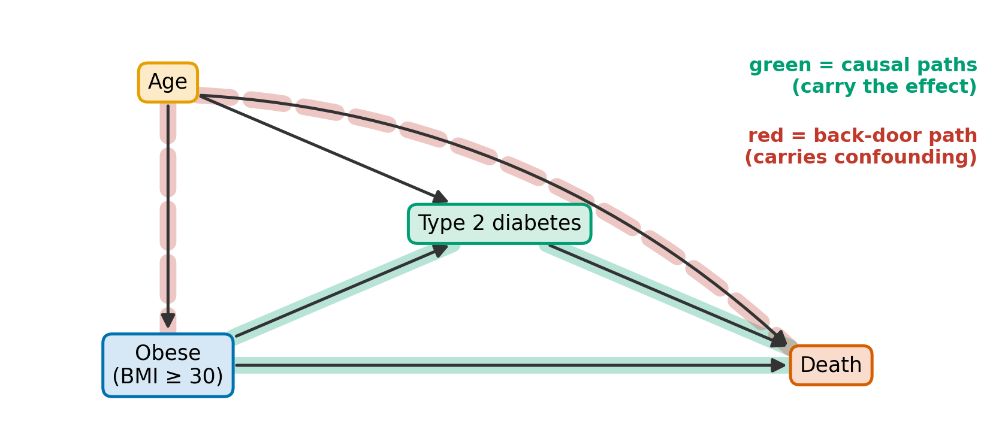
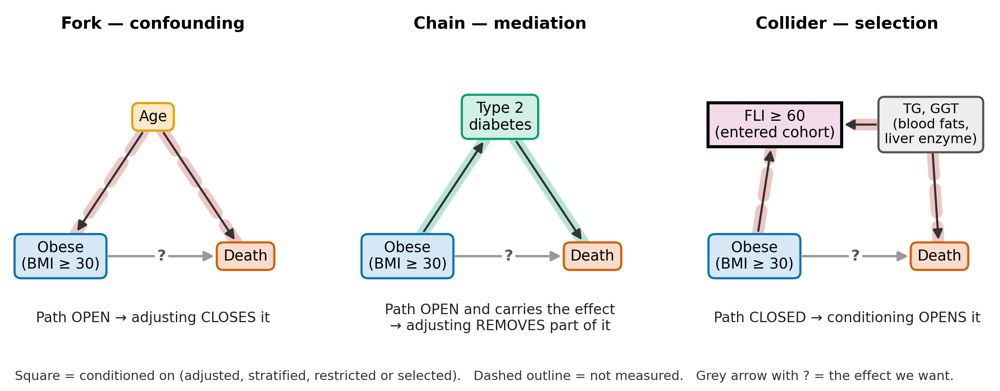
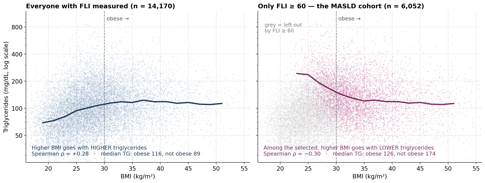
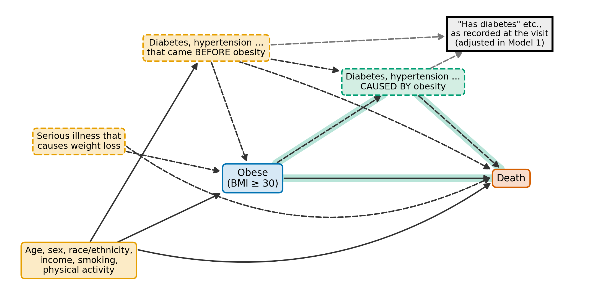
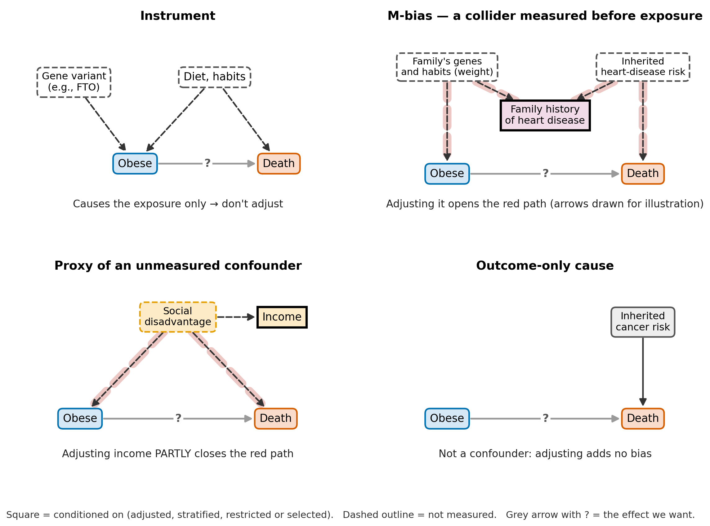

## Today's question: is obesity protective?

Among adults with MASLD, people **with obesity** died **less often** than people without
it: **7.9%** vs **13.0%**. The hazard ratio (HR) for death, obese vs not obese:

| What the model adjusts for | HR (95% CI) |
|---|---|
| Nothing (crude) | **0.67** (0.56–0.81) |
| Age and sex | **0.91** (0.75–1.09) |
| The paper's **Model 1**: age, sex + diabetes, hypertension, cholesterol, kidney disease, heart attack, cancer, medicines | **0.77** (0.64–0.93) |
| The paper's **Model 2**: Model 1 + smoking, sedentary time | **0.80** (0.66–0.97) |

[Same 5,911 people in every row. HR < 1 = a lower death rate with obesity.]{.foot}

::: {.notes}
THE WEEK 4 DECK, with obesity as the only exposure. It covers Plan Slides 1–18 and 22; the Lab 3 bridge (Plan Slides 19–21) is not in it. Every number
comes from lectures/analysis/Week4_bmi_exposure.R (written to Week4_bmi_exposure.json).
The paper does not report obese vs not obese; say so when you show the numbers.
Plan Slides 1–2 (10 min across the first three slides). The HR goes up, then down, then
up: the rest of the lecture explains why. HR 0.67: among people still alive at any point, the death rate with
obesity was about two-thirds of that without (the Cox model assumes the ratio is constant).
Visual language for every DAG: colour = role, dashed outline = not measured, square =
conditioned on, grey arrow with ? = the effect we want.
:::

## Our running example

- **Who:** US adults (NHANES 2007–2018) with **MASLD** — fatty liver (fatty liver index,
  **FLI ≥ 60**) plus at least one cardiometabolic risk factor
- **Exposure (A):** **obesity** — BMI ≥ 30 (≥ 25 for Asian participants). **Outcome (Y):**
  death from any cause, compared with a Cox model's HR
- **People:** 5,911 with complete data — 4,620 with obesity, 1,291 without
- **Adjusting for** (or **conditioning on**) a variable = comparing people with the **same
  value** of it — in a model, by stratifying, by restricting the sample, or by **selecting**
  who enters the study. **L** = measured covariates; **U** = unmeasured ones

::: {.plain}
**Simplified for today.** The paper crosses BMI with waist size to make four groups. We use
**BMI alone**, which the paper does not report — today's numbers are our own reproduction.
:::

::: {.readmore}
**Read more** · Kueh et al., *BMJ Open* 2026 · EpiMethods [Notation and glossary](https://ehsanx.github.io/EpiMethods/notation.html#variables-and-symbols)
· our code: `lectures/analysis/Week4_bmi_exposure.R`
:::

::: {.notes}
Plan Slide 1. Rows: the locked domain (6,048 MASLD adults with a valid fasting weight),
restricted to the 5,911 complete on every covariate of the largest model, so all models use
the same people. Obesity as defined here equals the paper's Groups I + II.
:::

## By the end of today you can…

1. Say what **causal question** an adjusted estimate answers, and what must be true for it
   to answer it
2. Use a **DAG** (a diagram of what causes what) to choose what to adjust for
3. Name the **role** a variable plays — confounder, mediator, collider, instrument, proxy
4. Explain why **odds ratios and hazard ratios** change when you adjust, even with no
   confounding
5. Report adjusted results **without the Table 2 fallacy**

::: {.readmore}
**Read more** · EpiMethods *Concepts*, "Causal roles":
[ehsanx.github.io/EpiMethods/confounding0.html](https://ehsanx.github.io/EpiMethods/confounding0.html)
:::

::: {.notes}
Plan Slide 1.
:::

# Part 1 · What question are we asking? {background-color="#eef4fa"}

[EpiMethods *Concepts*: "The Epistemological Divide" · "The Counterfactual Framework"]{.part}

## Explaining or predicting?

:::: {.columns}
::: {.column width="50%"}
**Predicting:** *"Which adults with MASLD are most likely to die?"*

Anything that tracks death helps — **including** diabetes caused by obesity.
:::
::: {.column width="50%"}
**Explaining:** *"Would they live longer if they were not obese?"*

Adjusting for diabetes **caused by** obesity hides part of the effect we want.
:::
::::

::: {.plain}
Same R code (`+ diabetes`), **opposite rules**. The paper uses causal words (*"confers the
poorest survival"*) but adjusts like a prediction model — for diabetes, kidney disease and
heart attack, which obesity may itself cause.
:::

::: {.readmore}
**Read more** · EpiMethods *Concepts*, "The Epistemological Divide: Explanatory versus
Predictive Modeling"
:::

::: {.notes}
Plan Slide 3 (3 min). Do not adjudicate the paper's framing; name the gap between its
causal wording and its prognostic-looking model. Prediction tools (stepwise, AIC, LASSO)
aim at the wrong target for a causal question — Part 3.
:::

## What we want vs what we can see

| Person | Obese? | Y(1): if obese | Y(0): if not obese |
|---|---|---|---|
| Ana | yes | died | **?** |
| Ben | no | **?** | alive |

- Everyone has two **potential outcomes**; we only ever see one. So we aim for an average:
  the **average treatment effect**, ATE = E[Y(1) − Y(0)]
- The data give E[Y | A = 1] − E[Y | A = 0]: 7.9% − 13.0%. The two match only if the groups
  are **exchangeable** — alike except for obesity
- Here they are not: people without obesity are older (**54.6** vs **50.5** years), more
  often men and more often smokers (**24.7%** vs **18.0%**)

::: {.plain}
Our hope is **conditional exchangeability**: comparable within levels of L (same age, sex …).
It **cannot be tested** — a DAG writes down why we believe it.
:::

::: {.readmore}
**Read more** · EpiMethods *Concepts*, ["The Counterfactual Framework"](https://ehsanx.github.io/EpiMethods/confounding0.html#the-counterfactual-framework-for-defining-causality)
· [video](https://youtu.be/6MGvEVVijQc) · Hernán & Robins, *What If*, ch. 1–2 (free online)
:::

::: {.notes}
Plan Slide 4 (9 min across this and the next slide). Hypothetical people. Causal
inference is a missing-data problem: half of every person's data is always missing. Women
are 52.6% of the obese group and 27.7% of the non-obese, so men are about 47% and 72%.
:::

## Positivity, consistency and a tricky exposure

- **Positivity — is it violated here? No.** It needs every kind of person to appear in both
  groups, and they do: given age, sex, race/ethnicity, smoking and activity, each person's
  predicted chance of obesity lies between **35%** and **97%** — never 0% or 100%
- **But it is thin in places:** among women aged 18–39, **671** have obesity and only **53**
  do not, so what we conclude about young women rests on 53 people
- **Consistency:** "not obese" must mean **one** thing. It doesn't — diet, exercise,
  surgery, a drug, smoking or cancer can each make someone not obese, with different
  effects on death. *What If* uses exactly this example, down to asking whether we mean
  *"a massive liposuction"*

::: {.plain}
**Positivity ✓** holds (thin for young women). **Consistency ✗** is doubtful: "obesity" is
not one well-defined thing we could change.
:::

::: {.readmore}
**Read more** · Hernán & Robins, *What If*, ch. 3: "Consistency: first, define the
counterfactual outcome" · Hernán & Taubman, *Int J Obes* 2008
:::

::: {.notes}
Plan Slide 4. Positivity is about P(obese | kind of person), not P(kind of person | obese).
The 35%–97% range comes from a logistic model of obesity on the pre-exposure covariates.
Cross-check by cells: of the 60 age band × sex × race/ethnicity × smoking cells, 58 hold
both groups; the other 2 hold 8 people between them — chance zeros in tiny cells, not a
structural violation. Among young women, 53 of 724 (7%) are not obese. The 52.6% vs 27.7%
sex split is imbalance (a confounder), not a positivity problem. Consistency matters for the
obesity paradox: a lean-for-life adult and someone who lost weight because they were ill are
both "not obese". The same objection applies to the paper's waist-size exposure.
:::

# Part 2 · Drawing our assumptions: DAGs {background-color="#eef4fa"}

[EpiMethods *Concepts*: "Structural and Knowledge-Based Selection Techniques"]{.part}

## A DAG, and the two kinds of path in it

{fig-align="center" width="70%"}

- **Arrow** = "directly causes"; **no arrow** = a claim of no direct effect
- **Causal paths** (green) follow the arrows forward: obesity → death; obesity → diabetes →
  death. **Back-door paths** (red) start with an arrow **into** obesity: obesity ← age →
  death — they carry **confounding**

::: {.plain}
**Goal:** block every back door, keep the causal paths open, open nothing new — here,
adjust for **age**. [dagitty.net](https://dagitty.net) finds the adjustment sets for you.
:::

::: {.notes}
Plan Slide 5 (6 min). DAG = directed acyclic graph: no loops, because time runs forward.
The strongest assumptions are the arrows you don't draw. EpiMethods calls causal paths
"front-door paths" — not Pearl's front-door criterion. dagitty lists minimal sufficient
adjustment sets: no variable can be dropped; if there are several, any one will do.
:::

## Three building blocks

{fig-align="center" width="94%"}

A **collider** (two arrows collide into it) blocks its path on its own. Adjusting for it —
or for something it causes — **opens** the path.

::: {.readmore}
**Read more** · EpiMethods *Concepts*, ["The Three Elementary Causal Structures"](https://ehsanx.github.io/EpiMethods/confounding0.html#the-three-elementary-causal-structures)
· tutorials: [confounding](https://ehsanx.github.io/EpiMethods/confounding1.html),
[mediator](https://ehsanx.github.io/EpiMethods/confounding2.html),
[collider](https://ehsanx.github.io/EpiMethods/confounding3.html)
:::

::: {.notes}
Plan Slide 6 (9 min across this and the next slide). Fork: adjust. Chain: don't, for the
total effect (everything obesity does to death, by every route). Collider: don't. This
cohort was selected on FLI ≥ 60, and FLI is calculated from BMI, waist, triglycerides (TG)
and GGT (a liver enzyme): the cohort is conditioned on a collider of obesity before any
model is fitted. One-minute check: "Which building block is hypertension?" Hold the
answers — the working DAG shows why the data cannot say.
:::

## Selecting on FLI ≥ 60: a collider you can see

{fig-align="center" width="92%"}

FLI rises with BMI **and** with triglycerides (TG). Keep only FLI ≥ 60, and people with a
low BMI stay in **only if** their TG is high: ρ = +0.28 among everyone, **−0.30** among the
selected.

::: {.notes}
Plan Slide 6. Real NHANES data: 14,170 adults in the fasting subsample with FLI computable
(P1's funnel step 3) and the 6,052 with FLI ≥ 60 (step 4). Grey points in the right panel
are the people the selection removed — point at the empty lower-left corner. Adjusting for
TG and GGT would undo it only in principle: obesity may cause them too.
:::

## Selection can make obesity look protective

{fig-align="center" width="90%"}

People without obesity reach FLI ≥ 60 with higher **TG** (174 vs 126 mg/dL) and **GGT**
(36 vs 25 U/L). If these raise the risk of death, obesity looks **protective** —
**index-event bias**. The birth-weight paradox (left) is the classic case.

::: {.plain}
**Describing** ✓ people with obesity died less often here. **Causal** ✗ "obesity protects"
is not supported.
:::

::: {.notes}
Plan Slide 7 (7 min). Birth-weight paradox: among low-birth-weight babies, a mother's
smoking looked protective, because low birth weight is a collider. Both are forms of
Simpson's paradox. Naming a candidate explanation is not demonstrating it; the size of
the selection bias is unknown. Read more: Hernán, Hernández-Díaz & Robins, Epidemiology
2004; Hernández-Díaz, Schisterman & Hernán, Am J Epidemiol 2006.
:::

## A working DAG for obesity and death

{fig-align="center" width="86%"}

::: {.plain}
**Serious illness** (unmeasured) causes weight loss *and* death — reverse causation.
**"Has diabetes"** is recorded once, so it mixes disease before obesity (a confounder) with
disease caused by it (a mediator). dagitty: **no set of the variables we measured** is valid.
:::

::: {.notes}
Plan Slide 8 (10 min across this and the next slide). DO NOT DROP. Adjusting the recorded
variable blocks some confounding, removes part of obesity's effect, and opens obesity →
disease-after → [recorded] ← disease-before → death. The paper's sensitivity analysis
excluding first-year deaths targets the reverse causation.
:::

## Reading the moves with the DAG

::: {style="font-size: 0.92em"}
| Step | HR | What was added | What the DAG predicts |
|------|------|------------|------------------------|
| Crude | 0.67 | — | confounded |
| + age, sex | 0.91 | **confounders** | closing back doors → **toward 1** ✓ |
| Model 1 | 0.77 | the recorded **conditions** | partly **mediators** → **away from 1** ✓ |
| Model 2 | 0.80 | + **smoking**, sedentary time | smokers are leaner and die more: a confounder → toward 1 ✓ |
| **Pre-exposure only** | **0.95** (0.78–1.14) | age, sex, race/ethnicity, smoking, sedentary time | the closest measured set to the DAG's |
:::

::: {.plain}
Every move goes the way the DAG predicts — **support, not proof**.
:::

::: {.notes}
Plan Slide 8. The pre-exposure model still misses income
(missing for some people; adding it would change the rows) and serious illness, and it is
still selected on FLI. Report it as the main answer to the causal question, with Models 1
and 2 as what they are: adjusted for possible mediators. The Model 1 step is also the
direction non-collapsibility pushes (Part 4), but near 1 that share is small.
:::

## Four more roles a variable can play

:::: {.columns}
::: {.column width="55%"}
{width="100%"}
:::
::: {.column width="45%"}
- **Instrument** (causes the exposure only): **don't** adjust — it can amplify hidden bias
- **M-bias variable** (a collider measured before the exposure): don't, if that is all it
  is. If it might also confound, adjust — M-bias tends to be small
- **Proxy** for an unmeasured confounder: **adjust** — it helps, but doesn't fully fix
- **Outcome-only cause:** optional — no bias, often a sharper estimate
:::
::::

::: {.readmore}
**Read more** · EpiMethods [Z-bias tutorial](https://ehsanx.github.io/EpiMethods/confounding4.html)
· VanderWeele, "Principles of confounder selection", *Eur J Epidemiol* 2019
:::

::: {.notes}
Plan Slide 9 (5 min). Instrument: a gene variant that raises weight (e.g., in FTO) would
be one IF it affected death only through obesity — the idea behind Mendelian randomisation.
Dispute it: genes can have other effects too (pleiotropy). M-bias: family history of heart
disease is in the paper's Table 1 (arrows drawn for illustration). "Proxy" here is a
stand-in for an unmeasured confounder; EpiMethods' prediction box uses "proxy" for a
consequence of the outcome — never adjust for one of those.
:::

## Can't draw the whole DAG? Rules of thumb

::: {style="font-size: 0.9em"}
| Rule | Adjust for | Catch |
|---|---|---|
| Pre-treatment | everything measured before the exposure | may include instruments and M-bias variables |
| Common cause | only causes of **both** | too strict — drops real confounders |
| Disjunctive cause | pre-exposure causes of the exposure **or** the outcome | you only need to know one arrow |
| **Modified disjunctive cause** | the same, **minus** instruments, **plus** proxies | **a practical default** ✓ |
:::

::: {.plain}
Every rule needs **time order**, and one NHANES visit can't tell whether diabetes came
before obesity.
:::

::: {.readmore}
**Read more** · EpiMethods *Concepts*, "Empirical Criteria for DAG-Deficient Scenarios" ·
[video](https://youtu.be/snx3nD3Oyvg) · VanderWeele & Shpitser, *Biometrics* 2011
:::

::: {.notes}
Plan Slide 10 (8 min). Age, sex, race/ethnicity, income, smoking, activity and alcohol all
pass the modified disjunctive rule (alcohol also raises GGT, one of FLI's inputs).
Diabetes, cancer and the other conditions cannot be placed: timing unknown, and causation
runs both ways (illness → weight loss; obesity → diabetes). Medicines follow diagnosis and inherit its
problem. Common cause failing: C1 → A and C2 → Y sharing an unmeasured parent U — adjusting
for EITHER blocks A ← C1 ← U → C2 → Y, but neither is a common cause.
BREAK after this slide (Plan Slide 11, 10 min).
:::

# Part 3 · Why data-driven shortcuts fail {background-color="#eef4fa"}

[EpiMethods *Concepts*: "Modelling criteria for variable selection"]{.part}

## Table 1 describes; a DAG chooses

::: {style="font-size: 0.9em"}
| | Obese | Not obese | p-value | SMD |
|---|---|---|---|---|
| Number of people | 4,620 | 1,291 | | |
| Died, n (%) | 366 (7.9%) | 168 (13.0%) | <0.001 | 0.17 |
| Age, mean (SD) | 50.5 (16.1) | 54.6 (15.5) | <0.001 | 0.26 |
| Women | 52.6% | 27.7% | <0.001 | 0.52 |
| Current smokers | 18.0% | 24.7% | <0.001 | 0.16 |
| Type 2 diabetes | 26.2% | 20.9% | <0.001 | 0.13 |
:::

- **Every p-value is <0.001** — with 5,911 people, even small gaps are "significant". The
  **SMD** (standardised mean difference) measures the gap's **size**: at EpiMethods' cut-off
  of 0.2, sex (0.52) and age (0.26) are imbalanced; smoking (0.16) and diabetes (0.13) are not
- A gap says a variable **differs** between the groups — not whether it is a confounder,
  a mediator or neither. That takes the DAG

::: {.notes}
Plan Slide 12 (5 min). p-values and SMDs as tableone prints them:
print(CreateTableOne(..., strata = "obese"), smd = TRUE). EpiMethods' notation page uses
SMD < 0.2 as its working threshold; 0.1 is also common. The Died row's p-value is the crude
association, not a balance check. Diabetes is more common WITH obesity — consistent with
obesity → diabetes, which is why it may be a mediator. Use Table 1 to spot positivity
problems (53 young women without obesity), small numbers and label mismatches (Week 3:
the paper's tables say "BMI < 25" where its Methods say 30).
:::

## Change-in-estimate: "if it moves, keep it"

**The rule:** add a variable; keep it if the exposure's estimate changes by more than 10%.

- Age and sex: **+34%** → "confounders" ✓ right
- The recorded conditions: **−15%** → "confounders" ✗ probably partly mediators
- Smoking and sedentary time: **+4%** → "not confounders" ✗ smoking **is** a confounder

::: {.plain}
An estimate can move because confounding was removed, **or** part of the effect was removed
(mediators), **or** bias was added (colliders), **or** because ORs and HRs move with no
confounding at all (after the next part). The rule can't tell which.
:::

::: {.readmore}
**Read more** · EpiMethods *Concepts*, "Change-in-Estimate" · [tutorial](https://ehsanx.github.io/EpiMethods/confounding6.html)
· [video](https://youtu.be/Rxg-x-MZykc)
:::

::: {.notes}
Plan Slide 13 (7 min). These are the reasons the HR moved on the first slide. A fifth reason —
different people — is ruled out here: the same 5,911 throughout. The +4% step added
smoking and sedentary time together.
:::

## p-values, stepwise and machine learning

- **Confounding is not a significance test:** a strong confounder can be "not significant"
  in a small sample
- **Stepwise selection** keeps whatever predicts death best — here, diabetes, kidney
  disease, heart attack — and its confidence intervals ignore the search: **too narrow**
- **Purposeful selection** is more careful, but still blind to causal structure: it keeps
  colliders, because colliders move the estimate
- **Machine learning** (e.g., LASSO) is excellent at prediction; in causal work, use it only
  for the prediction parts of a method (propensity scores, later in the course)

::: {.plain}
Choose confounders from **knowledge** — a DAG and the rules of thumb — not from the data.
:::

::: {.readmore}
**Read more** · EpiMethods *Concepts*, "Statistical Significance (Stepwise Selection)",
"Purposeful Selection of Covariates", "Machine Learning (ML)" · Heinze, Wallisch & Dunkler,
*Biom J* 2018
:::

::: {.notes}
Plan Slide 14 (4 min). "Keeps diabetes …": no stepwise analysis has been run; this is what
the algorithm's scoring implies. Purposeful selection screens at p < 0.25 and keeps a
variable whose removal moves other estimates by more than 15–20% (thresholds vary: Bursac
et al. used 0.10). Methods built for confounder selection (post-double-selection,
outcome-adaptive LASSO) come later.
:::

# Part 4 · What adjustment does to the effect measure {background-color="#eef4fa"}

[EpiMethods *Concepts*: "Collapsibility and the Choice of Effect Measure"]{.part}

## Collapsibility: ORs move without confounding

*Made-up numbers. Half of each age group is exposed, so age is **not** a confounder.
OR = odds ratio · RR = risk ratio · RD = risk difference.*

::: {style="font-size: 0.86em"}
| Age group (people) | Risk, exposed | Risk, unexposed | OR | RR | RD |
|---|---|---|---|---|---|
| 60 or older (200) | 0.80 | 0.50 | 4.00 | 1.60 | 0.30 |
| Under 60 (200) | 0.50 | 0.20 | 4.00 | 2.50 | 0.30 |
| **Everyone (400)** | 0.65 | 0.35 | **3.45** | 1.86 | 0.30 |
:::

- **RD** and **RR** are **collapsible**: the overall value is an average of the subgroups'
- **OR** is not: 4.00 in **both** age groups, 3.45 overall. **HRs behave like ORs**
- Adjusting for age moves the OR **away from 1** (3.45 → 4.00) — change-in-estimate would
  wrongly call age a confounder

::: {.readmore}
**Read more** · EpiMethods [collapsibility tutorial](https://ehsanx.github.io/EpiMethods/confounding5.html)
· Naimi & Whitcomb, *Am J Epidemiol* 2020
:::

::: {.notes}
Plan Slide 15 (12 min). Odds = risk ÷ (1 − risk): 0.65/0.35 = 1.857; 0.35/0.65 = 0.538; 1.857/0.538 = 3.45.
The toy is generic (exposed / unexposed) so students do not mistake it for MASLD results.
When the outcome is rare, OR ≈ RR; when it is common, they can differ a lot. In passing:
OR and RD are constant across age groups while the RR is not — whether an effect "varies"
depends on the scale (Week 5).
:::

## Conditional vs marginal — both are right

- **Conditional:** among people with the **same covariate values** — what a regression
  coefficient gives. Here, **OR = 4.00**
- **Marginal:** in the **whole population** — everyone exposed vs everyone unexposed, what
  a randomised trial gives. Here, **OR = 3.45**
- The gap is **not bias**. It needs a real effect, and it always pushes the conditional OR
  or HR **away from 1**

::: {.plain}
Here the marginal OR equals the crude OR **only because age is not a confounder**. With
confounding, the marginal effect is the **standardised** one (next slide) — not the crude.
:::

::: {.readmore}
**Read more** · EpiMethods [collapsibility tutorial](https://ehsanx.github.io/EpiMethods/confounding5.html)
· Hernán, "The hazards of hazard ratios", *Epidemiology* 2010
:::

::: {.notes}
Plan Slide 16 (10 min across this and the next slide). DO NOT DROP: marginal is often
confused with crude — EpiMethods' Collapsibility box writes "marginal (crude)", true only
without confounding. In our HR table, adding the recorded conditions
moved the HR away from 1 (0.91 → 0.77); non-collapsibility pushes that way too, but near 1
its share is small — the mediator explanation fits better. Extra twist for HRs: late in
follow-up, the survivors in each group are the hardier ones.
:::

## Getting a marginal effect: g-computation

1. Fit an outcome model with the exposure and the covariates
2. Set **everyone to obese**; predict each person's risk and average
3. Set **everyone to not obese**; predict and average again — then compare

```r
# fit = glm(died ~ obese + age + female + ..., family = binomial, data = d)
d1 <- transform(d, obese = 1);  d0 <- transform(d, obese = 0)
p1 <- mean(predict(fit, newdata = d1, type = "response"))
p0 <- mean(predict(fit, newdata = d0, type = "response"))
c(RD = p1 - p0, RR = p1 / p0, OR = (p1 / (1 - p1)) / (p0 / (1 - p0)))
```

One logistic model gives the **marginal** RD, RR and OR together. For survival, the same
idea gives a **standardised survival curve**: everyone obese vs no one obese.

::: {.readmore}
**Read more** · EpiMethods [collapsibility tutorial, "Marginal RD, RR and OR"](https://ehsanx.github.io/EpiMethods/confounding5.html#marginal-rd-rr-and-or)
· Snowden, Rose & Mortimer, *Am J Epidemiol* 2011 · Naimi & Whitcomb, *Am J Epidemiol* 2020
:::

::: {.notes}
Plan Slide 16. The code shows the shape of the method; no MASLD number is quoted from it.
The marginal effect answers "what if everyone were obese vs no one", which is the question
a policy or a trial asks.
:::

# Part 5 · Reporting what you estimated {background-color="#eef4fa"}

[EpiMethods *Concepts*: "The Table 2 Fallacy"]{.part}

## Table 2 fallacy: one model, many questions

One Cox model, as a paper's Table 2 would print it:

::: {style="font-size: 0.95em"}
| In one model: obesity + high waist fat + age + sex + diabetes | HR (95% CI) |
|---|---|
| Obese | **0.80** (0.65–0.99) |
| High waist fat (WHtR ≥ 0.6) | **1.17** (0.87–1.57) |
| Age, per 10 years | **2.30** (2.12–2.49) |
| Type 2 diabetes | **1.65** (1.39–1.97) |
:::

::: {.plain}
**Table 2 fallacy** = reading every row as that variable's own effect. Each row answers a
**different** question — and each question needs **its own DAG and adjustment set**.
:::

::: {.readmore}
**Read more** · EpiMethods *Concepts*, ["Why A Single Model Fails"](https://ehsanx.github.io/EpiMethods/confounding0.html#why-a-single-model-fails-a-dag-based-explanation)
· [video](https://youtu.be/W5nFdiP5pU4) · Westreich & Greenland, *Am J Epidemiol* 2013
:::

::: {.notes}
Plan Slide 17 (8 min across the four Table 2 slides). 5,911 people; sex is also in the
model. Take a vote: "Obesity 0.80 — so obesity is protective?" Then show the four DAGs.
:::

## Four questions, four adjustment sets (1 of 2)

{fig-align="center" width="96%"}

**Same DAG, different question — different roles.** Waist fat is a **mediator** in Q1 but
the exposure in Q2; obesity is the exposure in Q1 but a **confounder** in Q2.

::: {.notes}
Plan Slide 17. The DAG assumes obesity comes first (overall weight gain enlarges the
waist). Flip that arrow (waist → obese) and Q1 and Q2 swap roles: the DAG, not the data,
decides.
:::

## Four questions, four adjustment sets (2 of 2)

{fig-align="center" width="96%"}

**Age** needs no adjustment — nothing causes it. **Diabetes** needs a variable nobody
measured (genetic risk), so no model in our data answers Q4.

::: {.notes}
Plan Slide 17. Other confounders (sex, race/ethnicity, smoking, activity) are left out of
the pictures for clarity and are adjusted in every model on the next slide.
:::

## The one model vs each question's own model

::: {style="font-size: 0.88em"}
| Question | Its own DAG says adjust for | Its own model | The one model's row |
|---|---|---|---|
| Q1 · obesity | age (+ sex, race/ethnicity, smoking, activity) | **0.95** (0.78–1.14) | 0.80 (0.65–0.99) |
| Q2 · high waist fat | age, **obesity** (+ the same) | **1.24** (0.93–1.67) | 1.17 (0.87–1.57) |
| Q3 · age, per 10 years | nothing | **2.38** (2.21–2.56) | 2.30 (2.12–2.49) |
| Q4 · diabetes | age, obesity, waist + genetic risk (**unmeasured**) | **1.71** (1.43–2.04)\* | 1.65 (1.39–1.97) |
:::

- **Obesity** looks "protective" (0.80) in the one model because it holds waist fat and
  diabetes fixed — both on obesity's path. Its own model says **0.95**
- Even where the numbers are close, each row **means** something different

::: {.plain}
**Rule:** one exposure, one model, one row reported — covariates in a footnote.
\* Still confounded: genetic risk is not measured.
:::

::: {.notes}
Plan Slides 17–18. The one model's obesity row is a controlled direct effect at best, and
holding diabetes fixed also opens obesity → diabetes ← genetic risk → death. The paper's own
Table 2 shows only its exposure rows, with covariates in a footnote: the right layout.
Plan Slide 18 (the paper's four BMI × waist groups, Week 5) is one line on the closing
slide in this deck.
:::

## Key takeaways

1. An adjusted estimate answers a causal question only under **assumptions** — draw them
   as a **DAG**
2. Adjust for **confounders**; not for **mediators** (for the total effect), **colliders**
   or **instruments**. **Selecting** who is in the study counts as adjusting
3. Choose confounders from knowledge, not p-values or change-in-estimate
4. **ORs and HRs** move on adjustment even without confounding; RDs and RRs don't
5. **One exposure per model** — the other rows are not effects
6. Obesity's apparent protection (**0.67**) mostly disappears with pre-exposure variables
   (**0.95**). Adjustment can't fix what's unmeasured (serious illness) or the selection
   (FLI ≥ 60)

::: {.plain}
**Next:** Week 5 — the paper's four BMI × waist groups (effect modification). **Exit
question:** the one arrow in your own paper's DAG you are least sure of?
:::

::: {.notes}
Plan Slides 18 and 22 (4 min). Week 6 redoes analyses with the NHANES survey weights.
:::

## Where to read more {visibility="uncounted"}

::: {style="font-size: 0.8em"}
| Topic | EpiMethods | Key reading |
|---|---|---|
| Notation, positivity, consistency | [Notation and glossary](https://ehsanx.github.io/EpiMethods/notation.html) | Hernán & Robins, *What If* (free) |
| Potential outcomes | [*Concepts* — Counterfactual Framework](https://ehsanx.github.io/EpiMethods/confounding0.html#the-counterfactual-framework-for-defining-causality) · [video](https://youtu.be/6MGvEVVijQc) | Hernán & Robins, *What If*, ch. 1 |
| DAGs | [*Concepts* — Grammar of causal diagrams](https://ehsanx.github.io/EpiMethods/confounding0.html#the-grammar-of-causal-diagrams) · videos [1](https://youtu.be/hvK0VIX8kxE) [2](https://youtu.be/Y_9SQznhoXo) [3](https://youtu.be/9Zglfijstdk) | Greenland et al. 1999; Tennant et al. 2021 |
| Roles, by simulation | tutorials [1](https://ehsanx.github.io/EpiMethods/confounding1.html) [2](https://ehsanx.github.io/EpiMethods/confounding2.html) [3](https://ehsanx.github.io/EpiMethods/confounding3.html) [3b](https://ehsanx.github.io/EpiMethods/confounding3b.html) [4](https://ehsanx.github.io/EpiMethods/confounding4.html) | — |
| Rules of thumb | [*Concepts*](https://ehsanx.github.io/EpiMethods/confounding0.html) — Empirical Criteria · [video](https://youtu.be/snx3nD3Oyvg) | VanderWeele 2019 |
| Data-driven selection | [*Concepts*](https://ehsanx.github.io/EpiMethods/confounding0.html) — Modelling criteria · [tutorial](https://ehsanx.github.io/EpiMethods/confounding6.html) | Heinze et al. 2018 |
| Collapsibility, standardisation | [tutorial](https://ehsanx.github.io/EpiMethods/confounding5.html) · [marginal RD/RR/OR](https://ehsanx.github.io/EpiMethods/confounding5.html#marginal-rd-rr-and-or) | Naimi & Whitcomb 2020 |
| Table 2 fallacy | [*Concepts* — Why a single model fails](https://ehsanx.github.io/EpiMethods/confounding0.html#why-a-single-model-fails-a-dag-based-explanation) · [video](https://youtu.be/W5nFdiP5pU4) | Westreich & Greenland 2013 |
| Test yourself | [EpiMethods quiz](https://ehsanx.github.io/EpiMethods/confoundingQ.html) | — |
:::

## References (1 of 2) {visibility="uncounted"}

::: {style="font-size: 0.66em"}
- Greenland S, Pearl J, Robins JM. Causal diagrams for epidemiologic research. *Epidemiology* 1999.
- Heinze G, Wallisch C, Dunkler D. Variable selection — a review and recommendations for the practicing statistician. *Biom J* 2018.
- Hernán MA. The hazards of hazard ratios. *Epidemiology* 2010.
- Hernán MA, Hernández-Díaz S, Robins JM. A structural approach to selection bias. *Epidemiology* 2004.
- Hernán MA, Robins JM. *Causal Inference: What If.* Chapman & Hall/CRC 2020 (free online).
- Hernán MA, Taubman SL. Does obesity shorten life? The importance of well-defined interventions to answer causal questions. *Int J Obes* 2008.
- Hernández-Díaz S, Schisterman EF, Hernán MA. The birth weight "paradox" uncovered? *Am J Epidemiol* 2006.
:::

## References (2 of 2) {visibility="uncounted"}

::: {style="font-size: 0.66em"}
- Kueh MTW, et al. Body weight categories and fat distribution in relation to all-cause mortality among adults with metabolic dysfunction-associated steatotic liver disease. *BMJ Open* 2026;16:e113719. doi:10.1136/bmjopen-2025-113719
- Naimi AI, Whitcomb BW. Estimating risk ratios and risk differences using regression. *Am J Epidemiol* 2020.
- Snowden JM, Rose S, Mortimer KM. Implementation of G-computation on a simulated data set: demonstration of a causal inference technique. *Am J Epidemiol* 2011.
- Tennant PWG, et al. Use of directed acyclic graphs (DAGs) to identify confounders in applied health research: review and recommendations. *Int J Epidemiol* 2021.
- VanderWeele TJ. Principles of confounder selection. *Eur J Epidemiol* 2019.
- VanderWeele TJ, Shpitser I. A new criterion for confounder selection. *Biometrics* 2011.
- Westreich D, Greenland S. The Table 2 fallacy: presenting and interpreting confounder and modifier coefficients. *Am J Epidemiol* 2013.
:::

## Appendix: our working DAG as dagitty code {visibility="uncounted"}

Paste into the *Model code* box at [dagitty.net](https://dagitty.net). With `Ill`, `Before`
and `After` marked latent (never measured), dagitty reports that **no adjustment set
exists**. Remove the latent tags from `Ill` and `Before`, and it returns **{Before, Ill, L}**.

```
dag {
  Obese [exposure]  Death [outcome]  Ill [latent]  Before [latent]  After [latent]
  L -> Obese  L -> Death  L -> Before
  Ill -> Obese  Ill -> Death
  Before -> Obese  Before -> Death  Before -> After
  Obese -> After  After -> Death  Obese -> Death
  Before -> Blend  After -> Blend
}
```

`L` = age, sex, race/ethnicity, income, smoking, physical activity. `Ill` = serious illness
that causes weight loss. `Blend` = the recorded "has diabetes (etc.)" variable.
