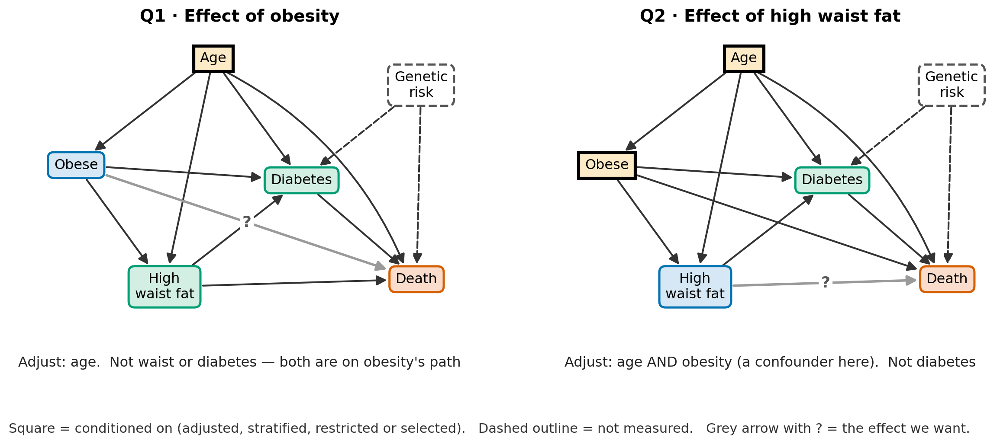
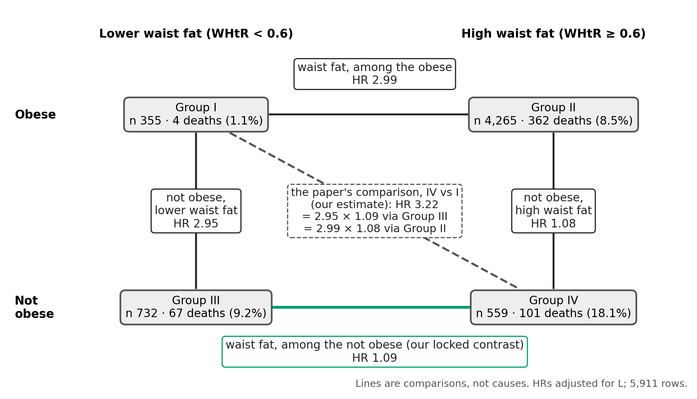

## Does waist fat matter more for some people?

The paper's exposure is not one variable but **two crossed**: obesity and waist fat.

| Group | Obese? | Waist fat (WHtR) | People | Deaths |
|---|---|---|---|---|
| I | yes | lower (< 0.6) | 355 | **4** (1.1%) |
| II | yes | high (≥ 0.6) | 4,265 | 362 (8.5%) |
| III | no | lower | 732 | 67 (9.2%) |
| IV | no | high | 559 | 101 (18.1%) |

[Same 5,911 people as Week 4. WHtR = waist-to-height ratio.]{.foot}

::: {.plain}
Week 4 asked about **obesity alone**. Today: does **waist fat's** effect depend on obesity —
and what do the two do **together**? Two questions that sound alike, and are not.
:::

::: {.notes}
Plan Slide 1 (4 min). Every number comes from lectures/analysis/Week5_joint_exposure.R
(written to Week5_joint_exposure.json). Rows: Week 4's — the locked domain restricted to the
5,911 complete on every covariate. Point at Group I's 4 deaths now; the whole lecture comes
back to it. Visual language for every DAG is Week 4's: colour = role, dashed outline = not
measured, square = conditioned on, grey arrow with ? = the effect we want.
:::

## Our running example

- **Who:** the Week 4 cohort — US adults with MASLD (NHANES 2007–2018), **5,911** with
  complete data
- **Exposure (A):** **high waist fat**, WHtR ≥ 0.6. **Second variable (M):** **obesity**,
  BMI ≥ 30 (≥ 25 for Asian participants). **Outcome (Y):** death from any cause
- **L** = Week 4's **pre-exposure set**: age, sex, race/ethnicity, smoking, sedentary time.
  Every new model today adjusts for L — not for the paper's Model 1 conditions, some of
  which Week 4 showed may be mediators
- **Potential outcomes:** Y(a) when only A is set; Y(a, m) when both are set

::: {.plain}
The paper compares every group with Group I and never asks either of today's questions.
**Today's numbers are our own analysis of the paper's data.**
:::

::: {.readmore}
**Read more** · Week 4 deck, "Reading the moves with the DAG" · EpiMethods
[Notation and glossary](https://ehsanx.github.io/EpiMethods/notation.html#variables-and-symbols)
· our code: `lectures/analysis/Week5_joint_exposure.R`
:::

::: {.notes}
Plan Slide 2 (3 min). Groups I + II = obese, Groups II + IV = high waist fat. The
pre-exposure set is the one Week 4 reported as "the closest measured set to the DAG's";
Week 4 got HR 0.95 for obesity with it. Week 4's L also listed income; it is missing for
516 of the 5,911, so adding it would change the rows (Plan Slide 8). Slides 22–23 also
show P3's crude and Model 1 fits, labelled as such.
:::

## By the end of today you can…

1. Tell **effect modification** from **interaction**, and say which one your analysis answers
2. Choose the **adjustment set** each question needs — Week 4's DAGs, one step further
3. Name the **scale** (additive or multiplicative), and explain why the answer can differ
4. **Count** the people and deaths in every cell before trusting an interaction measure
5. Use **time-to-event tools**: a Cox product term, and standardised risks for the additive
   scale
6. Report a **subgroup finding** without over-reading it

::: {.readmore}
**Read more** · EpiMethods *Concepts*, "Unpacking Effect Heterogeneity: Interaction vs.
Effect Modification": [ehsanx.github.io/EpiMethods/confounding0.html](https://ehsanx.github.io/EpiMethods/confounding0.html#formal-definitions)
:::

::: {.notes}
Plan Slide 3 (2 min).
:::

# Part 1 · Two questions that sound alike {background-color="#eef4fa"}

[EpiMethods *Concepts*: "Unpacking Effect Heterogeneity" · "Formal Definitions"]{.part}

## Effect modification: one exposure

- **One exposure, A.** A second variable, M, only sorts people into groups. Is A's effect
  the **same in every group**?
- Within M = m, compare the two potential outcomes:
  RD~m~ = P[Y(1) = 1 | M = m] − P[Y(0) = 1 | M = m], and RR~m~ the same as a ratio.
  Effect modification on the additive scale if RD~1~ ≠ RD~0~; multiplicative if RR~1~ ≠ RR~0~
- **MASLD:** does high waist fat's effect on death **differ between the obese and the not
  obese**? We imagine changing waist fat only; obesity just sorts people

::: {.plain}
M's **own** effect needs no causal story: sex can modify an effect though nobody can set it.
But M must be something **A cannot change** (Part 2 shows why).
:::

::: {.readmore}
**Read more** · EpiMethods *Concepts*, ["Formal Definitions"](https://ehsanx.github.io/EpiMethods/confounding0.html#formal-definitions)
· [video](https://youtu.be/cxfwqBD1M1c) · VanderWeele, *Epidemiology* 2009 · Karim,
*Effect modification in non-randomized studies*, ch. 8, §8.4
:::

::: {.notes}
Plan Slide 4 (5 min). The definition conditions on M; it does not intervene on it. That is
why the exposure needs exchangeability, positivity and consistency (Week 4) but the modifier
does not (Karim ch. 8, §8.4.1). Ask: "Could sex modify an effect? Could anyone set your sex?"
:::

## Interaction: two exposures, one joint effect

- **Two exposures, A and M.** Each person now has **four** potential outcomes:
  Y(0, 0), Y(1, 0), Y(0, 1), Y(1, 1)
- Is the effect of **both together** different from what each does alone — more (synergy)
  or less (antagonism)?
- **MASLD:** what would happen to deaths if we could set **both** obesity and waist fat?
  All four groups are compared with **one** reference

::: {.plain}
**Same 2 × 2 table, different question.** Effect modification imagines changing **one**
variable; interaction imagines changing **two**.
:::

::: {.readmore}
**Read more** · EpiMethods *Concepts*, ["Formal Definitions"](https://ehsanx.github.io/EpiMethods/confounding0.html#formal-definitions)
· Bours, *J Clin Epidemiol* 2021 · Karim, ch. 8, §8.5
:::

::: {.notes}
Plan Slide 5 (5 min). Same letter M, new role: in interaction M is a second exposure we
imagine setting (Karim ch. 8 keeps M for both; EpiMethods writes B). Interaction is
symmetric — it does not matter which exposure you call A. Effect modification is not:
"waist fat's effect, by obesity" and "obesity's effect, by waist fat" are different
questions (Plan Slide 9).
:::

## Confounding, modification, interaction

| | What it is | What you do with it |
|---|---|---|
| **Confounding** | a common cause that biases **one** estimate | **remove** it — adjust |
| **Effect modification** | A's effect differs across levels of M | **report** it — one estimate per level |
| **Interaction** | A and M together differ from A and M apart | **report** all four combinations |
| **A product term** (A × M) | a term in a **model** | a tool for both questions, on that model's scale only |

::: {.plain}
One product-term model can serve either question **if it has that question's adjustment
set**. What differs is the set (next) and how you **read** the output.
:::

::: {.notes}
Plan Slide 6 (4 min). The same variable can be a confounder and a modifier at once: obesity
confounds waist fat → death (Week 4, Table 2 Q2) and is today's modifier. A confounder is
something to fix; a modifier is a result to describe.
:::

# Part 2 · What to adjust for {background-color="#eef4fa"}

[EpiMethods *Concepts*: "Implications for Confounding Control"]{.part}

## Each question has its own adjustment set

- **Effect modification of A by M:** adjust for the confounders of **A → Y**. M needs none
- **Interaction of A and M:** adjust for the confounders of **A → Y and of M → Y** — a
  bigger demand
- Week 4's rule, one step further: **the adjustment set follows the question**

::: {.plain}
Same two variables, same data: one question can need far more than the other. In MASLD,
that decides which question we can even attempt.
:::

::: {.readmore}
**Read more** · EpiMethods *Concepts*, ["Implications for Confounding Control"](https://ehsanx.github.io/EpiMethods/confounding0.html#implications-for-confounding-control)
· effect-modification [slides](https://docs.google.com/presentation/d/1q-RTYkiQV8tCbn71BGL3V11jjlGgq1oBfZwavLuWOks/edit?usp=sharing)
(smoking, income and education) · Karim, ch. 8, Fig. 8.1
:::

::: {.notes}
Plan Slide 7 (4 min). The EpiMethods slides run the classic example. Income as a modifier
of smoking → hypertension: {age, gender}. Income as a second exposure: add diet or
education, and the slides ask "but how?" — income has no arrow into hypertension, so is it
a real exposure or a proxy for education? Their "true" interaction is education as the
second exposure, needing only {age, gender}. The same question returns today: is obesity a
second exposure, or only a sorter?
:::

## In MASLD, one question needs less

{fig-align="center" width="94%"}

::: {.notes}
Plan Slide 8 (10 min across this and the next slide). DO NOT DROP. Panel A: the back door
waist ← obese ← U → death passes through obesity, so stratifying on obesity blocks it —
{L, obesity} is the one minimal set ON THIS DAG. Panel B: obesity is now an exposure, and
obese ← U → death is open; no measured set closes it. With U measured, {L, U} would do. U
merges Week 4's two latent nodes (serious illness; disease that came before obesity) —
Week 4's appendix needed {Before, Ill, L} for the same reason. dagitty confirms all of this
(appendix code).
:::

## What Panel A's ✓ assumes

- **Obesity comes before waist fat** (Week 4's Table 2 DAG). If waist fat drives BMI
  instead, the exposure changes obesity, so obesity cannot be the modifier (two slides on)
- **U reaches waist fat only by moving people across BMI 30.** Adjusting for BMI itself
  barely moves today's estimates: 2.80 and 1.07, against 2.99 and 1.09
- **Nothing unmeasured causes both obesity and waist fat** (a fat-distribution gene, say):
  obesity is a collider of U and that cause, so stratifying on it would open a path
- **L is complete.** Week 4's L also had income, missing for 516 of the 5,911

::: {.plain}
Under all of this sits the **FLI ≥ 60 selection**: FLI is computed from BMI **and waist**, so
the cohort is selected on a child of both exposures (Week 4). That biases even Panel A —
for IV vs III, downward. Interaction fails **before** any of these.
:::

::: {.notes}
Plan Slide 8, continued. Each bullet is dagitty-checked: flip obese → waist; add a latent
G → obese, G → waist; add waist → FLI ← TG → death with FLI selected — each removes Panel A's
set. Panel B has no set even without them. Week 4's plan gave the FLI direction for IV vs
III: the not obese with low waist fat reach FLI ≥ 60 with higher triglycerides and GGT.
The honest summary: modification is answerable only under strong, stated assumptions;
interaction is not answerable even under those.
:::

## Which way round? Choosing the modifier

{fig-align="center" width="86%"}

::: {.plain}
**Waist fat by obesity:** obesity is a confounder (Q2), so stratifying on it helps.
**Obesity by waist fat:** waist fat is on obesity's path (Q1), so stratifying on it removes
part of obesity's effect — and this Week 4 figure leaves out U, which also blocks obesity's
own effect. Which variable comes first decides which reading works: the DAG, not the data.
:::

::: {.notes}
Plan Slide 9 (3 min). This is Week 4's Table 2 figure, Q1 and Q2, reused on purpose; it was
drawn without U. A modifier caused by the exposure is a mediator (or a collider) in
subgroup form: Week 4's problems come back. Age, sex and race/ethnicity are before waist
fat; obesity is, only under the arrow we drew; diabetes and medicines are not.
:::

## The exposure must not change the modifier

{fig-align="center" width="70%"}

::: {.plain}
"Waist fat's effect among people with M = m" makes sense only if waist fat cannot move people
into or out of that group. So the modifier must be something **the exposure cannot change**.
The safe check is time — sex, age, genes, a condition that began **before** the exposure.
*Recorded at the same visit* is not enough: waist fat could have caused the diabetes found at
the NHANES exam. Our modifier, obesity, passes only if it came before the waist fat.
:::

::: {.notes}
Plan Slide 9a (5 min). Two things go wrong at once in panel B. (1) Part of waist fat's
effect runs through diabetes, and holding diabetes fixed cuts that route out. (2) The
strata stop holding comparable people: among people with diabetes, those with high waist
fat often got it from the waist fat, while those with lower waist fat got it some other
way — genes, illness — which also raises the risk of death. That is collider bias, Week 4's
FLI lesson in subgroup form. What is still allowed: a modifier that causes the exposure, a
confounder, or a marker nobody can change. A variable that arises after the exposure but is
not affected by it (calendar time, say) is also fine — timing is the safe check, "cannot be
changed by the exposure" is the rule. If the downstream variable is what interests you,
the question becomes mediation: the effect with diabetes held fixed (a controlled direct
effect, which needs diabetes' own confounders measured), or the effect among people whose
diabetes would not change with waist fat — not a subgroup you can see in the data. The
"obesity paradox" has panel B's shape in heart disease (Banack & Kaufman 2014) and in
diabetes (Lajous et al. 2014); whether collider bias explains all of it is debated. Obesity
passes only under the arrow obese → waist fat (the first assumption under Panel A's ✓).
Thursday's DNR order is a timing question of the same kind.
:::

## In R: could waist fat cause the modifier?

<!-- code: diabetes_tab -->
```r
tab <- table(diabetes = d$t2dm, high_waist = d$central)
tab                                    # people
#>         high_waist
#> diabetes    0    1
#>        0  947 3482
#>        1  140 1342
round(100 * prop.table(tab, 2))        # % in each waist group
#>         high_waist
#> diabetes  0  1
#>        0 87 72
#>        1 13 28
```

::: {.plain}
Diabetes is twice as common with high waist fat (28% vs 13%). That does not prove waist fat
causes it, but it is plausible — so diabetes fails the rule and is a risky modifier.
:::

[`d`: Week 4's 5,911 people, one row each. `t2dm`: 1 = diabetes at the exam; `central`: 1 =
high waist fat. The "In R" slides are one R session, run in order:
`lectures/analysis/Week5_code_outputs.R`.]{.foot}

::: {.notes}
Plan Slide 9b (2 min). `prop.table(tab, 2)` gives column percentages: of the people with
lower waist fat, 13% have diabetes; of those with high waist fat, 28%.
:::

## In R: what splitting by diabetes does

<!-- code: diabetes -->
```r
f_no  <- coxph(Surv(time_yr, dead) ~ central + obese + age + female +
                 race + smk_current + sed, data = subset(d, t2dm == 0))
f_yes <- coxph(Surv(time_yr, dead) ~ central + obese + age + female +
                 race + smk_current + sed, data = subset(d, t2dm == 1))
round(summary(f_no)$conf.int["central", c(1, 3, 4)], 2)   # HR, lower, upper
#> exp(coef) lower .95 upper .95
#>      1.23      0.85      1.78
round(summary(f_yes)$conf.int["central", c(1, 3, 4)], 2)
#> exp(coef) lower .95 upper .95
#>      0.93      0.56      1.54
```

::: {.plain}
Without diabetes the HR is **1.23 (0.85–1.78)**; with it, **0.93 (0.56–1.54)** — a gap well
within noise. And **neither** is waist fat's effect in a fixed group: waist fat moves people
into one stratum and out of the other, so both cut the diabetes route and may compare unlike
people (panel B).
:::

[`time_yr`: years followed; `dead`: 1 = died; `obese`: 1 = obese. L = `age`, `female`, `race`,
`smk_current`, `sed` (sedentary time, standardised). `c(1, 3, 4)` picks the HR and its
interval.]{.foot}

::: {.notes}
Plan Slide 9c (2 min). One model per diabetes stratum — the stratified approach of Karim
ch. 8, §8.4.3.2. Whether the gap is collider bias, a real difference or noise, the data
cannot say; a product term for the two strata gives p ≈ 0.2. The point is that neither
number can be read as modification. That 1.23 is close to Week 4's 1.24 does not rescue it.
:::

# Part 3 · Which scale? {background-color="#eef4fa"}

[EpiMethods *Concepts*: "The Role of the Scale: Effect Measure Modification"]{.part}

## Last week's table, read for modification

*Week 4's made-up collapsibility table: half of each age group exposed.*

| Age group (people) | Risk, exposed | Risk, unexposed | OR | RR | RD |
|---|---|---|---|---|---|
| 60 or older (200) | 0.80 | 0.50 | 4.00 | **1.60** | 0.30 |
| Under 60 (200) | 0.50 | 0.20 | 4.00 | **2.50** | 0.30 |

- Does age **modify** the exposure's effect? **RR: yes** (1.60 vs 2.50). **OR: no** (4.00
  in both). **RD: no** (0.30 in both)
- Same data, three answers. That is why the careful name is **effect-measure
  modification**

::: {.plain}
Never write "there is no effect modification" without naming the **scale**.
:::

::: {.readmore}
**Read more** · EpiMethods *Concepts*, ["The Role of the Scale"](https://ehsanx.github.io/EpiMethods/confounding0.html#the-role-of-the-scale-effect-measure-modification)
· Week 4 deck, "Collapsibility: ORs move without confounding"
:::

::: {.notes}
Plan Slide 10 (3 min). Week 4's notes promised this: the same table, read the other way.
Constant OR and constant RD together is a constructed coincidence; real data usually differ
on every scale.
:::

## In R: the same table, three scales

<!-- code: scale_toy -->
```r
toy <- data.frame(age = c("60+", "<60"),
                  risk1 = c(0.80, 0.50), risk0 = c(0.50, 0.20))
toy$RD <- toy$risk1 - toy$risk0                    # risk difference
toy$RR <- toy$risk1 / toy$risk0                    # risk ratio
toy$OR <- (toy$risk1 / (1 - toy$risk1)) /
          (toy$risk0 / (1 - toy$risk0))            # odds ratio
toy
#>   age risk1 risk0  RD  RR OR
#> 1 60+   0.8   0.5 0.3 1.6  4
#> 2 <60   0.5   0.2 0.3 2.5  4
```

::: {.plain}
One line per measure. The **RR** differs by age (1.6 vs 2.5); the **OR** (4) and the **RD**
(0.3) do not. Same data, three answers — so name the scale.
:::

::: {.notes}
Plan Slide 10a (2 min). Week 4's made-up table, typed into a data frame.
:::

## Two scales, two questions

*R~am~ = risk with A = a and M = m (11 = both, 00 = neither); RR~am~ = R~am~ ÷ R~00~.*

:::: {.columns}
::: {.column width="50%"}
**Multiplicative** — do the **ratios** differ?

- **ratio of HRs** = HR for A among M = 1 ÷ HR for A among M = 0
- in a Cox or logistic model: exp(product-term coefficient)
- **1** = none
:::
::: {.column width="50%"}
**Additive** — do the **differences** differ?

- RD~M=1~ − RD~M=0~; for two exposures, the **interaction contrast**
  IC = R~11~ − R~10~ − R~01~ + R~00~
- **RERI** (relative excess risk due to interaction) = RR~11~ − RR~10~ − RR~01~ + 1
- **0** = none
:::
::::

- Two more: **AP** (attributable proportion) = RERI ÷ RR~11~, 0 = none; **S** (synergy index)
  = (RR~11~ − 1) ÷ [(RR~10~ − 1) + (RR~01~ − 1)], 1 = none. RERI, AP and S are all
  **additive-scale** measures
- The additive scale counts **deaths you could prevent, and in whom**

::: {.readmore}
**Read more** · VanderWeele & Knol, "A tutorial on interaction", *Epidemiol Methods* 2014
· [Interaction tutorial](https://ehsanx.github.io/interaction/) (oral cancer, alcohol and
smoking: OR, RR and RD versions)
:::

::: {.notes}
Plan Slide 11 (6 min). RERI uses ratios relative to R~00~, so it needs that reference to be
the LOWEST-risk cell; if an exposure is protective, recode it first (Knol et al. 2011).
Thursday's lab does exactly that recoding. RERI and AP can be negative, with no lower
bound. The lab's text calls S a multiplicative measure: it is additive.
:::

## Same data, two answers

| Risk of the outcome | M absent | M present |
|---|---|---|
| **A absent** | 5% | 15% |
| **A present** | 10% | 30% |

- **Multiplicative:** RR 2 for A alone, 3 for M alone, 6 for both = 2 × 3 → **no
  interaction**
- **Additive:** RERI = 6 − 2 − 3 + 1 = **2**; IC = 30 − 10 − 15 + 5 = **+10 points** →
  **positive interaction**

::: {.plain}
When both exposures **raise** risk, no multiplicative interaction **means** positive additive
interaction: RERI = (RR~10~ − 1)(RR~01~ − 1) > 0. Neither scale is "right": **report both**,
and say which scale each verdict refers to.
:::

::: {.notes}
Plan Slide 12 (3 min). Made-up numbers. Same arithmetic as baselines differing: an equal
ratio on a higher baseline is a bigger difference. The reverse also exists (additive null,
multiplicative non-null); say so in one line.
:::

## In R: RERI, AP, S and IC from four risks

<!-- code: measures_toy -->
```r
r00 <- 0.05; r10 <- 0.10; r01 <- 0.15; r11 <- 0.30   # risk, A = a, M = m
rr10 <- r10 / r00; rr01 <- r01 / r00; rr11 <- r11 / r00
RERI <- rr11 - rr10 - rr01 + 1
round(c(ratio = rr11 / (rr10 * rr01),          # multiplicative: 1 = none
        RERI  = RERI,                          # additive: 0 = none
        AP    = RERI / rr11,                   # additive: 0 = none
        S     = (rr11 - 1) / ((rr10 - 1) + (rr01 - 1)),   # additive: 1 = none
        IC    = r11 - r10 - r01 + r00), 3)     # additive, in risk: 0 = none
#> ratio  RERI    AP     S    IC
#> 1.000 2.000 0.333 1.667 0.100
```

::: {.plain}
**ratio = 1:** no multiplicative interaction. **RERI = 2, AP = 0.33, S = 1.67, IC = +0.10**
(ten points): positive additive interaction. Same four risks, two verdicts.
:::

::: {.notes}
Plan Slide 12a (3 min). The made-up risks from the last slide. AP = 0.33: a third of the
risk in the doubly exposed group is due to the interaction. Part 4 uses exactly these
formulas, with hazard ratios and standardised risks in place of the four risks.
:::

## What to report: one table, both scales

::: {style="font-size: 0.9em"}
| Report | Effect modification | Interaction |
|---|---|---|
| People **and** outcomes in every cell | yes | yes |
| Every combination vs **one** reference (the lowest-risk cell) | yes | yes |
| A's effect within each level of M | yes | yes |
| M's effect within each level of A | — | yes |
| Measures on **both** scales, with intervals | yes | yes |
| What was adjusted for | A's confounders | **both** exposures' confounders |
:::

::: {.readmore}
**Read more** · Knol & VanderWeele, *Int J Epidemiol* 2012 · EpiMethods *Concepts*,
["Reporting guideline"](https://ehsanx.github.io/EpiMethods/confounding0.html#reporting-guideline)
· Karim, ch. 8, §8.7
:::

::: {.notes}
Plan Slide 13 (2 min). The rest of the lecture fills this table in for MASLD. BREAK after
this slide (Plan Slide 14, 10 min).
:::

# Part 4 · The four groups, analysed {background-color="#eef4fa"}

[EpiMethods: "Interaction" — a joint-exposure analysis on NHANES]{.part}

## Count first

| | Lower waist fat | High waist fat |
|---|---|---|
| **Obese** | Group I: 355 people, **4** deaths | Group II: 4,265 people, 362 deaths |
| **Not obese** | Group III: 732 people, 67 deaths | Group IV: 559 people, 101 deaths |

- Every comparison **with Group I** divides by **4 deaths** — and Group I is the
  **lowest-risk** cell, the reference the additive measures need
- **Week 4's positivity check, for the new exposure:** of 2,432 obese women, only **57**
  have lower waist fat; among the obese, the chance of high waist fat given L runs from
  27%–99.7%

::: {.plain}
The cell the method needs most is the one the data fill least. **Print these counts** in
every interaction table.
:::

[5,911 rows, as Week 4.]{.foot}

::: {.notes}
Plan Slide 15 (3 min). Group I: 57 women, 2 of the 4 deaths. Among the not obese the
chance of high waist fat runs 3%–95%. In the bootstrap that follows, 10 of 500 resamples
drew none of Group I's deaths at all; they are kept, since they are what the data allow.
For obese women, the obese-stratum risks lean on the model more than on data.
:::

## In R: count first

<!-- code: counts -->
```r
table(group = d$group, died = d$dead)
#>      died
#> group    0    1
#>   I    351    4
#>   II  3903  362
#>   III  665   67
#>   IV   458  101
with(subset(d, obese == 1 & female == 1),     # obese women only
     table(high_waist = central))
#> high_waist
#>    0    1
#>   57 2375
```

::: {.plain}
Two lines of code, before any model: **4** deaths in Group I, and only **57** of 2,432 obese
women with lower waist fat.
:::

[5,911 rows. `dead`: 1 = died during follow-up. `central`: 1 = high waist fat.]{.foot}

::: {.notes}
Plan Slide 15a (2 min). Knol & VanderWeele ask for exactly these counts in the reporting
table.
:::

## One model, two ways to write it

<!-- code: twoways -->
```r
fit_joint <- coxph(Surv(time_yr, dead) ~ group +
                     age + female + race + smk_current + sed, data = d)
fit_prod  <- coxph(Surv(time_yr, dead) ~ obese * central +
                     age + female + race + smk_current + sed, data = d)
all.equal(fit_joint$loglik, fit_prod$loglik)     # the same fit?
#> [1] TRUE
round(exp(coef(fit_prod))[c("obese", "central", "obese:central")], 2)
#>         obese       central obese:central
#>          0.34          1.09          2.74
```

- **The same fit** (`TRUE`): the 4-group factor and the product term are two ways of
  writing one model. Both adjust for L = age, sex, race/ethnicity, smoking, sedentary time
- `obese` (0.34) is obesity's HR among those with **lower** waist fat; `central` (1.09) is
  waist fat's HR among the **not obese** only; `obese:central` (2.74) is the **ratio** of
  waist fat's HR in the obese to that in the not obese
- Reading `central` as "the effect of waist fat" is the **Table 2 fallacy** again

::: {.readmore}
**Read more** · EpiMethods ["Interaction" — joint variable and product-term models](https://ehsanx.github.io/EpiMethods/confounding9.html#model-1.-joint-variable-model)
· Westreich & Greenland, *Am J Epidemiol* 2013 ("…confounder and modifier coefficients")
:::

::: {.notes}
Plan Slide 16 (4 min). `obese` and `central` are 0/1; `group` is I–IV. obese = 0.34 is
1 ÷ 2.95: Group I vs Group III. `Publish::publish()`
prints the stratum-specific estimates for you (Thursday); `interactionR`'s effect-modification
table treats the FIRST exposure named as the modifier, so check which way round it prints.
:::

## In R: which hazard ratio is which

<!-- code: strata -->
```r
b <- coef(fit_prod)
round(exp(b[["central"]]), 2)                 # not obese: IV vs III
#> [1] 1.09
round(exp(b[["central"]] + b[["obese:central"]]), 2)   # obese: II vs I
#> [1] 2.99
d$notobese <- 1 - d$obese      # flip: the obese become the reference
fit_flip <- coxph(Surv(time_yr, dead) ~ notobese * central +
                    age + female + race + smk_current + sed, data = d)
round(summary(fit_flip)$conf.int["central", c(1, 3, 4)], 2)   # HR, lower, upper
#> exp(coef) lower .95 upper .95
#>      2.99      1.11      8.09
```

::: {.plain}
Add coefficients to get each stratum's HR. For its confidence interval, **flip the coding**
so the other stratum is the reference: then `central` is waist fat's HR among the obese,
**2.99 (1.11–8.09)**.
:::

::: {.notes}
Plan Slide 16a (3 min). The flip is the "re-run with a different reference group" of Karim
ch. 8, §8.4.3.1. `Publish::publish()` and `interactionR` do the same arithmetic for you.
:::

## In R: does the product term matter?

<!-- code: lrt -->
```r
# fit_prod: from "One model, two ways"
fit_main <- coxph(Surv(time_yr, dead) ~ obese + central +   # no product
                    age + female + race + smk_current + sed, data = d)
round(exp(coef(fit_main))[["central"]], 2)    # one HR for all: Week 4's
#> [1] 1.24
lr <- anova(fit_main, fit_prod)       # likelihood-ratio test, product term
round(c(chisq = lr$Chisq[2], p = lr$`Pr(>|Chi|)`[2]), 3)
#> chisq     p
#> 4.754 0.029
```

::: {.plain}
Without the product term, waist fat gets **one** HR for everyone — Week 4's **1.24**. Letting
it differ by obesity improves the fit: likelihood-ratio **p = 0.03**. Borderline, and resting
on Group I's 4 deaths.
:::

::: {.notes}
Plan Slide 16b (2 min). `fit_main` is Week 4's Table 2 "Q2" model: waist fat adjusted for
obesity and L. The Wald p for the product term is 0.06; with only 4 deaths in the reference
cell, the likelihood-ratio test is the better guide.
:::

## In R: standardised six-year risks

<!-- code: std -->
```r
risk6 <- function(people, g) {   # fit_joint: from "One model, two ways"
  people$group <- factor(g, levels = levels(d$group))   # set everyone to g
  1 - mean(summary(survfit(fit_joint, newdata = people), times = 6)$surv)
}
ob <- subset(d, obese == 1); notob <- subset(d, obese == 0)
r_within <- c(I = risk6(ob, "I"), II = risk6(ob, "II"),           # obese
              III = risk6(notob, "III"), IV = risk6(notob, "IV"))  # not obese
round(100 * r_within, 1)                  # standardised 6-year risk, %
#>   I  II III  IV
#> 2.3 6.4 9.1 9.8
rd <- 100 * c(obese = r_within[["II"]] - r_within[["I"]],
              not_obese = r_within[["IV"]] - r_within[["III"]])
round(c(rd, difference = rd[["obese"]] - rd[["not_obese"]]), 1)   # points
#>      obese  not_obese difference
#>        4.1        0.7        3.4
```

::: {.plain}
Week 4's g-computation with a survival curve: set everyone in a stratum to each waist level,
predict six-year survival, average. Waist fat adds **4.1** points among the obese and **0.7**
among the not obese: a difference of **3.4** points.
:::

::: {.notes}
Plan Slide 16c (3 min). Effect modification standardises WITHIN each obesity stratum: the
obese are set to Groups I and II, the not obese to III and IV. The intervals on the next
slide come from 500 bootstrap resamples in Week5_joint_exposure.R; 10 of them drew none of
Group I's deaths.
:::

## Effect modification: waist fat, by obesity

{fig-align="center" width="100%"}

::: {.plain}
Week 4's single answer for waist fat, **1.24 (0.93–1.67)**, assumed **one** HR for everyone.
Let it differ by obesity: **2.99** among the obese, **1.09** among the not obese. Both scales
point the same way. The evidence is **borderline** — likelihood-ratio p = 0.03, Wald interval
0.97–7.71 — and the obese estimate rests on Group I's 4 deaths.
:::

[5,911 rows, adjusted for L. Risk differences are standardised six-year risks (Week 4's
g-computation): within each stratum, everyone set to lower, then high, waist fat.]{.foot}

::: {.notes}
Plan Slide 17 (4 min). Standardised risks within each stratum: among the obese, 2.3% vs
6.4%; among the not obese, 9.1% vs 9.8%. With only 4 deaths in the reference cell the
likelihood-ratio test is the better guide than the Wald test; its profile-likelihood
interval for the ratio is 1.10–9.18. Do not let either threshold decide: the honest
reading is "possibly larger among the obese, resting on four deaths". Sensitivity: adding
BMI itself gives 2.80 and 1.07 (ratio 2.62). The green row is our locked contrast, with
Week 4's pre-exposure set instead of Model 1.
:::

## The paper's IV vs I, taken apart

{fig-align="center" width="70%"}

- IV vs I changes **both** exposures, and splits two ways: **2.95 × 1.09** via Group III, or
  **2.99 × 1.08** via Group II. Which step looks big depends on the route — because the two
  **interact**, today's topic
- Either way, the big step is the one that **leaves Group I** and its 4 deaths. The
  one-exposure-at-a-time contrast is our locked **IV vs III: 1.09**

[3.22 is our estimate of the paper's comparison, adjusted for L. The paper reports 2.9
(its Model 2).]{.foot}

::: {.notes}
Plan Slide 18 (4 min). 2.95 × 1.09 and 2.99 × 1.08 both give 3.22 up to rounding: the
product identity holds both ways, the attribution does not. This is why the course locked
IV vs III: it changes one exposure at a time, and it is the reading Panel A targets. With
the paper's Model 1 instead of L, P2's locked estimate is 1.06 (0.77–1.45) on 5,939 rows;
the story is the same.
:::

## Interaction: four cells, one reference

*HR (95% CI) vs Group I, the lowest-risk cell, adjusted for L · deaths in the cell. The two
"exposures" are now **not being obese** (A) and **high waist fat** (M): RR~10~ = Group III,
RR~01~ = Group II, RR~11~ = Group IV.*

::: {style="font-size: 0.86em"}
| | Lower waist fat | High waist fat | Waist fat, within row |
|---|---|---|---|
| **Obese** | 1 (reference) · 4 deaths | 2.99 (1.11–8.09) · 362 | 2.99 (1.11–8.09) |
| **Not obese** | 2.95 (1.07–8.13) · 67 | 3.22 (1.17–8.87) · 101 | 1.09 (0.79–1.50) |
| **Not obese, within column** | 2.95 (1.07–8.13) | 1.08 (0.86–1.35) | |
:::

- **Multiplicative:** HR~IV~ ÷ (HR~II~ × HR~III~) = **0.37 (0.13–1.03)** — the forest plot's 2.74,
  coded the other way (0.37 = 1 ÷ 2.74, up to rounding)
- **Additive:** RERI = **−1.72 (−4.57 to 1.13)**. Standardised 6-year risks with everyone in
  Group I, II, III or IV: **2.5%, 7.0%, 6.9%, 7.5%** → IC = **−3.9 (−6.7 to −0.5)** points

::: {.plain}
The point estimates are **less than additive** — the same borderline evidence as before,
coded the other way. Every comparison with Group I leans on its 4 deaths (1.09 and 1.08 do
not). And this **cannot be read as causal**: U, obesity's confounder, was never measured.
:::

::: {.notes}
Plan Slides 19–20 (5 min). RERI needs the lowest-risk cell as its reference (Knol et al.
2011), and here it is the paper's own reference — which is also why its comparisons are so
imprecise. AP = −0.53, S = 0.56: the same verdict, less than additive. The RERI interval
includes 0 and the IC interval does not: different measures, one from hazard ratios and one
from standardised risks over everyone; do not let a threshold pick between them. The
risk-based RERI (IC ÷ R~00~) is −1.56, close to the −1.72 from hazard ratios.
:::

## In R: RERI, AP, S and IC for the four groups

<!-- code: joint -->
```r
# fit_joint and risk6(): from the earlier In-R slides
h <- exp(coef(fit_joint))[c("groupII", "groupIII", "groupIV")]   # vs I
RERI <- h[["groupIV"]] - h[["groupII"]] - h[["groupIII"]] + 1
round(c(RERI = RERI, AP = RERI / h[["groupIV"]],
        S = (h[["groupIV"]] - 1) /
            ((h[["groupII"]] - 1) + (h[["groupIII"]] - 1))), 2)
#>  RERI    AP     S
#> -1.72 -0.53  0.56
r_all <- sapply(c("I", "II", "III", "IV"),
                function(g) risk6(d, g))       # everyone, set to each group
round(100 * c(r_all, IC = r_all[["IV"]] - r_all[["II"]] -
                          r_all[["III"]] + r_all[["I"]]), 1)
#>    I   II  III   IV   IC
#>  2.5  7.0  6.9  7.5 -3.9
```

::: {.plain}
Read the four risks in pairs. If everyone were obese, high waist fat would add 7.0 − 2.5 =
**4.5** points; if no one were, 7.5 − 6.9 = **0.6**. IC = 0.6 − 4.5 = **−3.9**: waist fat adds
more among the obese — the standardised-risk slide's pattern, now averaged over everyone.
Both point estimates are below additive; RERI's interval includes 0 (−4.57 to 1.13), IC's
does not (−6.7 to −0.5).
:::

::: {.notes}
Plan Slide 20a (3 min). With Group I as the reference, "not obese" is the first exposure,
so "less than additive" here means "waist fat adds more among the obese". The risk-based
RERI is IC ÷ R(Group I) = −1.56.
:::

# Part 5 · Tools for time-to-event, and a subgroup claim {background-color="#eef4fa"}

[EpiMethods *Concepts*: "Reporting guideline"]{.part}

## The right tools for a time-to-event outcome

::: {style="font-size: 0.86em"}
| Scale | Tool | Effect modification (waist fat, obese vs not) | Interaction (Group I reference) |
|---|---|---|---|
| Multiplicative | product term in the **Cox** model → ratio of HRs | 2.74 (0.97–7.71) | 0.37 (0.13–1.03) |
| Additive | **standardised risks** at a fixed time → difference of RDs, or IC | +3.4 (−0.1 to +6.6) points | IC −3.9 (−6.7 to −0.5) points |
| Additive, shortcut | **RERI from HRs** — close to the risk-based RERI when deaths are uncommon | — | −1.72 (risk-based −1.56) |
:::

- **Don't** turn survival into "ever died" and fit a logistic model: it throws away
  follow-up time and censoring
- A **binary** outcome with fixed follow-up (Thursday's lab) is different: logistic is
  right there. But an OR approximates an RR only when the outcome is **rare**, so with a
  common outcome an RERI from ORs is **not** the RERI from risks

[5,911 rows, adjusted for L.]{.foot}

::: {.notes}
Plan Slide 21 (3 min). The standardised-risk idea is Week 4's g-computation with a survival
curve: set everyone's group, predict survival at 6 years, average. Effect modification
standardises within each obesity stratum; interaction standardises over everyone. Thursday's
lab: death is common there (about 40%), so read its RERI as an OR-based quantity.
:::

## A dramatic subgroup claim

*Crude HR, Group IV vs Group I, fitted separately in men and women (the 6,048-row locked
domain, where Group I has 375 people):*

| | Men | Women |
|---|---|---|
| HR, IV vs I | **36.14 (8.86–147.48)** | **4.11 (0.99–17.12)** |
| Group I, deaths / people | 2 / 317 (0.6%) | 2 / 58 (3.4%) |

- "Non-obese waist fat is far deadlier in men"? Each HR **divides by a death rate built on
  2 deaths**
- The crude ratio, women vs men, is 0.11 (0.02–0.85): "significant" — for a contrast that
  changes **both** exposures, in a crude model

::: {.plain}
**Count first.** A "significant" interaction can rest on four deaths.
:::

::: {.notes}
Plan Slide 22 (4 min). Rows: the 6,048-row locked domain, crude, as in P3's code. P3's
worked example retires exactly this table. Do not offer a mechanism for the gap: the point
is what each number rests on, not why it is large.
:::

## In R: count Group I by sex first

<!-- code: sexcount -->
```r
with(subset(dom, group == "I"), table(female, died = dead))   # 6,048 rows
#>       died
#> female   0   1
#>      0 315   2
#>      1  56   2
```

::: {.plain}
**Two** deaths among the men in Group I, and **two** among the women. Every IV-vs-I hazard
ratio in the last table divides by one of these death rates.
:::

[`dom`: the 6,048-row locked domain, before rows with incomplete covariates are dropped —
the rows P3's code uses.]{.foot}

::: {.notes}
Plan Slide 22a (2 min).
:::

## The same question, asked properly

*Our locked contrast, IV vs III, with sex as the modifier: one test of the product term.*

::: {style="font-size: 0.9em"}
| Model | Ratio of HRs, women ÷ men | p |
|---|---|---|
| Crude (P3; 1,296 rows) | 0.62 (0.26–1.43) | 0.278 |
| The paper's Model 1 (P3; 1,296 rows) | 1.00 (0.42–2.35) | 0.993 |
| Week 4's pre-exposure set (1,291 rows) | 1.13 (0.48–2.66) | 0.78 |
:::

- Additive (P3): six-year risk differences of +0.8 (−3.3 to +4.2) points in men and
  +0.5 (−7.3 to +7.6) in women — small point estimates, wide intervals

::: {.plain}
**No evidence of modification at this precision** — and an interval compatible with the
effect in women being **less than half**, or **more than twice**, that in men. Report the
interval; don't explain a gap the data cannot.
:::

[p: likelihood-ratio tests. 1,296 = Groups III + IV complete on Model 1; 1,291 = Groups III +
IV within Week 4's 5,911.]{.foot}

::: {.notes}
Plan Slide 23 (4 min). The first two rows are P3's (examples/_results/P3.json); the third is
from today's analysis. A null test is not evidence that sex is irrelevant. If students saw
an earlier version of this lecture: it called the crude gap "confounding by baseline risk";
that claim is withdrawn — the data cannot say what produced it.
:::

## In R: one test for sex, on the locked contrast

<!-- code: sextest -->
```r
s34 <- subset(d, group %in% c("III", "IV"))   # the locked contrast only
s34$IV <- as.integer(s34$group == "IV")
f0 <- coxph(Surv(time_yr, dead) ~ IV + female +        # no product term
              age + race + smk_current + sed, data = s34)
f1 <- coxph(Surv(time_yr, dead) ~ IV * female +        # IV x sex
              age + race + smk_current + sed, data = s34)
round(summary(f1)$conf.int["IV:female", c(1, 3, 4)], 2)   # HR, lower, upper
#> exp(coef) lower .95 upper .95
#>      1.13      0.48      2.66
round(anova(f0, f1)$`Pr(>|Chi|)`[2], 2)        # likelihood-ratio p
#> [1] 0.78
```

::: {.plain}
Restricting to Groups III and IV makes the product term test exactly the locked contrast:
**1.13 (0.48–2.66)**, likelihood-ratio **p = 0.78**. No evidence of modification, and an
interval wide enough to allow large differences either way.
:::

::: {.notes}
Plan Slide 23a (2 min). This is the third row of the previous table. P3's own code fits the
same model with the paper's Model 1 covariates on 1,296 rows.
:::

## Honest subgroup reporting

1. **Pre-specify** one modifier, with a reason. One well-argued modifier beats twenty
2. Say **which question** — effect modification or interaction. It sets the adjustment set
3. **Count** the people and outcomes in every cell
4. Report **both scales**, with intervals, and name the reference cell
5. A big crude gap is not evidence of modification; a null test is not evidence of none
6. Don't **explain** a difference the data cannot

::: {.readmore}
**Read more** · Knol & VanderWeele, *Int J Epidemiol* 2012 · Karim, ch. 8, §8.7–8.8 ·
[Interaction tutorial: effect modification](https://ehsanx.github.io/interaction/effect-modification-1.html)
:::

::: {.notes}
Plan Slide 24 (2 min). This is the checklist for P3: one pre-specified modifier on the
student's own paper, the cell counts, both scales, and a one-line verdict stated as
evidence, not mechanism.
:::

## Key takeaways

1. **Effect modification:** one exposure, its effect differs by M — and M must be something
   the exposure **cannot change**. **Interaction:** the joint effect of two exposures
2. Modification needs A's confounders; interaction needs **both** exposures'. In MASLD,
   interaction fails even under the assumptions that would rescue modification
3. **Name the scale.** Harmful exposures with no multiplicative interaction have additive
   interaction
4. **Count every cell.** The lowest-risk reference is often the sparse one
5. Time-to-event: a **Cox product term** and **standardised risks**, not "ever died"
6. Waist fat may matter more among the obese — borderline, on four deaths. The paper's
   IV vs I mixes two exposures and cannot be split uniquely

::: {.plain}
**Next:** Week 6 — survey weights. Design-aware, P3's Model 1 sex ratio (1.00) becomes
2.53 (0.92–6.98) (M1). **Exit question:** one modifier for your own paper — and why your
exposure cannot change it.
:::

::: {.notes}
Plan Slide 25 (4 min). What today cannot fix: unmeasured U, and selection on FLI ≥ 60,
which is computed from both of today's exposures and need not bias every stratum equally —
so it can create or hide a difference between strata. M1 asks each group to rank these
threats from its own evidence.
:::

## Where to read more {visibility="uncounted"}

::: {style="font-size: 0.8em"}
| Topic | EpiMethods and course pages | Key reading |
|---|---|---|
| Definitions | [*Concepts* — Formal Definitions](https://ehsanx.github.io/EpiMethods/confounding0.html#formal-definitions) · [video](https://youtu.be/cxfwqBD1M1c) · [slides](https://docs.google.com/presentation/d/1q-RTYkiQV8tCbn71BGL3V11jjlGgq1oBfZwavLuWOks/edit?usp=sharing) | VanderWeele 2009; Bours 2021 |
| What to adjust for | [*Concepts* — Implications for Confounding Control](https://ehsanx.github.io/EpiMethods/confounding0.html#implications-for-confounding-control) | Karim, ch. 8 |
| Scale | [*Concepts* — The Role of the Scale](https://ehsanx.github.io/EpiMethods/confounding0.html#the-role-of-the-scale-effect-measure-modification) | VanderWeele & Knol 2014 |
| Joint exposure, NHANES | [Interaction (joint variable, product term, RERI)](https://ehsanx.github.io/EpiMethods/confounding9.html) | Knol et al. 2011 |
| Worked OR / RR / RD | [Interaction tutorial](https://ehsanx.github.io/interaction/) | Hosmer & Lemeshow 1992 |
| Reporting | [*Concepts* — Reporting guideline](https://ehsanx.github.io/EpiMethods/confounding0.html#reporting-guideline) | Knol & VanderWeele 2012 |
| Thursday's lab | [Exercise](https://ehsanx.github.io/EpiMethods/confoundingE2.html) · [solution](https://ehsanx.github.io/EpiMethods/confoundingE2solution.html) | — |
:::

## References {visibility="uncounted"}

::: {style="font-size: 0.66em"}
- Banack HR, Kaufman JS. The obesity paradox: understanding the effect of obesity on mortality among individuals with cardiovascular disease. *Prev Med* 2014;62:96–102.
- Bours MJL. Tutorial: a nontechnical explanation of the counterfactual definition of effect modification and interaction. *J Clin Epidemiol* 2021;134:113–124.
- Hosmer DW, Lemeshow S. Confidence interval estimation of interaction. *Epidemiology* 1992;3:452–456.
- Karim ME. Effect modification in non-randomized studies: methods and applications with propensity scores. Chapter 8 (book chapter).
- Lajous M, Bijon A, Fagherazzi G, et al. Body mass index, diabetes, and mortality in French women: explaining away a "paradox". *Epidemiology* 2014;25:10–14.
- Knol MJ, VanderWeele TJ. Recommendations for presenting analyses of effect modification and interaction. *Int J Epidemiol* 2012;41:514–520.
- Knol MJ, VanderWeele TJ, Groenwold RHH, et al. Estimating measures of interaction on an additive scale for preventive exposures. *Eur J Epidemiol* 2011;26:433–438.
- Kueh MTW, et al. Body weight categories and fat distribution in relation to all-cause mortality among adults with metabolic dysfunction-associated steatotic liver disease. *BMJ Open* 2026;16:e113719.
- VanderWeele TJ. On the distinction between interaction and effect modification. *Epidemiology* 2009;20:863–871.
- VanderWeele TJ, Knol MJ. A tutorial on interaction. *Epidemiol Methods* 2014;3:33–72.
- Westreich D, Greenland S. The Table 2 fallacy: presenting and interpreting confounder and modifier coefficients. *Am J Epidemiol* 2013;177:292–298.
:::

## Appendix: the two questions as dagitty code {visibility="uncounted"}

Paste into the *Model code* box at [dagitty.net](https://dagitty.net). With `Waist` as the
only exposure, dagitty returns **{L, Obese}**. Mark `Obese` as an exposure too, and it
reports that **no adjustment set exists** — until you remove the latent tag from `U`.

```
dag {
  Waist [exposure]  Death [outcome]  U [latent]
  L -> Obese  L -> Waist  L -> Death
  U -> Obese  U -> Death
  Obese -> Waist  Obese -> Death  Waist -> Death
}
```

`L` = age, sex, race/ethnicity, smoking, sedentary time. `U` = serious illness and disease
that came before obesity (Week 4's `Ill` and `Before`). Then test the assumptions: add
`G [latent]  G -> Obese  G -> Waist`, or `FLI [adjusted]  Waist -> FLI  Waist -> TG  TG -> FLI
TG -> Death`, and watch every adjustment set disappear.
