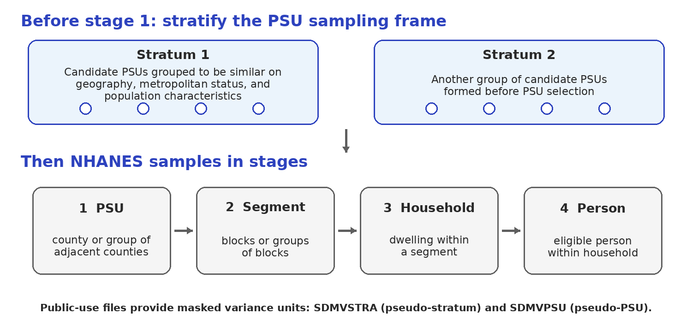
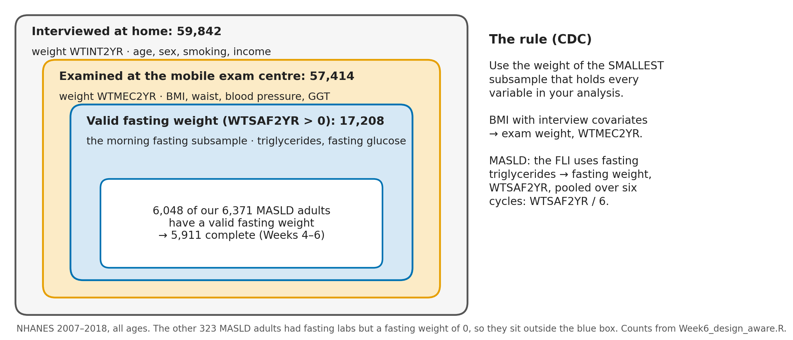
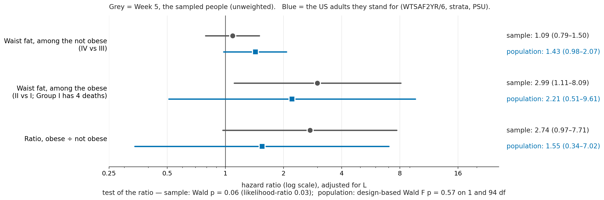
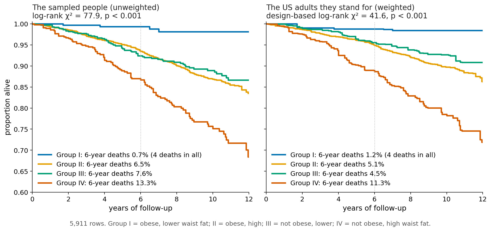

## Why Week 6 matters

NHANES is designed to describe the **US civilian, noninstitutionalized population** - but it does **not** take a simple random sample of people.

That creates two practical questions:

1. **Who does each respondent represent?**
2. **How should uncertainty reflect the way the sample was drawn?**

::: {.remember}
**Today's practical goal:** choose the right NHANES weight, declare the survey design, analyse a subgroup without breaking that design, and fit a survey-aware model.
:::

::: {.notes}
Start with the practical problem rather than terminology. The lecture will repeatedly return to one workflow: who -> which weight -> how sampled -> which subgroup -> which model.
:::

## NHANES: stratify first, then sample in stages

{width="96%"}

::: {.remember}
**Stratification happens before Stage 1.** NHANES groups candidate PSUs into strata, then samples through **PSUs -> segments -> households -> people**.
:::

## What are a stratum and a PSU?

| Term | Plain-language meaning in NHANES |
|---|---|
| **Stratum** | a group of candidate PSUs made relatively similar using geography, metropolitan status, and population characteristics **before PSU selection** |
| **PSU** | a large geographic sampling cluster, usually a **county or group of adjacent counties**, selected at Stage 1 |
| **Segment** | a smaller geographic unit within a PSU, such as a block or group of blocks |

::: {.question}
Is a PSU just a group of "neighbours"? **Not quite.** A county can be large. The more neighbourhood-like units are the **segments** sampled inside a PSU.
:::

## What the public NHANES file gives you

The true first-stage geographic identities are protected for confidentiality. Public NHANES therefore provides **masked variance units**:

- `SDMVSTRA` = masked variance **pseudo-stratum**;
- `SDMVPSU` = masked variance **pseudo-PSU**.

Use these variables to tell the software how to estimate sampling uncertainty.

::: {.remember}
Conceptually, NHANES sampled geographic PSUs within strata. In the public file, `SDMVSTRA` and `SDMVPSU` are the variables we actually use for design-based variance estimation.
:::

## Why sample this way?

NHANES uses complex sampling for two broad reasons:

- **Efficiency of data collection:** people are sampled in geographic clusters rather than scattered independently across the country.
- **Precision for important subgroups:** some groups are sampled at higher rates so estimates are possible for groups that would otherwise have too few respondents.

Examples of groups oversampled in various NHANES cycles include some race/ethnicity groups, older adults, and lower-income groups.

::: {.remember}
Complex sampling gives us richer data - but the analysis has to remember **who was oversampled** and **who was sampled together**.
:::

## One set of rows, two different mixes

| | Our 5,911 rows | Weighted US population represented |
|---|---:|---:|
| Non-Hispanic White | 42.2% | 66.8% |
| Non-Hispanic Black | 20.2% | 11.3% |
| Mexican American | 18.6% | 10.4% |
| Other Hispanic | 11.7% | 6.1% |
| Other or multiracial | 7.2% | 5.4% |
| Mean age, years | 51.4 | 49.4 |

::: {.question}
The rows are the same. What changed? **How much each row counts when we describe the target population.**
:::

::: {.notes}
Avoid raw "died during follow-up" here because follow-up differs. The point is representation, not survival analysis.
:::

## The workflow for today

::: {.workflow}
**Who? -> Which weight? -> How sampled? -> Which subgroup? -> Which model?**
:::

1. **Who?** What population should the estimate describe?
2. **Which weight?** Which NHANES component measured every variable, and how were cycles combined?
3. **How sampled?** What are the survey weight, strata, and PSU variables?
4. **Which subgroup?** How do we analyse a domain/subpopulation without redefining the survey?
5. **Which model?** Which survey estimator and test answer the epidemiologic question?

::: {.remember}
Software comes last. `svydesign()` cannot choose the target population or the correct weight for you.
:::

# Part 1 - What a survey weight does

## A public-health town: younger and older adults

Imagine a town of 1,000 adults. We deliberately sample older adults at a much higher rate so that we have enough of them to study.

| Age group | People in town | People sampled | Sampling chance | Toy weight |
|---|---:|---:|---:|---:|
| Younger adults | 900 | 100 | 1 in 9 | **9** |
| Older adults | 100 | 100 | 1 in 1 | **1** |

::: {.remember}
For this toy survey: **weight = 1 / probability of selection**. Each sampled younger adult represents 9 townspeople; each sampled older adult represents 1.
:::

::: {.notes}
This is deliberately simple but public-health concrete. NHANES has oversampled older adults in some cycles for the same broad reason: to improve precision for important subgroups.
:::

## In R: the toy weight

<!-- code: town_weight -->
```r
town <- data.frame(
  age_group = c("Younger", "Older"),
  in_town = c(900, 100),
  sampled = c(100, 100)
)

town$chance <- town$sampled / town$in_town
town$weight <- 1 / town$chance
town
#>   age_group in_town sampled    chance weight
#> 1   Younger     900     100 0.1111111      9
#> 2     Older     100     100 1.0000000      1
```

::: {.remember}
The weights add back to the town: `100 * 9 + 100 * 1 = 1,000`.
:::

## Hypertension prevalence: sample versus town

Suppose hypertension prevalence is **15% in younger adults** and **40% in older adults**.

| | Younger | Older | Overall |
|---|---:|---:|---:|
| **Sample**: 100 younger + 100 older | 15% | 40% | **27.5%** |
| **Town**: 900 younger + 100 older | 15% | 40% | **17.5%** |

- Sample: $(15+40)/2 = 27.5\%$.
- Town: $[900(0.15)+100(0.40)]/1000 = 17.5\%$.

::: {.remember}
**27.5% correctly describes the 200 sampled people.** Weighting is needed when the question is hypertension prevalence in the **town**.
:::

## In R: build the town sample

<!-- code: town_sample -->
```r
library(survey)

s <- data.frame(
  age_group = rep(c("Younger", "Older"), each = 100),
  weight = rep(c(9, 1), each = 100)
)

s$htn <- c(
  rep(1, 15), rep(0, 85),
  rep(1, 40), rep(0, 60)
)

mean(s$htn)
#> [1] 0.275
```

The ordinary mean gives the prevalence among the **200 sampled people**.

## In R: let the weights reconstruct the town

<!-- code: town_svymean -->
```r
des_town <- svydesign(
  ids = ~1,
  weights = ~weight,
  data = s
)

svymean(~htn, des_town)
#>      mean     SE
#> htn 0.175 0.0327
```

::: {.remember}
Same 200 rows; different contribution from each age group. The weighted mean recovers the town's **17.5%** prevalence.
:::

::: {.notes}
The toy uses no clusters (`ids=~1`) so students can understand weighting before strata and PSUs are added.
:::

## Age can matter for two different reasons

| Week 4: confounding | Week 6: survey sampling |
|---|---|
| Age may be a common cause/predictor of both an exposure and an outcome. | Age may affect the probability of being sampled. |
| Question: **Is the exposure comparison fair?** | Question: **Does the sample have the population's age mix?** |
| Tool: causal design / covariate adjustment. | Tool: survey weights + design information. |

::: {.remember}
**Survey weighting is not confounding adjustment.** The same variable (such as age) can matter for both reasons, but the two methods solve different problems.
:::

## Back to NHANES: the final weight is more than 1 / probability

The toy isolated the **base selection weight**. NHANES final weights also adjust for two additional features.

| Component | Why it is needed |
|---|---|
| **Selection weight** | some people had a smaller chance of selection than others |
| **Nonresponse adjustment** | selected people do not all participate |
| **Population calibration / post-stratification** | align the responding sample with external population control totals |

::: {.remember}
NHANES gives you the **final weight**. You usually choose the correct weight; you do not reconstruct it from scratch.
:::

## Which NHANES weight?

Different variables come from different components of NHANES.

| Component | Typical variables | Example weight |
|---|---|---|
| Home interview | age, sex, smoking, income | `WTINT2YR` |
| Mobile examination centre | BMI, waist, blood pressure | `WTMEC2YR` |
| Fasting morning subsample | fasting triglycerides, fasting glucose | `WTSAF2YR` / cycle-specific fasting weight |
| Other subsamples | dietary, environmental, etc. | component-specific weight |

::: {.remember}
**Use the weight for the smallest NHANES component that contains every variable needed in the analysis.**
:::

## MASLD: follow the measurement path

{width="92%"}

::: {.remember}
Our MASLD definition uses fasting triglycerides. That makes the **fasting-subsample weight** the primary weight, even though many other variables were measured in larger components.
:::

::: {.notes}
The rule is about the measurement path, not which weight produces a nicer estimate. A more restrictive weight can be valid but inefficient when none of the variables require that subsample.
:::

## Combining ordinary two-year cycles

For 2007-2018, we combine **six ordinary two-year cycles**.

Each two-year weight represents a full population for its cycle, so the pooled weight is

$$
w_{2007-2018}=\frac{1}{6}w_{2yr}.
$$

Dividing every weight by the same constant:

- **changes weighted population totals**;
- does **not** change weighted percentages, means, or most regression coefficients;
- does **not** change standard errors that are invariant to a common scaling of weights.

::: {.warning}
The easy rule "divide by the number of cycles" works here because all six components are ordinary **two-year** cycles.
:::

## In R: `/ 6` changes totals, not the model coefficient {.tight .shrink}

<!-- code: pool6 -->
```r
fast <- subset(nhanes, WTSAF2YR > 0)
fast$wt <- fast$WTSAF2YR / 6

full6 <- svydesign(
  ids = ~SDMVPSU, strata = ~SDMVSTRA,
  weights = ~wt, nest = TRUE, data = fast
)

full1 <- svydesign(
  ids = ~SDMVPSU, strata = ~SDMVSTRA,
  weights = ~WTSAF2YR, nest = TRUE, data = fast
)

round(c(
  divided = sum(weights(subset(full6, in_rows))),
  not_divided = sum(weights(subset(full1, in_rows)))
) / 1e6, 1)
#>     divided not_divided
#>        93.0       558.2
```

::: {.remember}
For pooled cycles, the weighted total is a **period-representative population total**, not a cumulative count of unique people across all years.
:::

## First special case: analyses that include 1999-2000 {.tight}

The **1999-2000** two-year weights used a different Census population base from **2001-2002 and later** cycles. NCHS therefore says the two two-year weights should **not** simply be pooled together.

- For **1999-2002**, use the NCHS-provided **4-year weight** (`WTMEC4YR`, `WTINT4YR`, or the corresponding 4-year subsample weight).
- When adding later cycles, start from that 1999-2002 4-year weight and combine it with the later 2-year weights.

Example: **1999-2004** represents 6 years:

$$
w^*_{1999-2002}=\frac{2}{3}w_{4yr}, \qquad
w^*_{2003-04}=\frac{1}{3}w_{2yr}.
$$

::: {.remember}
The special period is **1999-2000**. If it is in your analysis, begin with the NCHS-provided **1999-2002 four-year weight**.
:::

## In R: pooling 1999-2004

```r
nhanes$wt6 <- NA_real_

# 1999-2002: start with the NCHS 4-year weight
nhanes$wt6[nhanes$SDDSRVYR %in% c(1, 2)] <-
  (2 / 3) * nhanes$WTMEC4YR[nhanes$SDDSRVYR %in% c(1, 2)]

# 2003-2004: ordinary 2-year weight
nhanes$wt6[nhanes$SDDSRVYR == 3] <-
  (1 / 3) * nhanes$WTMEC2YR[nhanes$SDDSRVYR == 3]
```

::: {.notes}
The same structure applies to interview or subsample weights: use the appropriate 4-year weight for 1999-2002, then combine with the appropriate later 2-year weights.
:::

## Second special case: 2017-March 2020 is a 3.2-year file

The public-use **2017-March 2020 pre-pandemic** file represents **3.2 years**, not 2 years.

Combine 2015-2016 (2 years) with 2017-March 2020 (3.2 years): total period = **5.2 years**.

$$
w^*_{2015-16}=\frac{2}{5.2}w_{2015-16}
$$

$$
w^*_{2017-Mar2020}=\frac{3.2}{5.2}w_{2017-Mar2020}.
$$

::: {.remember}
**General idea:** each component receives the fraction of the combined time period that it represents. Do not mechanically divide both weights by 2.
:::

## COVID-era example in code

```r
nhanes$wt52 <- NA_real_

nhanes$wt52[nhanes$SDDSRVYR == 9] <-
  (2 / 5.2) * nhanes$WTMEC2YR[nhanes$SDDSRVYR == 9]

nhanes$wt52[nhanes$SDDSRVYR == 66] <-
  (3.2 / 5.2) * nhanes$WTMECPRP[nhanes$SDDSRVYR == 66]
```

For three components - 2013-14, 2015-16, and 2017-March 2020 - the total is **7.2 years**:

- each ordinary 2-year cycle gets `2 / 7.2`;
- the 3.2-year pre-pandemic file gets `3.2 / 7.2`.

::: {.warning}
Pooling is not only arithmetic: verify that the variables are comparable across cycles and that combining the periods answers a sensible epidemiologic question.
:::

## Three pooling situations to remember

| What you are combining | Starting rule |
|---|---|
| Ordinary **2-year cycles from 2001-2002 onward** | divide the 2-year weight by the number of equal 2-year cycles |
| Anything that includes **1999-2000** | start with NCHS's **1999-2002 4-year weight**, then scale it with later cycles |
| **2017-March 2020** plus other cycles | use **time-period fractions** because the pre-pandemic file represents 3.2 years |

::: {.remember}
Do not memorize only `/ number of files`. First ask: **What period and population does each supplied weight already represent?**
:::

# Part 2 - Weights, strata, PSUs, and subpopulations

## Three design ingredients, three jobs

| Design feature | Think of it as | Mainly affects |
|---|---|---|
| **Weight** | How much does this respondent count? | estimate + uncertainty |
| **PSU / cluster** | Who was sampled together? | uncertainty |
| **Stratum** | How were clusters organized before sampling? | uncertainty |

::: {.remember}
**Weights help reconstruct the population. Strata and PSUs tell us how much independent sampling information we actually have.**
:::

## Why strata and PSUs matter

People in the same sampled geographic unit often resemble each other. Treating them as completely independent can make uncertainty too optimistic.

Stratification does something different: sampling PSUs separately within planned strata can **increase precision**.

::: {.remember}
The net design effect is empirical. **Clustering often widens intervals; stratification often narrows them; unequal weights can also widen them.**
:::

::: {.notes}
Avoid teaching "complex survey always widens the CI". In the MASLD example, the weights account for most of the increase, while strata partially recover precision.
:::

## Design-based and model-based inference: the useful distinction

**Model-based analysis** asks what follows under a statistical model for how outcomes are generated.

**Design-based survey analysis** also uses the known sampling design to make inference about a finite target population represented by the survey.

::: {.remember}
For this lecture, the practical distinction is simple: **ordinary models treat the observed rows as the analysis dataset; survey models also use the information about how those rows were sampled.**
:::

::: {.warning}
This is not a claim that every unweighted regression coefficient is meaningless. Regression weighting has extra subtleties; we return to that after the basic workflow is clear.
:::

## Survey weights are not treatment/IP weights

| Weight | Statistical job |
|---|---|
| **Survey sampling weight** | represent the survey target population |
| **Treatment/IP weight** | create balance for a causal exposure comparison |
| **Frequency/model weight** | tell the fitting algorithm how observations are counted or prioritized |

::: {.remember}
Similar words, different jobs. **Today is about survey sampling weights.**
:::

## Build the survey design before defining the analysis subgroup

<!-- code: design -->
```r
# 1. People eligible for the fasting-subsample weight
fast <- subset(nhanes, WTSAF2YR > 0)
fast$wt <- fast$WTSAF2YR / 6

# 2. Tell R how NHANES sampled them
library(survey)
des_full <- svydesign(
  ids = ~SDMVPSU,
  strata = ~SDMVSTRA,
  weights = ~wt,
  nest = TRUE,
  data = fast
)
```

::: {.remember}
**Declare the survey first. Restrict to your epidemiologic subgroup second.**
:::

## A domain is just the subgroup you want to analyse

Examples:

- adults with MASLD;
- women;
- Group I;
- adults aged 60+;
- people with complete data for a particular model.

::: {.remember}
NHANES did not originally sample "only adults with MASLD." A domain analysis keeps the original survey structure while estimating something for that subgroup.
:::

## Wrong and right ways to analyse a subgroup

::: {.columns}
::: {.column width="49%"}
**Wrong: delete first, then redesign**

<!-- code: subset_wrong -->
```r
masld <- subset(fast, in_rows)

des_wrong <- svydesign(
  ids = ~SDMVPSU,
  strata = ~SDMVSTRA,
  weights = ~wt,
  nest = TRUE,
  data = masld
)
```
:::
::: {.column width="49%"}
**Right: design first, then subset**

<!-- code: subset_right -->
```r
des_full <- svydesign(
  ids = ~SDMVPSU,
  strata = ~SDMVSTRA,
  weights = ~wt,
  nest = TRUE,
  data = fast
)

des <- subset(des_full, in_rows)
```
:::
:::

::: {.remember}
Outside-domain respondents do not contribute to the domain estimate, but the **original design information remains available for variance estimation**.
:::

## A small domain shows why the order matters

<!-- code: lonely -->
```r
# Group I women: obese, lower waist fat
gw <- subset(fast, in_rows & group == "I" & female == 1)

c(people = nrow(gw), strata = length(unique(gw$SDMVSTRA)))
#> people strata
#>     57     44

tryCatch(svymean(~age, svydesign(
  ids = ~SDMVPSU, strata = ~SDMVSTRA,
  weights = ~wt, nest = TRUE, data = gw
)), error = function(e) cat("Error:", conditionMessage(e)))
#> Error: Stratum (59) has only one PSU at stage 1

svymean(~age, subset(des_full, in_rows & group == "I" & female == 1))
#>       mean     SE
#> age 41.711 2.3874
```

::: {.remember}
Deleting first can create a **lonely PSU** that was not lonely in the original survey design.
:::

## Complete cases are another domain - but that does not fix missing-data bias

<!-- code: complete_cases -->
```r
fast$complete_model <- complete.cases(
  fast[, c("time_yr", "dead", "obese", "central",
           "age", "female", "race", "smk_current", "sed")]
)

# survey design already exists
des_full <- update(des_full, complete_model = fast$complete_model)
analysis_des <- subset(
  des_full,
  MASLD == 1 & complete_model
)
```

::: {.remember}
Using `subset()` gives the appropriate **survey variance for the complete-case domain**.
:::

::: {.warning}
It does **not** make complete-case analysis unbiased for item missingness. Survey design and missing-data assumptions are separate problems.
:::

## A weighted estimate can still be based on little information

A subgroup may represent millions of people but contain only a small number of respondents.

For descriptive survey estimates, inspect:

- **unweighted n**;
- the **design effect** and effective sample size;
- **design degrees of freedom**;
- confidence-interval width.

::: {.remember}
**Population size is not information size.** Always show the empirical sample size behind a weighted estimate.
:::

## Design effect and effective sample size {.tight}

For an estimate $\hat\theta$,

$$
DEFF = \frac{Var_{complex}(\hat\theta)}{Var_{SRS}(\hat\theta)}.
$$

A rough effective sample size is

$$
n_{eff} \approx \frac{n}{DEFF}.
$$

For the toy town, unequal weights alone give Kish's approximation:

<!-- code: kish -->
```r
w <- s$weight
n <- length(w)
deff <- n * sum(w^2) / sum(w)^2
round(c(deff = deff, effective_n = n / deff), 2)
#>        deff effective_n
#>        1.64      121.95
```

::: {.remember}
DEFF is **estimate-specific**. It is not one permanent number attached to a dataset.
:::

## Table 1 for a complex survey

A useful reporting convention is:

- report **unweighted n**;
- report **weighted percentages or weighted means**;
- report design-based uncertainty when appropriate.

Example:

| Group | Unweighted n | Weighted % |
|---|---:|---:|
| Group I | 355 | 6.1% |
| Group II | 4,265 | 71.7% |
| Group III | 732 | 14.0% |
| Group IV | 559 | 8.3% |

::: {.remember}
The unweighted count tells the reader **how much data you actually observed**; the weighted percentage tells the reader **how common the group is in the represented population**.
:::

# Part 3 - Survey regression in the MASLD example

## Fit the model on the design object

<!-- code: fit_model -->
```r
fm <- Surv(time_yr, dead) ~ obese * central +
  age + female + race + smk_current + sed

fit_w <- svycoxph(fm, design = des)
```

The design object supplies:

- the analysis rows in the domain;
- their survey weights;
- strata and PSU information for variance estimation.

::: {.remember}
`svycoxph()` is not simply `coxph(..., weights=)`. The **survey design**, not the weight column alone, carries the inferential structure.
:::

## Tests use the survey design too

<!-- code: regterm -->
```r
regTermTest(
  fit_w,
  ~obese:central,
  df = degf(des)
)
#> Wald test for obese:central
#>  in svycoxph(formula = fm, design = des)
#> F =  0.3185855  on  1  and  94  df: p= 0.5738
```

For our pooled design:

$$
\text{design df} = \text{PSUs} - \text{strata} = 184 - 90 = 94.
$$

::: {.remember}
The denominator degrees of freedom come from the **sampling design**, not from the 5,911 individual rows.
:::

## Weighting changes the real MASLD population mix only modestly

| | Our 5,911 rows | Weighted population represented |
|---|---:|---:|
| Women | 47.2% | 45.5% |
| Group I: obese, lower waist | 6.0% | 6.1% |
| Group II: obese, high waist | 72.2% | 71.7% |
| Group III: not obese, lower waist | 12.4% | 14.0% |
| Group IV: not obese, high waist | 9.5% | 8.3% |

::: {.remember}
The weights matter even when the phenotype percentages barely move, because **age, race/ethnicity, income, and other characteristics can still be redistributed**.
:::

## What can we say about the published Cox analysis?

The paper describes NHANES as a stratified, multistage survey designed for national inference.

Its reported statistical methods do **not appear to specify survey weights, strata, or PSUs**, and an ordinary Cox model closely reproduces the published unadjusted Group IV vs I hazard ratio.

::: {.remember}
A careful statement is: **the published Cox analysis should not be labelled a design-based nationally representative analysis unless the survey design was incorporated in an analysis not reported in the paper.**
:::

::: {.warning}
This is not the same as saying every unweighted regression coefficient is invalid. Regression weighting depends on the target estimand, sampling mechanism, model specification, and effect heterogeneity.
:::

## Start with one comparison

High vs lower waist fat **among the non-obese** (Group IV vs III), adjusted for Week 4's L:

| Analysis | HR (95% CI) |
|---|---:|
| Ordinary Cox model | **1.09 (0.79-1.50)** |
| NHANES design-based Cox model | **1.43 (0.98-2.07)** |

::: {.question}
Why can the coefficient move? The weighted analysis changes the distribution of people represented by the rows. If the exposure effect or the fitted model behaves differently across those characteristics, the average coefficient can move.
:::

::: {.remember}
Do not interpret the movement itself as proof that one model "fixed bias." A weighted-unweighted gap is a **clue**, not a diagnosis.
:::

## Adjustment and survey design are different choices

::: {.smallish}
| | Unweighted, crude | Unweighted, adjusted | Weighted, crude | Weighted, adjusted |
|---|---:|---:|---:|---:|
| Obese vs not | 0.67 (0.56-0.81) | 0.95 (0.78-1.14) | 0.76 (0.59-0.97) | 1.02 (0.79-1.30) |
| Waist fat, not obese | 2.31 (1.69-3.14) | 1.09 (0.79-1.50) | 3.06 (2.10-4.46) | 1.43 (0.98-2.07) |
| Waist fat, obese | 7.56 (2.82-20.25) | 2.99 (1.11-8.09) | 5.23 (1.16-23.63) | 2.21 (0.51-9.61) |
:::

- Left -> right **within weighting status**: confounder adjustment.
- Unweighted -> weighted **within adjustment status**: survey design / represented population.

::: {.remember}
The two operations answer different questions. **Do not call survey weighting "confounding adjustment."**
:::

## Week 5's effect-modification result, redone with the survey design

{width="96%"}

::: {.remember}
Unweighted ratio of waist-fat HRs, obese / not obese: **2.74 (0.97-7.71)**.  
Survey-design ratio: **1.55 (0.34-7.02)**, design-based p = **0.57**.
:::

The survey-design analysis gives **less evidence and much more uncertainty**. That is not evidence of no heterogeneity - the interval is very wide.

::: {.notes}
The point estimate moved, the variance increased, and the inferential test changed. The lesson is not "weighting discovered the truth"; it changed both the represented population and the variance calculation.
:::

## In R: the Week 5 interaction model, survey-aware

<!-- code: week5_w -->
```r
fit_u <- coxph(fm, data = d)          # ordinary model
fit_w <- svycoxph(fm, design = des)   # NHANES design

waist_hr <- function(fit, obese) {
  b <- coef(fit)
  exp(b[["central"]] + obese * b[["obese:central"]])
}

round(c(
  unweighted_not_obese = waist_hr(fit_u, 0),
  weighted_not_obese   = waist_hr(fit_w, 0),
  unweighted_obese     = waist_hr(fit_u, 1),
  weighted_obese       = waist_hr(fit_w, 1)
), 2)
#> unweighted_not_obese   weighted_not_obese
#>                 1.09                 1.43
#>     unweighted_obese       weighted_obese
#>                 2.99                 2.21
```

## The correct weight is chosen by the measurement process

*Same 5,911 rows; waist fat adjusted for L.*

| Weight | Not obese HR | Obese HR | Ratio of HRs |
|---|---:|---:|---:|
| **Fasting weight** `WTSAF2YR / 6` | 1.43 | 2.21 | 1.55 |
| Exam weight `WTMEC2YR / 6` | 1.46 | 2.10 | 1.44 |

::: {.remember}
The HRs happen to be similar. That does **not** make the exam weight correct for an analysis that depends on fasting triglycerides.
:::

::: {.question}
Choose the primary weight **before** looking at the answer. Sensitivity analyses can show how much the decision mattered.
:::

## In R: sensitivity to the exam weight

<!-- code: mec -->
```r
mec <- subset(nhanes, WTMEC2YR > 0)
mec$wt <- mec$WTMEC2YR / 6

des_mec <- subset(
  svydesign(
    ids = ~SDMVPSU, strata = ~SDMVSTRA,
    weights = ~wt, nest = TRUE, data = mec
  ),
  in_rows
)

fit_m <- svycoxph(fm, design = des_mec)

round(rbind(
  fasting = c(not_obese = waist_hr(fit_w, 0), obese = waist_hr(fit_w, 1)),
  exam    = c(not_obese = waist_hr(fit_m, 0), obese = waist_hr(fit_m, 1))
), 2)
#>         not_obese obese
#> fasting      1.43  2.21
#> exam         1.46  2.10
```

## Why can weighted and unweighted regression differ?

Three broad reasons are worth considering:

1. **Sampling variation:** two noisy estimators can differ by chance.
2. **Effect heterogeneity:** the effect differs across age/race/income/etc., and weighting changes their population mix.
3. **Sampling-model dependence:** variables related to sampling or participation are not adequately represented in the outcome model.

::: {.remember}
The **direction or size of the gap does not tell you which explanation is true**.
:::

## Why weighting can change an overall RR

::: {.question .smallish}
**Recall the town:** population = **90% younger / 10% older**; survey sample = **50% younger / 50% older**. Older adults are over-represented, and survey weights restore the 90:10 age mix. Assume half of each age group has a **high-sodium diet**.
:::

*Hypothetical 5-year hypertension risks:*

| Scenario | Younger | Older | Sample RR (50:50) | Town RR (90:10) |
|---|---:|---:|---:|---:|
| Same RR by age | 10% -> 20% (**RR 2**) | 20% -> 40% (**RR 2**) | 2.00 | 2.00 |
| RR differs by age | 10% -> 20% (**RR 2**) | 20% -> 60% (**RR 3**) | **2.67** | **2.18** |

::: {.remember .smallish}
**What changes?** When the age-specific RRs are both 2, changing the age mix does not change this overall RR. When the older-adult RR is 3, the unweighted sample gives that stronger effect too much influence because older adults are 50% of the sample but only 10% of the town. Weighting moves the overall RR from **2.67 to 2.18**.
:::

<span class="foot">**Week 5 + Week 6:** effect modification by age + unequal sampling of age groups. High-sodium diet is 50% in both age groups here, so age does not confound this toy comparison.</span>

## In R: build the high-sodium example

<!-- code: sodium_build -->
```r
# 100 younger + 100 older; half exposed in each age group
s2 <- data.frame(
  age_group = rep(c("Younger", "Older"), each = 100),
  high_sodium = rep(rep(c(0, 1), each = 50), times = 2),
  weight = rep(c(9, 1), each = 100)
)

cases <- function(k, n = 50) c(rep(1, k), rep(0, n - k))
s2$incident_htn <- c(
  cases(5), cases(10),    # younger: 10% -> 20%
  cases(10), cases(30)    # older:   20% -> 60%
)

des2 <- svydesign(ids = ~1, weights = ~weight, data = s2)
```

## In R: sample RR versus town RR

<!-- code: sodium_rr -->
```r
fit_sample <- glm(
  incident_htn ~ high_sodium,
  family = poisson(link = "log"), data = s2
)

fit_town <- svyglm(
  incident_htn ~ high_sodium,
  family = quasipoisson(link = "log"), design = des2
)

round(exp(c(
  sample = coef(fit_sample)[["high_sodium"]],
  town = coef(fit_town)[["high_sodium"]]
)), 2)
#> sample   town
#>   2.67   2.18
```

::: {.remember}
The rows did not change. The **population mix being averaged over** changed.
:::

## What survey design cannot fix

Survey weighting/design does **not** repair:

- **confounding** of the exposure-outcome comparison;
- **selection** created by defining the MASLD cohort using variables related to the exposures;
- **bias from complete-case analysis** due to item missingness;
- **poorly defined exposures or causal estimands**;
- **sparse cells** - four deaths remain four deaths after weighting.

::: {.remember}
Survey design answers **"for whom?"** and **"how uncertain?"**. It does not by itself answer **"is the comparison causal?"**
:::

# Part 4 - Reporting and synthesis

## Report the same decisions you made

| Decision | What to report |
|---|---|
| **Who?** | target population / analytic domain |
| **Which weight?** | weight name, why it was chosen, how cycles were combined |
| **How sampled?** | strata, PSU, variance method |
| **Which subgroup?** | eligibility and complete-case restrictions; unweighted n |
| **Which model?** | survey estimator, design-based CI/test and degrees of freedom |

::: {.remember}
For descriptive tables: **unweighted n + weighted %/mean** is usually the most informative pairing.
:::

## The algorithm to take into your own paper

::: {.workflow}
**1. Define population -> 2. Select weight -> 3. Combine cycles -> 4. Declare design -> 5. Subset domain -> 6. Fit survey model -> 7. Report n + weighted estimate + uncertainty.**
:::

Before trusting a result, ask:

- Is the weight valid for every variable?
- Did cycle pooling follow the correct time period?
- Was the full survey design declared before subgroup restriction?
- Is there enough empirical information in the subgroup?
- Does the population claim match the analysis?

## Key takeaways

1. NHANES is **not** a simple random sample; weights, strata and PSUs each have a job.
2. Choose the weight from the **smallest component needed by your variables**, not from the answer it produces.
3. Pool weights according to what each supplied weight represents: ordinary 2-year cycles use `/ number of cycles`; analyses including **1999-2000 must start with the NCHS 1999-2002 4-year weight**; the **2017-March 2020 3.2-year file uses time-proportional scaling**.
4. **Declare the design first, then subset the domain.** Complete cases are another domain, but that does not solve missing-data bias.
5. Weighted regression and unweighted regression may differ for several reasons; the gap is a **question to investigate**, not a diagnosis.
6. Survey design changes **who is represented and how uncertainty is calculated**. It does not make a causal comparison valid.

## Sources for the core workflow

::: {.smallish}
**EpiMethods**

- Survey data analysis hub: `https://ehsanx.github.io/EpiMethods/surveydata.html`
- Concepts (weights, strata, PSUs, tests, reporting): `surveydata0.html`
- Properly subsetting an NHANES design: `surveydata8.html`
- NHANES reliability standards: `surveydata9.html`

**CDC / NCHS NHANES**

- NHANES Tutorials - Weighting Module (weight construction, correct weight, 1999-2000 special case, and cycle pooling)
- NHANES Tutorials - Sample Design Module (stratification, PSUs, sampling stages, masked variance units)
- NHANES Tutorials - Variance Estimation Module
- NHANES 2017-March 2020 Pre-pandemic analytic guidance (Series 2, No. 190)
:::


## Selected references - survey foundations

::: {.tiny}
- Heeringa SG, West BT, Berglund PA. *Applied Survey Data Analysis*. Chapman & Hall/CRC; 2010/2017.
- Johnson CL, Paulose-Ram R, Ogden CL, et al. NHANES analytic guidelines, 1999-2010. *Vital Health Stat 2*. 2013;(161):1-24.
- Korn EL, Graubard BI. *Analysis of Health Surveys*. Wiley; 1999.
- Lumley T. *Complex Surveys: A Guide to Analysis Using R*. Wiley; 2010.
- Kish L. Weighting for unequal Pi. *Journal of Official Statistics*. 1992;8:183-200.
- NCHS. *NHANES 2017-March 2020 Pre-pandemic File: Sample Design, Estimation, and Analytic Guidelines*. Series 2, No. 190; 2021.
:::

## Selected references - regression and reporting

::: {.tiny}
- Binder DA. Fitting Cox's proportional hazards models from survey data. *Biometrika*. 1992;79:139-147.
- DuMouchel WH, Duncan GJ. Using sample survey weights in multiple regression analyses of stratified samples. *JASA*. 1983;78:535-543.
- Lumley T, Scott A. Fitting regression models to survey data. *Statistical Science*. 2017;32:265-278.
- Seidenberg AB, Moser RP, West BT. PRICSSA. *J Survey Statistics and Methodology*. 2023;11:743-757.
- Solon G, Haider SJ, Wooldridge JM. What are we weighting for? *Journal of Human Resources*. 2015;50:301-316.
:::

# Appendix - deeper survey ideas and code

## Appendix: design effect in the MASLD model

*Waist fat among the not obese, adjusted for L.*

| Variance calculation | Variance / ordinary-model variance |
|---|---:|
| ordinary model only | 1.00 |
| strata + PSUs, equal weights | 1.05 |
| weights, no strata/PSUs | 1.56 |
| full survey design | 1.37 |

::: {.remember}
In this particular contrast, **unequal weights** account for most of the precision cost; stratification partly offsets it. That is an empirical result, not a universal rule.
:::

## Appendix: R code for the variance decomposition {.tight .shrink}

<!-- code: ci_cost -->
```r
v <- function(fit) vcov(fit)["central", "central"]

fast$one <- 1

des_eq <- subset(
  svydesign(
    ids = ~SDMVPSU, strata = ~SDMVSTRA,
    weights = ~one, nest = TRUE, data = fast
  ),
  in_rows
)

vs <- c(
  model    = v(fit_u),
  clusters = v(svycoxph(fm, design = des_eq)),
  weights  = v(coxph(fm, data = d, weights = wt, robust = TRUE)),
  design   = v(fit_w)
)

round(vs / vs[["model"]], 2)
#>    model clusters  weights   design
#>     1.00     1.05     1.56     1.37
```

## Appendix: variance estimation methods

Two broad families are common in complex surveys:

**Taylor linearization**

- approximates the variance of a complex estimator with a linearized form;
- uses design strata and PSUs;
- is the standard approach used in the main NHANES examples in this lecture.

**Replication methods**

- repeatedly recompute the statistic under replicate weights;
- examples: jackknife, BRR, Fay's BRR, survey bootstrap.

::: {.remember}
Use the variance method that matches the survey documentation and the available design information.
:::

## Appendix: design-adjusted tests

Complex survey analysis changes more than standard errors.

Examples include:

- **Rao-Scott chi-square** instead of an ordinary Pearson chi-square for contingency tables;
- design-based Wald/F tests for regression terms;
- survey-adapted goodness-of-fit procedures such as Archer-Lemeshow for logistic models;
- survey-aware versions of model summaries such as pseudo-R2 when appropriate.

::: {.remember}
Do not take an ordinary SRS hypothesis test and simply attach survey-weighted point estimates to it.
:::

## Appendix: survey-weighted survival curves

{width="84%"}

Group IV has the lowest survival in both ordinary and survey-weighted curves. The weighted curves shift because the represented population is younger and differently distributed across sampled groups.

::: {.remember}
Survey design can change both **descriptive survival curves** and the uncertainty/test attached to their comparison.
:::

## Appendix: R code for survey survival curves

<!-- code: km -->
```r
km <- svykm(Surv(time_yr, dead) ~ group, design = des)

died6 <- function(k) {
  100 * (1 - k$surv[max(which(k$time <= 6))])
}

round(sapply(km, died6), 1)
#>    I   II  III   IV
#>  1.2  5.1  4.5 11.3

lr <- svylogrank(Surv(time_yr, dead) ~ group, design = des)
round(lr[[2]], 4)
#>   Chisq       p
#> 41.5624  0.0000
```

## Appendix: Week 5's sex-modification analysis, design-aware

<!-- code: sex -->
```r
fs <- Surv(time_yr, dead) ~
  IV * female + age + race + smk_current + sed

d34 <- subset(des, group %in% c("III", "IV"))
fit_s <- svycoxph(fs, design = d34)

round(exp(c(
  ratio = coef(fit_s)[["IV:female"]],
  confint(fit_s)["IV:female", ]
)), 2)
#>  ratio  2.5 % 97.5 %
#>   2.60   0.89   7.58

regTermTest(fit_s, ~IV:female, df = degf(des))
#> Wald test for IV:female
#>  in svycoxph(formula = fs, design = d34)
#> F =  3.067102  on  1  and  94  df: p= 0.083154
```

## Appendix: the debate about regression weights

There is broad agreement that survey weights are needed for **population descriptive estimates**.

Regression is more nuanced because the coefficient can depend on:

- the target estimand;
- whether sampling is informative after conditioning on modeled covariates;
- model misspecification;
- effect heterogeneity;
- efficiency costs from highly variable weights.

::: {.remember}
A sensible workflow is to **pre-specify the population target and primary survey analysis**, then use unweighted/model-based fits as a sensitivity or diagnostic comparison when scientifically justified.
:::

## Appendix: extreme weights and trimming

Highly variable survey weights can make a small number of respondents extremely influential and increase variance.

Possible responses include:

- inspect whether the large weights are expected from the documented survey design;
- verify that the **correct component weight** was chosen;
- report the weight distribution and design effect;
- consider trimming only as a **sensitivity analysis** when scientifically justified.

::: {.warning}
Trimming can improve precision but changes the weighting scheme and can introduce bias. It is not an automatic fix for a wide confidence interval.
:::

## Appendix: sample and population causal effects - SATE and PATE

When the estimand is genuinely causal, survey generalization is sometimes described using:

- **SATE:** sample average treatment effect - average causal effect in the sampled people;
- **PATE:** population average treatment effect - average causal effect in the target population.

::: {.remember}
Survey weights can help move from a sample target toward a population target, but **causal identification still requires the exposure comparison to be valid**. Survey weighting does not replace confounding control.
:::

## Appendix: sample target vs population target

The old shorthand "weighted = population, unweighted = sample" is most literal for descriptive statistics.

For regression, distinguish the target explicitly:

- **Sample-average / model-based association:** what does the fitted model say for the observed analytic sample under its assumptions?
- **Population-representative survey analysis:** what coefficient/contrast is obtained when the survey design is used to represent the target population?

::: {.warning}
Do not attach a national-population interpretation to a coefficient merely because the source dataset is NHANES.
:::

## Appendix: extra COVID-era pooling example

Combine 2013-14, 2015-16, and 2017-March 2020.

Total represented period:

$$
2 + 2 + 3.2 = 7.2\text{ years}.
$$

So:

$$
w^*_{2013-14}=\frac{2}{7.2}w_{2yr}, \qquad
w^*_{2015-16}=\frac{2}{7.2}w_{2yr},
$$

$$
w^*_{2017-Mar2020}=\frac{3.2}{7.2}w_{prepandemic}.
$$

::: {.remember}
The special 3.2-year release teaches the principle better than memorizing a denominator: **scale each component to the fraction of the total represented period.**
:::

## Appendix: COVID-era pooling in code

```r
nhanes$wt72 <- NA_real_

nhanes$wt72[nhanes$SDDSRVYR %in% c(8, 9)] <-
  (2 / 7.2) * nhanes$WTMEC2YR[nhanes$SDDSRVYR %in% c(8, 9)]

nhanes$wt72[nhanes$SDDSRVYR == 66] <-
  (3.2 / 7.2) * nhanes$WTMECPRP[nhanes$SDDSRVYR == 66]
```

Check the relevant data-file documentation before assuming the same variable definition or weight name exists in every cycle.

## Appendix: reliability standards - the formal idea

For descriptive proportions, NCHS reliability guidance considers multiple features, not only raw n.

Common diagnostics include:

- unweighted sample size;
- effective sample size;
- design degrees of freedom;
- confidence-interval width / relative precision;
- whether the estimate is close to the boundary 0 or 1.

::: {.remember}
Formal suppression/reliability rules are designed mainly for descriptive estimates. Regression coefficients require judgment based on their information, SE/CI, design, and model.
:::

## Appendix: what if a lonely PSU truly remains?

Sometimes a stratum has only one PSU even after the design is declared correctly. Then the variance for that stratum cannot be estimated in the usual way.

Possible strategies depend on the survey documentation and software:

- treat a certainty PSU appropriately when that is how the design was constructed;
- combine or adjust singleton strata using a documented rule;
- use an approved replication method when replicate weights/design information are available.

::: {.warning}
Do not solve a lonely-PSU problem by silently deleting the stratum or pretending the design was simple random sampling.
:::

## Appendix: other complex surveys

The same principles recur in many public-health datasets:

- Canadian Community Health Survey (CCHS)
- Behavioral Risk Factor Surveillance System (BRFSS)
- Korean NHANES (KNHANES)
- Health and Retirement Study (HRS)
- National Comorbidity Survey Replication (NCS-R)
- European Social Survey (ESS)

::: {.remember}
The variable names change. The questions do not: **who is represented, what is the weight, how was the sample drawn, and how should subgroups be analysed?**
:::

## Appendix: software

Common software has dedicated complex-survey procedures:

- **R:** `survey` package (`svydesign`, `svymean`, `svyglm`, `svycoxph`, `svykm`)
- **Stata:** `svyset`, `svy:` estimators
- **SAS:** SURVEY procedures
- **SUDAAN:** survey-specific procedures
- **SPSS:** Complex Samples procedures

::: {.remember}
The critical step is not the brand of software. It is **declaring the correct survey design and target population before fitting the model**.
:::

## Appendix: future extensions

Survey principles also matter for modern prediction workflows.

Examples include:

- sampling weights in machine-learning models;
- survey-aware cross-validation;
- calibration and performance measures for complex samples.

These require more than simply passing a weight column to an algorithm and are beyond the core Week 6 goals.

